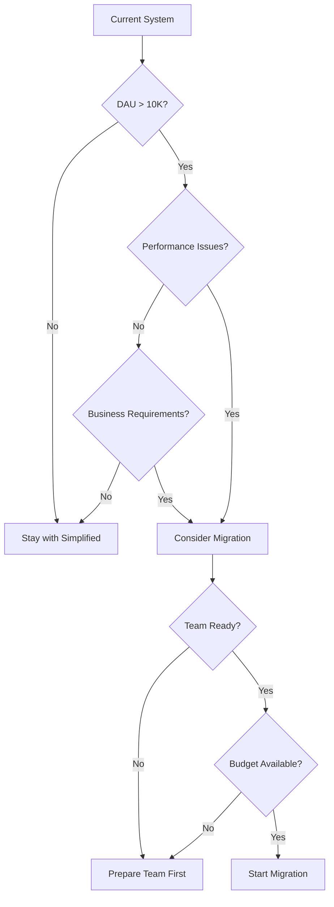

# UIM System Design: Simplified vs. Extended Version Guide

**Document Version:** 1.0  
**Last Updated:** January 5, 2026  
**Author:** convexwf@gmail.com

---

## Executive Summary

This document explains the rationale behind having two design documents for the UIM system:

- **Simplified Version** (`uim-system-design-simplified.md`): For MVP and personal projects
- **Extended Version** (`uim-system-design.md`): For enterprise-scale systems and future expansion

This guide helps you understand:

- Why we need a simplified design approach
- When to use each version
- How to migrate from simplified to extended design
- Migration strategies and considerations

---

## Table of Contents

1. [Why Simplified Design?](#1-why-simplified-design)
2. [When to Use Each Version](#2-when-to-use-each-version)
3. [Migration Path: Simplified to Extended](#3-migration-path-simplified-to-extended)
4. [Migration Strategies](#4-migration-strategies)
5. [Decision Framework](#5-decision-framework)
6. [Cost-Benefit Analysis](#6-cost-benefit-analysis)

---

## 1. Why Simplified Design?

### 1.1 The Problem with Premature Optimization

Starting with an enterprise-scale design (Cassandra, Kafka, microservices) for a personal project or MVP creates several problems:

**Development Velocity**:

- Complex infrastructure setup takes weeks instead of days
- Learning curve for distributed systems is steep
- Debugging across multiple services is difficult
- Slower iteration cycles delay feedback

**Resource Requirements**:

- Multiple servers needed (high cost)
- Complex deployment procedures
- Requires DevOps expertise
- High operational overhead

**Risk of Over-Engineering**:
- Building features you may never need
- Wasting time on scalability that isn't required
- Increased complexity without clear benefits
- Higher chance of project abandonment

### 1.2 Benefits of Simplified Design

**Faster Time to Market**:
- Get MVP running in 10-12 weeks vs. 32+ weeks
- See results and validate ideas quickly
- Learn by building, not by configuring infrastructure

**Lower Barrier to Entry**:
- Single server deployment
- Familiar technologies (PostgreSQL, Redis)
- Minimal DevOps knowledge required
- Cost-effective ($50-100/month vs. $115K/month)

**Focus on Core Features**:

- Build what users actually need
- Validate product-market fit
- Iterate based on real feedback
- Avoid building unnecessary infrastructure

**Learning Path**:

- Understand fundamentals first
- Gradually learn distributed systems
- Natural progression from simple to complex
- Build expertise incrementally

### 1.3 Real-World Examples

**Successful Startups**:

- Many successful products started with simple architectures
- Instagram: Started with Django on a single server
- Twitter: Began with Ruby on Rails, MySQL
- WhatsApp: Started simple, scaled later

**Key Insight**: 
> "Premature optimization is the root of all evil" - Donald Knuth

Build for your current scale, optimize when you need to.

---

## 2. When to Use Each Version

### 2.1 Use Simplified Version When:

✅ **Starting a new project**

- Personal projects or side projects
- MVP development
- Learning IM system fundamentals
- Proof of concept

✅ **Small to Medium Scale**

- DAU < 10,000
- Concurrent connections < 1,000
- Message volume < 1 million/day
- Single region deployment

✅ **Resource Constraints**
- Limited budget ($50-100/month)
- Small team (1-3 developers)
- Limited DevOps expertise
- Need to move fast

✅ **Early Stage**
- Validating product-market fit
- Building core features
- Rapid iteration needed
- Uncertain about future requirements

### 2.2 Use Extended Version When:

✅ **Enterprise Scale Requirements**
- DAU > 100,000
- Concurrent connections > 10,000
- Message volume > 10 million/day
- Multi-region deployment needed

✅ **High Availability Requirements**
- 99.95%+ uptime SLA
- Zero-downtime deployments
- Disaster recovery requirements
- Compliance and regulatory needs

✅ **Team and Resources**
- Large engineering team
- Dedicated DevOps team
- Budget for infrastructure ($10K+/month)
- Enterprise customers

✅ **System Design Interviews**
- Preparing for technical interviews
- Understanding large-scale architecture
- Learning distributed systems concepts
- Reference for architectural discussions

### 2.3 Decision Matrix

| Factor                     | Simplified   | Extended        |
| -------------------------- | ------------ | --------------- |
| **DAU**                    | < 10K        | > 100K          |
| **Concurrent Connections** | < 1K         | > 10K           |
| **Message Volume/Day**     | < 1M         | > 10M           |
| **Budget/Month**           | < $500       | > $10K          |
| **Team Size**              | 1-3          | 10+             |
| **Time to Market**         | Fast (weeks) | Slower (months) |
| **Complexity**             | Low          | High            |
| **Learning Curve**         | Gentle       | Steep           |

---

## 3. Migration Path: Simplified to Extended

### 3.1 Migration Triggers

**Performance Indicators**:
- Database CPU consistently > 70%
- Response time P95 > 500ms
- Connection count approaching limits
- Message queue lag > 1 second

**Business Indicators**:
- DAU growing beyond 10K
- Enterprise customers requiring SLA
- Multi-region expansion needed
- Regulatory compliance requirements

**Operational Indicators**:
- Single server becoming bottleneck
- Frequent downtime or performance issues
- Team size growing (can handle complexity)
- Budget available for infrastructure

### 3.2 Migration Phases

#### Phase 1: Preparation (2-4 weeks)

**Assessment**:
- Measure current system performance
- Identify bottlenecks
- Document current architecture
- Plan migration strategy

**Infrastructure Setup**:
- Set up development/staging environment
- Prepare new infrastructure (Cassandra, Kafka)
- Set up monitoring and observability
- Create rollback plans

#### Phase 2: Service Split (4-6 weeks)

**Split Monolithic Application**:
1. Extract API Server (stateless)
2. Extract Chat Server (stateful)
3. Extract Presence Server
4. Implement service-to-service communication

**Database Migration**:
1. Set up Cassandra cluster
2. Migrate message data (dual-write strategy)
3. Verify data consistency
4. Switch reads to Cassandra

**Message Queue Migration**:
1. Set up Kafka cluster
2. Implement dual-write (Redis + Kafka)
3. Migrate consumers gradually
4. Switch to Kafka-only

#### Phase 3: Scale and Optimize (4-8 weeks)

**Horizontal Scaling**:
- Scale API servers (stateless, easy)
- Scale Chat servers (requires sticky sessions)
- Scale database (Cassandra sharding)
- Scale message queue (Kafka partitions)

**Multi-Region Setup**:
- Deploy to multiple regions
- Set up cross-region replication
- Implement region-aware routing
- Handle data consistency

**Observability**:
- Set up distributed tracing
- Implement comprehensive monitoring
- Create alerting rules
- Build dashboards

### 3.3 Migration Timeline

```
Week 1-2:   Assessment and Planning
Week 3-4:   Infrastructure Setup
Week 5-8:   Service Split
Week 9-12:  Database Migration
Week 13-16: Message Queue Migration
Week 17-20: Scaling and Optimization
Week 21-24: Multi-Region Setup
```

**Total**: 6 months (can be done incrementally)

---

## 4. Migration Strategies

### 4.1 Big Bang Migration (Not Recommended)

**Approach**: Migrate everything at once

**Pros**:
- Faster migration
- Clean cutover

**Cons**:
- High risk
- Difficult rollback
- Potential downtime
- High stress

**When to Use**: Never, unless absolutely necessary

### 4.2 Incremental Migration (Recommended)

**Approach**: Migrate component by component

**Strategy**:
1. **Dual-Write Phase**: Write to both old and new systems
2. **Gradual Read Migration**: Switch reads gradually
3. **Verification Phase**: Verify data consistency
4. **Cutover Phase**: Switch to new system completely
5. **Cleanup Phase**: Remove old system

**Example: Database Migration**


**Pros**:
- Low risk
- Easy rollback
- No downtime
- Can verify at each step

**Cons**:
- Takes longer
- Temporary complexity
- More testing needed

### 4.3 Strangler Fig Pattern

**Approach**: Gradually replace old system with new one

**Strategy**:
1. Build new system alongside old one
2. Route new features to new system
3. Gradually migrate existing features
4. Eventually replace old system completely

**Example: Service Split**

```
Old: Monolithic UIM Server
     ├── API Module
     ├── Chat Module
     └── Presence Module

New: Microservices
     ├── API Server (new)
     ├── Chat Server (new)
     └── Presence Server (new)

Migration:
Week 1-2:  Deploy new services, route 10% traffic
Week 3-4:  Route 50% traffic, verify
Week 5-6:  Route 100% traffic
Week 7-8:  Decommission old service
```

### 4.4 Blue-Green Deployment

**Approach**: Run two identical production environments

**Strategy**:
1. Deploy new version to green environment
2. Test green environment thoroughly
3. Switch traffic from blue to green
4. Keep blue as backup for rollback

**Use Cases**:
- Service deployments
- Database migrations (with replication)
- Infrastructure changes

---

## 5. Decision Framework

### 5.1 Should I Migrate Now?

**Decision Tree**:



### 5.2 Migration Readiness Checklist

**Technical Readiness**:
- [ ] Current system is stable and well-understood
- [ ] Performance bottlenecks identified
- [ ] Team has distributed systems knowledge
- [ ] Infrastructure budget approved
- [ ] Monitoring and observability in place

**Organizational Readiness**:
- [ ] Team size sufficient (10+ engineers)
- [ ] DevOps expertise available
- [ ] Management buy-in
- [ ] Time allocated (6+ months)
- [ ] Risk tolerance for migration

**Business Readiness**:
- [ ] Clear business case for migration
- [ ] Customer requirements justify complexity
- [ ] Growth projections support scale
- [ ] ROI calculation completed

### 5.3 When NOT to Migrate

**Don't Migrate If**:
- ❌ Current system works fine
- ❌ No clear performance issues
- ❌ Team is small (< 5 engineers)
- ❌ Budget is limited
- ❌ No business justification
- ❌ Premature optimization

**Remember**: 
> "If it ain't broke, don't fix it"

Migration is expensive and risky. Only migrate when you have clear reasons.

---

## 6. Cost-Benefit Analysis

### 6.1 Simplified Design Costs

**Monthly Costs**:
- Server: $20-50
- Database (PostgreSQL): $0-20
- Redis: $0-10
- **Total**: $50-100/month

**Development Costs**:
- Setup time: 1-2 days
- Learning curve: Low
- Maintenance: 2-4 hours/week
- **Total**: ~40 hours initial + 10 hours/week

**Benefits**:
- Fast development (10-12 weeks to MVP)
- Easy to understand and maintain
- Low operational overhead
- Focus on features, not infrastructure

### 6.2 Extended Design Costs

**Monthly Costs**:
- Compute (EC2): $5,000-10,000
- Database (Cassandra): $3,000-5,000
- Cache (Redis Cluster): $1,000-2,000
- Message Queue (Kafka): $1,500-3,000
- Load Balancers: $500-1,000
- Monitoring & Logging: $500-1,000
- **Total**: $11,500-22,000/month

**Development Costs**:
- Setup time: 2-4 weeks
- Learning curve: High (months)
- Maintenance: 20-40 hours/week
- **Total**: ~200 hours initial + 30 hours/week

**Benefits**:
- Handles millions of users
- High availability (99.95%+)
- Multi-region support
- Enterprise-grade reliability

### 6.3 ROI Calculation

**Simplified Design ROI**:
```
Development Time Saved: 20 weeks
Cost Saved: $11,400-21,900/month
Time to Market: 10-12 weeks vs. 32+ weeks

ROI: Very High for MVP stage
```

**Extended Design ROI**:
```
Only justified when:
- DAU > 100K
- Revenue > $100K/month
- Enterprise customers
- Clear scalability needs

ROI: High only at scale
```

### 6.4 Break-Even Analysis

**When Extended Design Makes Sense**:

| Metric               | Break-Even Point |
| -------------------- | ---------------- |
| **DAU**              | > 100,000        |
| **Monthly Revenue**  | > $50,000        |
| **Team Size**        | > 10 engineers   |
| **Message Volume**   | > 10M/day        |
| **Concurrent Users** | > 10,000         |

**Rule of Thumb**: 
If you're not hitting these numbers, stick with simplified design.

---

## 7. Best Practices

### 7.1 Start Simple, Scale When Needed

**Principle**: 
> "Make it work, make it right, make it fast" - Kent Beck

1. **Make it work**: Build MVP with simplified design
2. **Make it right**: Refactor and optimize as needed
3. **Make it fast**: Scale only when performance requires it

### 7.2 Monitor Key Metrics

**Track These Metrics**:
- DAU growth rate
- Response time (P50, P95, P99)
- Database CPU and memory usage
- Connection count
- Message queue lag
- Error rates

**Set Alerts**:
- When metrics approach limits
- Before performance degrades
- When migration triggers are hit

### 7.3 Plan for Migration Early

**Even if you start simple**:
- Design with migration in mind
- Use modular architecture
- Abstract database access
- Keep services loosely coupled
- Document everything

**This makes migration easier** when the time comes.

### 7.4 Don't Over-Engineer

**Common Mistakes**:
- ❌ Using microservices "because it's cool"
- ❌ Choosing Cassandra "for scale" when PostgreSQL works
- ❌ Setting up Kubernetes "for the future"
- ❌ Building for 1M users when you have 100

**Better Approach**:
- ✅ Build for current scale + 10x
- ✅ Use proven, simple technologies
- ✅ Add complexity only when needed
- ✅ Measure, don't guess

---

## 8. Conclusion

### Key Takeaways

1. **Start with Simplified Design**: 
   - Faster development
   - Lower costs
   - Focus on features
   - Learn fundamentals

2. **Migrate When Justified**:
   - Clear performance issues
   - Business requirements
   - Team and budget ready
   - Measurable ROI

3. **Migration is a Process**:
   - Plan carefully
   - Migrate incrementally
   - Verify at each step
   - Have rollback plans

4. **Both Designs Have Value**:
   - Simplified: For MVP and learning
   - Extended: For scale and interviews

### Final Recommendation

**For Your Project**:
- ✅ Start with **Simplified Design**
- ✅ Build MVP in 10-12 weeks
- ✅ Validate product-market fit
- ✅ Monitor metrics closely
- ✅ Migrate only when needed

**Remember**: 
> "The best code is the code you don't have to write" - Jeff Atwood

Don't build infrastructure you don't need. Start simple, scale smart.

---

## References

1. **Simplified Design Document**: [`uim-system-design-simplified.md`](./uim-system-design-simplified.md)
2. **Extended Design Document**: [`uim-system-design.md`](./uim-system-design.md)
3. **Martin Fowler - Strangler Fig Pattern**: https://martinfowler.com/bliki/StranglerFigApplication.html
4. **Sam Newman - Building Microservices**: https://www.oreilly.com/library/view/building-microservices/9781491950340/

---

**Document Change Log**:

| Version | Date       | Author             | Changes                |
| ------- | ---------- | ------------------ | ---------------------- |
| 1.0     | 2026-01-05 | convexwf@gmail.com | Initial guide document |

---

*End of Document*

