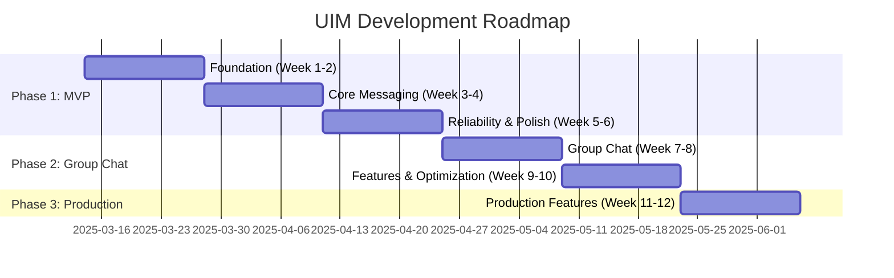

# UIM System Development Roadmap

**Document Version:** 1.0  
**Last Updated:** January 5, 2026  
**Author:** `convexwf@gmail.com`  
**Based on:** [Simplified System Design](./uim-system-design-simplified.md)

---

## Overview

This roadmap outlines the development plan for the UIM system based on the simplified design. The plan is divided into 3 phases over 12 weeks, focusing on delivering a production-ready MVP.

**Timeline**: 12 weeks (3 months)  
**Target**: MVP with one-on-one chat, group chat, and basic features  
**Scale**: Support 1K-10K DAU

---

## Roadmap Summary

---

## Phase 1: MVP (Minimum Viable Product) - 6 weeks

**Goal**: Launch basic one-on-one chat functionality

**Success Criteria**

- Users can register and login
- Users can send/receive messages in real-time
- Messages are persisted and retrievable
- Basic offline message support
- Support 100+ concurrent users

### Week 1-2: Foundation

**Objectives**

- Set up project structure and development environment
- Design and implement database schema
- Implement user authentication
- Set up basic API server

#### Phase 1: Foundation - Tasks

**Project Setup**

- [ ] Initialize Go project structure
- [ ] Set up Docker Compose for local development (PostgreSQL + Redis)
- [ ] Configure development environment
- [ ] Set up CI/CD pipeline (basic)
- [ ] Create project documentation structure

**Database Design**

- [ ] Design database schema (users, conversations, messages, participants)
- [ ] Create database migrations (using GORM)
- [ ] Set up database indexes
- [ ] Write database seed scripts for testing
- [ ] Test database performance with sample data

**User Authentication**

- [ ] Implement user registration API (`POST /api/auth/register`)
- [ ] Implement user login API (`POST /api/auth/login`)
- [ ] Implement JWT token generation and validation
- [ ] Implement refresh token mechanism
- [ ] Add password hashing (bcrypt)
- [ ] Add input validation and sanitization
- [ ] Write unit tests for authentication

**API Server Setup**

- [ ] Set up Gin framework
- [ ] Implement middleware (CORS, logging, error handling)
- [ ] Implement authentication middleware
- [ ] Create API route structure
- [ ] Implement health check endpoint (`GET /health`)
- [ ] Set up request/response logging

**Deliverables**

- ✅ Working authentication system
- ✅ Database schema deployed
- ✅ Basic API server running
- ✅ Development environment ready

**Estimated Effort**: 80 hours

---

### Week 3-4: Core Messaging

**Objectives**

- Implement one-on-one messaging
- Set up WebSocket connections
- Implement message persistence
- Create basic web client

#### Phase 2: Core Messaging - Tasks

**WebSocket Infrastructure**

- [ ] Set up Gorilla WebSocket
- [ ] Implement WebSocket connection handler
- [ ] Implement connection authentication (JWT validation)
- [ ] Implement connection lifecycle management
- [ ] Add connection heartbeat mechanism (30s interval)
- [ ] Implement graceful connection closure
- [ ] Add connection error handling and reconnection logic

**Message Handling**:
- [ ] Design message protocol (JSON over WebSocket)
- [ ] Implement message send handler
- [ ] Implement message receive handler
- [ ] Add message validation (content length, format)
- [ ] Implement rate limiting (50 messages/minute per user)
- [ ] Add message delivery acknowledgments (sent, delivered)

**Message Persistence**:
- [ ] Implement message storage to PostgreSQL
- [ ] Add message retrieval API (`GET /api/conversations/:id/messages`)
- [ ] Implement message pagination (cursor-based)
- [ ] Add message ordering (by timestamp)
- [ ] Optimize database queries with proper indexes
- [ ] Add database connection pooling

**Conversation Management**

- [ ] Implement conversation creation (one-on-one)
- [ ] Implement conversation list API (`GET /api/conversations`)
- [ ] Add conversation participants management
- [ ] Implement conversation metadata (last message, unread count)
- [ ] Add conversation search/filter

**Web Client (Basic)**

- [ ] Set up React project
- [ ] Implement login/register UI
- [ ] Implement conversation list UI
- [ ] Implement chat interface
- [ ] Implement WebSocket client connection
- [ ] Add message sending/receiving UI
- [ ] Add basic error handling and loading states

**Deliverables**

- ✅ Functional one-on-one messaging
- ✅ Real-time message delivery via WebSocket
- ✅ Message history retrieval
- ✅ Basic web client
- ✅ Message persistence working

**Estimated Effort**: 100 hours

---

### Week 5-6: Reliability & Polish

**Objectives**:
- Implement offline message support
- Add online presence tracking
- Improve error handling
- Prepare for deployment

#### Phase 3: Reliability & Polish - Tasks

**Offline Message Queue**:
- [ ] Implement Redis-based offline message queue
- [ ] Add message to queue when user is offline
- [ ] Implement message sync on reconnection
- [ ] Add queue expiration (24 hours TTL)
- [ ] Implement batch message delivery
- [ ] Add queue size monitoring

**Online Presence**:
- [ ] Implement presence tracking in Redis
- [ ] Update presence on connection/disconnection
- [ ] Implement presence broadcast (Pub/Sub)
- [ ] Add presence API (`GET /api/users/:id/presence`)
- [ ] Implement presence cache (60s TTL)
- [ ] Add presence status (online/offline)

**Error Handling**:
- [ ] Implement comprehensive error handling
- [ ] Add error logging and monitoring
- [ ] Implement retry logic for transient failures
- [ ] Add circuit breaker pattern for external dependencies
- [ ] Implement graceful degradation
- [ ] Add error recovery mechanisms

**Testing**:
- [ ] Write unit tests for core functionality
- [ ] Write integration tests for API endpoints
- [ ] Write WebSocket connection tests
- [ ] Add load testing (100 concurrent users)
- [ ] Test offline message delivery
- [ ] Test reconnection scenarios

**Deployment Preparation**:
- [ ] Set up production environment configuration
- [ ] Configure environment variables
- [ ] Set up database backups
- [ ] Configure logging (file-based)
- [ ] Add basic monitoring (health checks)
- [ ] Create deployment documentation
- [ ] Set up SSL/TLS certificates

**Deliverables**:
- ✅ Offline message support
- ✅ Online presence tracking
- ✅ Robust error handling
- ✅ Test coverage > 60%
- ✅ Deployment-ready system

**Estimated Effort**: 80 hours

**Phase 1 Total**: 260 hours (~6.5 weeks for 1 developer)

---

## Phase 2: Group Chat & Features - 4 weeks

**Goal**: Add group messaging and improve system reliability

**Success Criteria**:
- Users can create and manage groups
- Group messages delivered to all members
- Message search functionality
- Enhanced user experience features
- Support 1K+ concurrent users

### Week 7-8: Group Chat

**Objectives**

- Implement group creation and management
- Implement group messaging with fanout
- Add group member management

#### Phase 4: Group Chat - Tasks

**Group Management**:
- [ ] Implement group creation API (`POST /api/conversations/group`)
- [ ] Implement group update API (`PUT /api/conversations/:id`)
- [ ] Implement group deletion API (`DELETE /api/conversations/:id`)
- [ ] Add group metadata (name, description, avatar)
- [ ] Implement group roles (owner, admin, member)
- [ ] Add group permissions system

**Group Member Management**:
- [ ] Implement add member API (`POST /api/conversations/:id/members`)
- [ ] Implement remove member API (`DELETE /api/conversations/:id/members/:user_id`)
- [ ] Implement member list API (`GET /api/conversations/:id/members`)
- [ ] Add member role management
- [ ] Implement member invitation system
- [ ] Add member join/leave notifications

**Group Messaging**:
- [ ] Implement group message fanout logic
- [ ] Optimize message delivery (batch processing)
- [ ] Add group message persistence
- [ ] Implement group message delivery tracking
- [ ] Add group message read receipts (optional)
- [ ] Optimize for large groups (50 members)

**Group Features**:
- [ ] Add group settings (mute, notifications)
- [ ] Implement group admin actions
- [ ] Add group member count display
- [ ] Implement group activity indicators
- [ ] Add group search functionality

**Testing**:
- [ ] Test group creation and management
- [ ] Test group messaging with 50 members
- [ ] Test member add/remove scenarios
- [ ] Load test group messaging (100 groups, 50 members each)

**Deliverables**:
- ✅ Group chat functionality
- ✅ Group management APIs
- ✅ Group messaging with fanout
- ✅ Member management
- ✅ Support for 50 members per group

**Estimated Effort**: 80 hours

---

### Week 9-10: Features & Optimization

**Objectives**

- Add message search
- Implement typing indicators
- Add read receipts
- Optimize performance

#### Phase 5: Features & Optimization - Tasks

**Message Search**:
- [ ] Implement message search API (`GET /api/conversations/:id/messages/search`)
- [ ] Add full-text search (PostgreSQL)
- [ ] Implement search result pagination
- [ ] Add search filters (date range, sender)
- [ ] Optimize search queries with indexes
- [ ] Add search result highlighting

**Typing Indicators**:
- [ ] Implement typing indicator protocol
- [ ] Add typing indicator broadcast (Pub/Sub)
- [ ] Implement typing timeout (5 seconds)
- [ ] Add typing indicator UI in web client
- [ ] Optimize typing indicator delivery

**Read Receipts**:
- [ ] Implement read receipt tracking
- [ ] Add read receipt API (`POST /api/messages/:id/read`)
- [ ] Store read receipts in database
- [ ] Implement read receipt delivery
- [ ] Add read receipt privacy settings
- [ ] Display read receipts in UI

**Performance Optimization**:
- [ ] Optimize database queries (add missing indexes)
- [ ] Implement Redis caching for hot data
- [ ] Optimize WebSocket message delivery
- [ ] Add connection pooling optimization
- [ ] Implement message batching
- [ ] Optimize group message fanout

**Load Testing**:
- [ ] Set up load testing environment
- [ ] Test with 1K concurrent connections
- [ ] Test message throughput (100 msg/sec)
- [ ] Test group messaging performance
- [ ] Identify and fix bottlenecks
- [ ] Document performance benchmarks

**Deliverables**:
- ✅ Message search functionality
- ✅ Typing indicators
- ✅ Read receipts
- ✅ Performance optimizations
- ✅ Load testing completed
- ✅ Support for 1K+ concurrent users

**Estimated Effort**: 80 hours

**Phase 2 Total**: 160 hours (~4 weeks for 1 developer)

---

## Phase 3: Production Readiness - 2 weeks

**Goal**: Prepare for production deployment

**Success Criteria**

- Comprehensive error handling
- Monitoring and alerting set up
- Backup and recovery procedures
- Security audit passed
- Production deployment successful
- Support 10K+ DAU

### Week 11-12: Production Features

**Objectives**

- Set up monitoring and observability
- Implement backup and recovery
- Conduct security audit
- Deploy to production

#### Phase 6: Production Features - Tasks

**Error Handling & Resilience**

- [ ] Review and improve error handling
- [ ] Add comprehensive error logging
- [ ] Implement error alerting
- [ ] Add circuit breakers for all external dependencies
- [ ] Implement graceful shutdown
- [ ] Add data validation at all layers

**Monitoring & Observability**

- [ ] Set up structured logging (JSON format)
- [ ] Implement log rotation
- [ ] Add metrics collection (message count, connection count, latency)
- [ ] Create metrics endpoint (`GET /metrics`)
- [ ] Set up basic monitoring dashboard
- [ ] Implement alerting rules (error rate, latency)
- [ ] Add performance monitoring

**Backup & Recovery**

- [ ] Set up automated database backups (daily)
- [ ] Implement backup retention policy (7 days)
- [ ] Test backup restoration procedure
- [ ] Document recovery procedures
- [ ] Set up Redis persistence (RDB + AOF)
- [ ] Test Redis recovery

**Security Audit**

- [ ] Review authentication and authorization
- [ ] Check for SQL injection vulnerabilities
- [ ] Review input validation
- [ ] Check for XSS vulnerabilities
- [ ] Review rate limiting implementation
- [ ] Check TLS/SSL configuration
- [ ] Review password security
- [ ] Check for sensitive data exposure in logs
- [ ] Fix identified security issues

**Documentation**

- [ ] Write API documentation (OpenAPI/Swagger)
- [ ] Create deployment guide
- [ ] Write operations runbook
- [ ] Document troubleshooting procedures
- [ ] Create architecture diagrams
- [ ] Write user guide (if applicable)

**Production Deployment**

- [ ] Set up production server
- [ ] Configure production database
- [ ] Set up production Redis
- [ ] Configure Nginx reverse proxy
- [ ] Set up SSL certificates (Let's Encrypt)
- [ ] Configure firewall rules
- [ ] Set up DNS
- [ ] Deploy application
- [ ] Run smoke tests
- [ ] Monitor initial production traffic

**Deliverables**

- ✅ Production-ready system
- ✅ Monitoring and alerting
- ✅ Backup procedures
- ✅ Security audit passed
- ✅ Complete documentation
- ✅ Production deployment successful
- ✅ Support for 10K+ DAU

**Estimated Effort**: 80 hours

**Phase 3 Total**: 80 hours (~2 weeks for 1 developer)

---

## Overall Timeline

| Phase                   | Duration     | Effort        | Key Deliverables                              |
| ----------------------- | ------------ | ------------- | --------------------------------------------- |
| **Phase 1: MVP**        | 6 weeks      | 260 hours     | One-on-one chat, authentication, basic client |
| **Phase 2: Group Chat** | 4 weeks      | 160 hours     | Group chat, search, typing indicators         |
| **Phase 3: Production** | 2 weeks      | 80 hours      | Production deployment, monitoring, security   |
| **Total**               | **12 weeks** | **500 hours** | Production-ready IM system                    |

---

## Risk Management

### Technical Risks

**Risk 1: WebSocket Connection Stability**

- **Impact**: High
- **Probability**: Medium
- **Mitigation**: Implement robust reconnection logic, connection pooling, load testing

**Risk 2: Database Performance**

- **Impact**: High
- **Probability**: Medium
- **Mitigation**: Proper indexing, query optimization, connection pooling, monitoring

**Risk 3: Redis Memory Usage**

- **Impact**: Medium
- **Probability**: Low
- **Mitigation**: TTL on queues, memory monitoring, cleanup procedures

### Schedule Risks

**Risk 1: Scope Creep**

- **Impact**: High
- **Probability**: Medium
- **Mitigation**: Strict adherence to MVP scope, defer non-essential features

**Risk 2: Underestimated Complexity**

- **Impact**: Medium
- **Probability**: Medium
- **Mitigation**: Buffer time in schedule, regular reviews, adjust scope if needed

### Resource Risks

**Risk 1: Single Developer**

- **Impact**: High
- **Probability**: High
- **Mitigation**: Focus on MVP, use proven technologies, maintain documentation

---

## Success Metrics

### Phase 1 Success Metrics

- ✅ User registration and login working
- ✅ Messages delivered in < 500ms (P95)
- ✅ 100+ concurrent users supported
- ✅ 99% message delivery success rate
- ✅ Zero message loss

### Phase 2 Success Metrics

- ✅ Group chat with 50 members working
- ✅ Message search response time < 200ms
- ✅ 1K+ concurrent users supported
- ✅ Group message delivery < 1s (P95)

### Phase 3 Success Metrics

- ✅ 99% uptime
- ✅ Production deployment successful
- ✅ 10K+ DAU supported
- ✅ Security audit passed
- ✅ Monitoring and alerting working

---

## Next Steps After MVP

### Phase 4: Advanced Features (Future)

- Rich media support (images, videos, files)
- Voice messages
- Message reactions
- Message editing and deletion
- Advanced search (full-text across all conversations)

### Phase 5: Scale & Migration (Future)

- Consider migration to extended design
- Multi-region deployment
- Microservices split
- Advanced monitoring (Prometheus, Grafana)
- Performance optimization for 100K+ DAU

---

## References

- **Simplified System Design**: [uim-system-design-simplified.md](./uim-system-design-simplified.md)
- **Design Guide**: [design-document-guide.md](./design-document-guide.md)
- **Extended System Design**: [uim-system-design.md](./uim-system-design.md)
