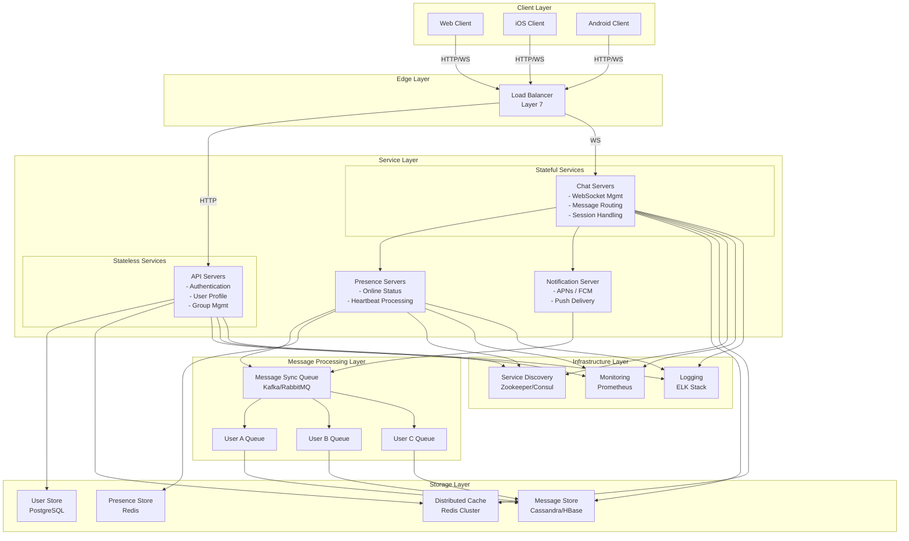
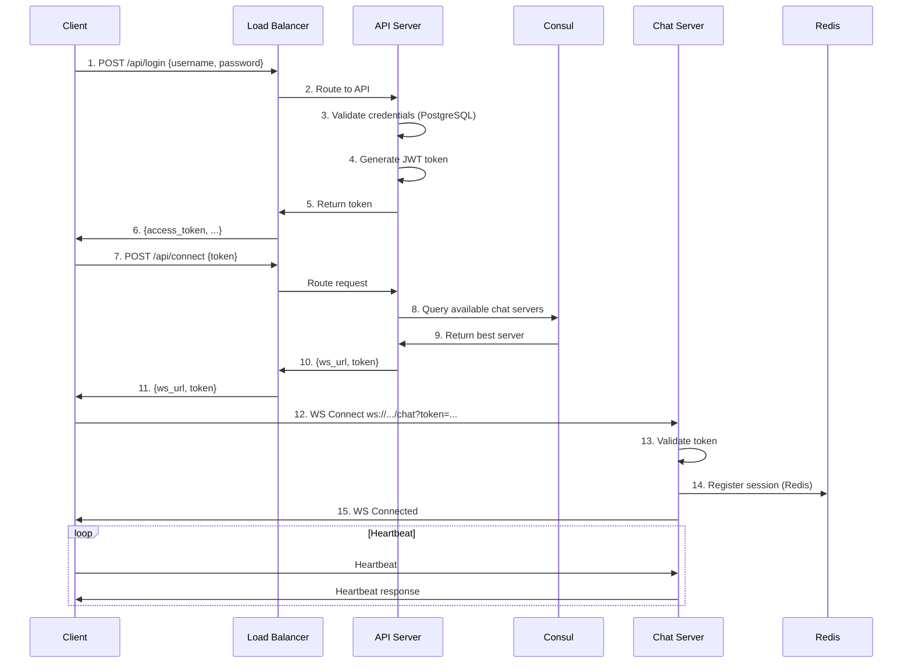
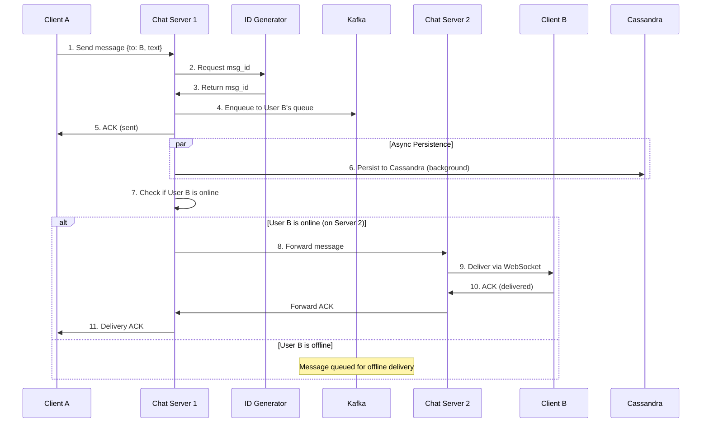
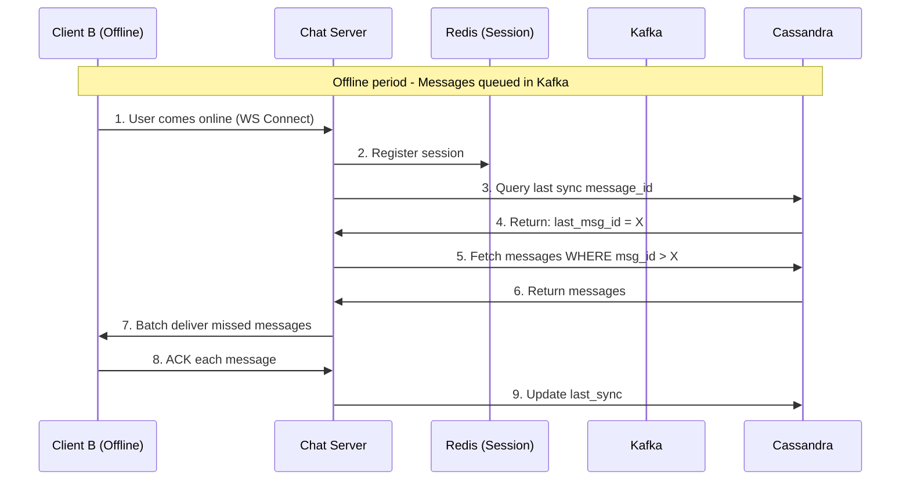

# UIM System Design (Extended/Ultimate Version)

**Document Version:** 1.0  
**Last Updated:** `2025-02-10`  
**Author:** `convexwf@gmail.com`  
**Status:** Design Review  
**Document Type:** Extended/Ultimate Implementation Plan

---

## ⚠️ Document Purpose & Scope

**This document describes an enterprise-grade, large-scale IM system design** suitable for:

- **Production systems** handling 50M+ DAU
- **Multi-region deployments** with high availability requirements
- **Interview preparation** and system design discussions
- **Future scaling** when the project grows beyond initial MVP

**For current development**, please refer to **v1.0**: [`v1.0/uim-system-design-v1.0.md`](./v1.0/uim-system-design-v1.0.md)

**Key Characteristics of This Design:**
- Microservices architecture with service separation
- Distributed systems (Cassandra, Kafka, Redis Cluster)
- Multi-region active-active deployment
- Enterprise-grade observability and monitoring
- 32-week development timeline

**When to Use This Document:**
- System design interviews
- Understanding large-scale IM architecture
- Planning for future expansion (when DAU > 100K)
- Learning distributed systems concepts

---

## Table of Contents

1. [Background & Goals](#1-background--goals)
2. [Requirements](#2-requirements)
3. [Terminology](#3-terminology)
4. [High-Level Architecture](#4-high-level-architecture)
5. [Core Components](#5-core-components)
6. [Key Flows](#6-key-flows)
7. [Data Model](#7-data-model)
8. [Reliability & Consistency](#8-reliability--consistency)
9. [Scalability](#9-scalability)
10. [Availability & Disaster Recovery](#10-availability--disaster-recovery)
11. [Security](#11-security)
12. [Observability](#12-observability)
13. [Milestones & Roadmap](#13-milestones--roadmap)
14. [Acceptance Criteria](#14-acceptance-criteria)
15. [Trade-offs & Risks](#15-trade-offs--risks)
16. [Future Work](#16-future-work)

---

## 1. Background & Goals

### 1.1 Background

Modern communication platforms require real-time, scalable, and reliable instant messaging capabilities. Organizations and individuals need a robust chat infrastructure that supports:

- **High-volume messaging**: Systems like WhatsApp and Facebook Messenger process 60+ billion messages daily
- **Real-time delivery**: Users expect sub-second message delivery latency
- **Multi-device synchronization**: Users access chat services from multiple devices simultaneously
- **Reliable message persistence**: Chat history must be stored indefinitely and remain accessible

Current landscape challenges include:

- Maintaining low-latency connections at scale
- Ensuring message delivery guarantees across unreliable networks
- Supporting both one-on-one and group conversations efficiently
- Providing consistent user experience across platforms

### 1.2 Design Goals

#### Functional Goals

- Support **one-on-one chat** with unlimited message history
- Support **group chat** with up to 100 participants per group
- Provide **online presence indicators** (online/offline/away status)
- Enable **multi-device synchronization** with consistent message ordering
- Support **offline message delivery** via push notifications
- Deliver **text messages** up to 100,000 characters
- Maintain **message delivery confirmations** (sent, delivered, read receipts)

#### Performance Goals

- **Message delivery latency**: < 200ms P99 for online users within the same region
- **Message delivery latency**: < 500ms P99 for cross-region delivery
- **WebSocket connection establishment**: < 1 second
- **Historical message retrieval**: < 100ms for recent messages (last 7 days)
- **Throughput**: Support 50 million daily active users (DAU)
- **Peak capacity**: Handle 1 million concurrent WebSocket connections per server cluster

#### Availability Goals
- **System uptime**: 99.95% availability (SLA target)
- **Message delivery success rate**: 99.99% for online users
- **Zero message loss**: All messages must be persisted durably
- **Graceful degradation**: System remains operational with reduced capacity during partial failures

#### Scalability Goals
- **Horizontal scaling**: Add capacity by adding more servers without architectural changes
- **Geographic distribution**: Support multi-region deployment for global user base
- **Storage scalability**: Efficiently store and retrieve billions of messages
- **Connection scalability**: Scale to support billions of daily messages

### 1.3 Non-Goals

The following are explicitly **out of scope** for the initial release:

- **End-to-end encryption**: Security layer will be addressed in Phase 2
- **Rich media support**: Images, videos, files (Phase 2 feature)
- **Voice and video calls**: Real-time communication beyond text
- **Message editing**: Ability to modify sent messages
- **Threaded conversations**: Nested reply structures
- **Bot integration and automation**: Third-party bot framework
- **Advanced search**: Full-text search across all messages
- **Message reactions and emoji support**: Beyond basic text
- **Custom themes and UI customization**: Client-side concerns

---

## 2. Requirements

### 2.1 Functional Requirements

#### Must Have (P0)

1. **User Authentication**
   - Users must authenticate before establishing connections
   - Support OAuth 2.0 and token-based authentication
   - Session management with automatic token refresh

2. **One-on-One Messaging**
   - Send text messages between two users
   - Receive messages in real-time when online
   - Store messages for offline delivery
   - Message size limit: 100,000 characters

3. **Group Messaging**
   - Create and manage group conversations
   - Support up to 100 participants per group
   - Deliver messages to all group members
   - Track group membership changes

4. **Online Presence**
   - Display user online/offline status to friends
   - Update presence status in real-time
   - Handle temporary disconnections gracefully

5. **Message History**
   - Store all messages permanently
   - Retrieve message history on demand
   - Synchronize messages across multiple devices
   - Maintain message ordering consistency

6. **Delivery Confirmation**
   - Track message states: sent, delivered, read
   - Update delivery status in real-time
   - Persist delivery status for reliability

7. **Push Notifications**
   - Send notifications for offline message delivery
   - Support iOS APNs and Android FCM
   - Include message preview and sender information

#### Should Have (P1)

1. **Message Search**: Search within recent conversations (last 30 days)
2. **Typing Indicators**: Show when users are composing messages
3. **User Blocking**: Prevent unwanted communication
4. **Read Receipts**: Optional read receipt privacy settings

#### Nice to Have (P2)

1. **Message Deletion**: Delete messages from conversation history
2. **User Profiles**: Rich user profile information
3. **Status Messages**: Custom status text and availability

### 2.2 Non-Functional Requirements

#### Performance Requirements

- **Latency**:
  - P50: < 100ms for message delivery
  - P95: < 200ms for message delivery
  - P99: < 500ms for message delivery
  - Message persistence: < 50ms
  
- **Throughput**:
  - 50 million DAU
  - Estimated 50 messages per user per day
  - Peak load: 2.5 billion messages/day
  - Peak QPS: ~30,000 messages/second (assuming peak is 2x average)

- **Connection Capacity**:
  - 5 million concurrent WebSocket connections per region
  - Average 10-20% of DAU online simultaneously

#### Reliability Requirements

- **Availability**: 99.95% uptime (< 4.38 hours downtime per year)
- **Durability**: 99.999999999% (11 nines) message durability
- **Message Delivery**: At-least-once delivery guarantee
- **Data Retention**: Indefinite storage of all messages
- **Disaster Recovery**: RPO < 1 second, RTO < 5 minutes

#### Scalability Requirements

- **Horizontal Scaling**: Auto-scale based on load metrics
- **Geographic Distribution**: Multi-region active-active deployment
- **Database Sharding**: Partition data across multiple database instances
- **Cache Layer**: Distributed caching for hot data

#### Security Requirements

- **Authentication**: OAuth 2.0 with JWT tokens
- **Authorization**: Role-based access control (RBAC)
- **Transport Security**: TLS 1.3 for all client-server communication
- **Data Protection**: Encryption at rest for stored messages
- **Rate Limiting**: Protect against abuse and DoS attacks
- **Audit Logging**: Comprehensive security event logging

#### Compliance Requirements

- **Data Privacy**: GDPR and CCPA compliance
- **Data Residency**: Support region-specific data storage
- **Audit Trail**: Immutable audit logs for security events
- **Data Retention**: Configurable retention policies

---

## 3. Terminology

| Term                     | Definition                                                                                                               |
| ------------------------ | ------------------------------------------------------------------------------------------------------------------------ |
| **User**                 | An authenticated entity that can send and receive messages. Each user has a unique user ID.                              |
| **Message**              | A text communication sent from one user to one or more recipients. Contains content, metadata, and delivery status.      |
| **Conversation**         | A messaging context between users. Can be one-on-one (2 participants) or group (3-100 participants).                     |
| **Channel**              | Same as conversation. Often used in the context of group messaging.                                                      |
| **Session**              | A persistent WebSocket connection between a client and chat server. Multiple sessions per user for multi-device support. |
| **Presence**             | The online/offline status of a user. Includes availability indicators (online, away, busy, offline).                     |
| **ACK (Acknowledgment)** | A confirmation message indicating receipt or processing of a message. Types: sent ACK, delivered ACK, read ACK.          |
| **Message ID**           | A globally unique, time-sortable identifier for each message. Used for ordering and deduplication.                       |
| **Sequence Number**      | A monotonically increasing number within a conversation, used for maintaining message order.                             |
| **Sync Queue**           | A per-user message queue that stores messages to be delivered when the user comes online.                                |
| **Heartbeat**            | A periodic ping sent by clients to maintain connection and indicate online status.                                       |
| **Fanout**               | The process of distributing a message to multiple recipients (used in group chat).                                       |
| **KV Store**             | Key-value data store optimized for high-throughput reads and writes (e.g., Cassandra, HBase).                            |
| **Chat Server**          | Stateful server that maintains WebSocket connections with clients.                                                       |
| **API Server**           | Stateless server handling HTTP REST API requests (login, signup, profile management).                                    |
| **Presence Server**      | Specialized server managing user online/offline status.                                                                  |
| **Service Discovery**    | Infrastructure component (e.g., Zookeeper, Consul) that routes clients to available chat servers.                        |
| **Load Balancer**        | Distributes incoming HTTP requests across API servers. Uses Layer 7 routing.                                             |
| **Push Notification**    | Mobile notification sent via APNs (iOS) or FCM (Android) for offline message delivery.                                   |
| **DAU**                  | Daily Active Users - unique users who interact with the system in a 24-hour period.                                      |
| **QPS**                  | Queries Per Second - measure of request throughput.                                                                      |
| **P50/P95/P99**          | Percentile latency metrics (50th, 95th, 99th percentile).                                                                |
| **RTO**                  | Recovery Time Objective - maximum acceptable downtime.                                                                   |
| **RPO**                  | Recovery Point Objective - maximum acceptable data loss.                                                                 |

---

## 4. High-Level Architecture

### 4.1 Architecture Overview

The UIM system follows a **distributed, microservices-oriented architecture** with clear separation between stateless and stateful components.

**Architecture Style**: 

- Hybrid microservices with domain-driven design principles
- Event-driven for asynchronous message processing
- Real-time WebSocket-based communication for chat
- RESTful HTTP for stateless operations

**System Layers**:

1. **Client Layer**: Web, iOS, Android applications
2. **Edge Layer**: Load balancers, CDN, API gateways
3. **Service Layer**
   - Stateless services (API servers)
   - Stateful services (Chat servers, Presence servers)
4. **Message Processing Layer**: Message queues, event streams
5. **Storage Layer**: Primary databases, caches, object storage
6. **Infrastructure Layer**: Service discovery, monitoring, logging

**Key Architectural Principles**:

- **Stateless API servers**: Enable horizontal scaling and simplified deployment
- **Stateful chat servers**: Maintain persistent WebSocket connections
- **Asynchronous processing**: Decouple message persistence from delivery
- **Data partitioning**: Shard by user ID and conversation ID
- **Geographic distribution**: Multi-region deployment for low latency

### 4.2 Architecture Diagram



### 4.3 Component Responsibilities

#### Client Layer

- **Responsibility**: User interface and WebSocket connection management
- **Technologies**: React (Web), Swift (iOS), Kotlin (Android)
- **Key Functions**: Render UI, maintain WebSocket connection, handle reconnection

#### Edge Layer

- **Load Balancer**: Route HTTP requests to API servers, health checks
- **Responsibilities**: SSL termination, DDoS protection, rate limiting

#### Stateless Services (API Servers)

- **Authentication Service**: OAuth 2.0, JWT token generation and validation
- **User Profile Service**: User information CRUD operations
- **Group Management Service**: Create, update, delete groups; manage membership
- **Service Discovery Client**: Query available chat servers for client connection

#### Stateful Services (Chat Servers)

- **WebSocket Management**: Maintain persistent connections with clients
- **Message Routing**: Route incoming messages to appropriate recipients
- **Session Management**: Track user sessions and device connections
- **Heartbeat Processing**: Monitor client health via periodic heartbeats

#### Presence Servers

- **Online Status**: Track and broadcast user online/offline status
- **Heartbeat Handler**: Process client heartbeats, update presence
- **Status Fanout**: Publish status changes to interested subscribers

#### Message Processing Layer

- **Message Sync Queue**: Per-user queues for message delivery
- **Event Processing**: Asynchronous message persistence and fanout
- **Delivery Orchestration**: Manage offline message storage and delivery

#### Storage Layer

- **Message Store (NoSQL)**: High-throughput message persistence (Cassandra/HBase)
- **User Store (SQL)**: User profiles, authentication, relationships (PostgreSQL)
- **Presence Store (In-Memory)**: Fast online status lookups (Redis)
- **Cache Layer**: Hot data caching, session storage (Redis Cluster)

#### Infrastructure Layer

- **Service Discovery**: Chat server registration and discovery (Zookeeper/Consul)
- **Monitoring**: Metrics collection and alerting (Prometheus/Grafana)
- **Logging**: Centralized log aggregation (ELK stack)

### 4.4 Technology Stack

| Component              | Technology Choices        | Rationale                                                               |
| ---------------------- | ------------------------- | ----------------------------------------------------------------------- |
| **Backend Language**   | Go                        | High performance, excellent concurrency support, efficient memory usage |
| **Web Framework**      | Gin                       | Lightweight, fast HTTP routing, middleware support                      |
| **WebSocket Library**  | Gorilla WebSocket         | Mature, RFC 6455 compliant, production-proven                           |
| **Message Queue**      | Apache Kafka              | High throughput, durable, excellent for event streaming                 |
| **Service Discovery**  | Consul                    | Service mesh capabilities, health checking, KV store                    |
| **Primary Database**   | PostgreSQL                | ACID compliance, rich feature set, excellent for relational data        |
| **Message Store**      | Apache Cassandra          | Linear scalability, high write throughput, tunable consistency          |
| **Cache**              | Redis Cluster             | In-memory performance, data structures, pub/sub support                 |
| **Load Balancer**      | NGINX                     | High performance, WebSocket support, reverse proxy                      |
| **Container Platform** | Kubernetes                | Container orchestration, auto-scaling, service discovery                |
| **Monitoring**         | Prometheus + Grafana      | Time-series metrics, flexible querying, rich visualization              |
| **Logging**            | ELK Stack                 | Centralized logging, full-text search, log analysis                     |
| **Tracing**            | Jaeger                    | Distributed tracing, performance analysis                               |
| **Push Notifications** | FCM (Android), APNs (iOS) | Official mobile notification services                                   |

---

## 5. Core Components

### 5.1 Connection Layer (Gateway / Chat Servers)

The connection layer is responsible for managing WebSocket connections and handling real-time bidirectional communication.

#### 5.1.1 Connection Management

**WebSocket Connection Lifecycle**

1. **Connection Establishment**:
   - Client initiates WebSocket handshake (HTTP Upgrade)
   - Server validates authentication token (JWT)
   - Server registers client session with session ID
   - Server subscribes to user's message sync queue

2. **Connection Maintenance**:
   - Bidirectional heartbeat every 30 seconds
   - Automatic reconnection with exponential backoff
   - Connection state tracking (connecting, connected, disconnecting, disconnected)

3. **Connection Termination**:
   - Graceful closure on user logout
   - Cleanup of session resources
   - Unsubscribe from message queues

**Key Design Decisions**

- **Single connection per device**: Each device maintains one WebSocket connection
- **Connection pooling**: Server maintains connection pool with configurable limits
- **Resource limits**: Max 10K connections per chat server instance
- **Memory per connection**: ~10KB overhead per WebSocket connection

#### 5.1.2 Protocol Design

**Message Frame Structure** (WebSocket Binary Frame):

```protobuf
message Frame {
  FrameType type = 1;           // Message type
  string request_id = 2;        // For request-response correlation
  int64 timestamp = 3;          // Client timestamp
  bytes payload = 4;            // Serialized message payload
  map<string, string> headers = 5; // Additional metadata
}

enum FrameType {
  HEARTBEAT_PING = 0;
  HEARTBEAT_PONG = 1;
  MESSAGE_SEND = 2;
  MESSAGE_RECEIVE = 3;
  MESSAGE_ACK = 4;
  PRESENCE_UPDATE = 5;
  TYPING_INDICATOR = 6;
  ERROR = 7;
}
```

**Message Payload** (For MESSAGE_SEND/RECEIVE):
```protobuf
message ChatMessage {
  string message_id = 1;        // Unique message identifier
  string conversation_id = 2;   // Target conversation
  string sender_id = 3;         // Sender user ID
  repeated string receiver_ids = 4; // Receiver user IDs (for groups)
  string content = 5;           // Message text content
  int64 timestamp = 6;          // Server-assigned timestamp
  MessageType type = 7;         // TEXT, IMAGE, etc. (future)
  map<string, string> metadata = 8; // Extensible metadata
}

enum MessageType {
  TEXT = 0;
  // Future: IMAGE, VIDEO, FILE, etc.
}
```

#### 5.1.3 Heartbeat & Keep-Alive

**Heartbeat Mechanism**:
- **Interval**: Client sends PING every 30 seconds
- **Timeout**: Server marks connection as stale after 60 seconds without PING
- **Reconnection**: Client auto-reconnects on connection loss

**Presence Inference**:
- User marked **online** while receiving regular heartbeats
- User marked **offline** after 60-second heartbeat timeout
- Presence state transitions debounced to avoid flapping

### 5.2 Messaging Layer

#### 5.2.1 Message Validation

**Input Validation**:
- Content length: 1 ≤ length ≤ 100,000 characters
- Conversation existence check
- Sender authorization (user is member of conversation)
- Rate limiting: Max 100 messages per minute per user
- Profanity and spam detection (basic filtering)

#### 5.2.2 Message Routing

**One-on-One Routing**:
```
Client A → Chat Server 1 → Message Sync Queue A
                         → Message Sync Queue B
                         → KV Store (persistence)
                         → Chat Server 2 → Client B (if online)
```

**Group Routing** (Fan-out pattern):
```
Client A → Chat Server → ID Generator (message_id)
                      → Message Sync Queue for each member
                      → KV Store (single write)
                      → Fan-out to online members
                      → Push Notification (offline members)
```

**Routing Strategy**:
- **Direct routing**: For online users connected to same server
- **Queue-based routing**: For users on different servers or offline
- **Batch delivery**: Group multiple messages in single network round-trip

#### 5.2.3 Message Delivery

**Delivery Guarantees**:
- **At-least-once delivery**: Messages may be delivered multiple times
- **Idempotency**: Clients must handle duplicate messages (dedupe by message_id)
- **Ordering**: Messages within conversation maintain causal order

**Delivery Acknowledgments**:
1. **Sent ACK**: Server confirms message received and persisted
2. **Delivered ACK**: Recipient's device confirms message received
3. **Read ACK**: User has read the message (optional, privacy-controlled)

**Retry Logic**:
- Exponential backoff: 1s, 2s, 4s, 8s, 16s, 30s (max)
- Max retry attempts: 10
- Dead letter queue: Messages failing after max retries

### 5.3 Session & Presence Management

#### 5.3.1 Session Tracking

**Session Data Structure**:
```go
type Session struct {
    SessionID     string
    UserID        string
    DeviceID      string
    ServerID      string
    ConnectedAt   time.Time
    LastHeartbeat time.Time
    ClientInfo    ClientInfo
}

type ClientInfo struct {
    Platform      string // "web", "ios", "android"
    AppVersion    string
    IPAddress     string
    UserAgent     string
}
```

**Session Storage**:
- **Primary**: Redis with TTL (90 seconds, refreshed on heartbeat)
- **Indexed by**: user_id → []session_id (support multiple devices)
- **Indexed by**: server_id → []session_id (for connection distribution)

#### 5.3.2 Online Presence

**Presence States**:
- `ONLINE`: User actively connected and sending heartbeats
- `AWAY`: Connected but idle > 5 minutes
- `OFFLINE`: No active connections

**Presence Update Flow**:
```
1. Client heartbeat → Chat Server
2. Chat Server → Presence Server (status update)
3. Presence Server → Redis (update presence cache)
4. Presence Server → Pub/Sub (notify subscribers)
5. Subscribers (friends) → Receive presence update
```

**Optimization - Presence Fanout**:
- **Small friend lists (< 500)**: Real-time fanout to all friends
- **Large friend lists (> 500)**: Lazy loading on friend list view
- **Group presence**: Fetch on-demand, cache for 30 seconds

### 5.4 Storage System

#### 5.4.1 Message Store (Cassandra)

**Schema Design**:
```cql
-- Partition by conversation_id for locality
CREATE TABLE messages (
    conversation_id text,
    message_id timeuuid,
    sender_id text,
    content text,
    timestamp timestamp,
    metadata map<text, text>,
    PRIMARY KEY (conversation_id, message_id)
) WITH CLUSTERING ORDER BY (message_id DESC);

-- Index for user's recent messages
CREATE TABLE user_messages_index (
    user_id text,
    conversation_id text,
    message_id timeuuid,
    snippet text,  -- First 100 chars for preview
    timestamp timestamp,
    PRIMARY KEY (user_id, timestamp, conversation_id)
) WITH CLUSTERING ORDER BY (timestamp DESC);
```

**Write Pattern**:
- **Single write** per message to primary table
- **Asynchronous indexing** to secondary tables
- **Batch writes** for group messages (single write, multiple indexes)

**Read Pattern**:
- **Recent messages**: Query by conversation_id with LIMIT
- **Pagination**: Use message_id as cursor for infinite scroll
- **User inbox**: Query user_messages_index for recent conversations

**Consistency Level**:
- **Write**: QUORUM (2 out of 3 replicas)
- **Read**: ONE (with read repair in background)

#### 5.4.2 User Store (PostgreSQL)

**Schema Design**:
```sql
-- Users table
CREATE TABLE users (
    user_id UUID PRIMARY KEY DEFAULT gen_random_uuid(),
    username VARCHAR(50) UNIQUE NOT NULL,
    email VARCHAR(255) UNIQUE NOT NULL,
    password_hash VARCHAR(255) NOT NULL,
    display_name VARCHAR(100),
    avatar_url TEXT,
    status VARCHAR(20) DEFAULT 'offline',
    last_seen_at TIMESTAMP,
    created_at TIMESTAMP DEFAULT NOW(),
    updated_at TIMESTAMP DEFAULT NOW(),
    INDEX idx_username (username),
    INDEX idx_email (email)
);

-- Conversations table
CREATE TABLE conversations (
    conversation_id UUID PRIMARY KEY DEFAULT gen_random_uuid(),
    type VARCHAR(20) NOT NULL, -- 'one_on_one' or 'group'
    name VARCHAR(255), -- For group chats
    created_by UUID REFERENCES users(user_id),
    created_at TIMESTAMP DEFAULT NOW(),
    updated_at TIMESTAMP DEFAULT NOW(),
    INDEX idx_type (type)
);

-- Conversation participants
CREATE TABLE conversation_participants (
    conversation_id UUID REFERENCES conversations(conversation_id),
    user_id UUID REFERENCES users(user_id),
    role VARCHAR(20) DEFAULT 'member', -- 'owner', 'admin', 'member'
    joined_at TIMESTAMP DEFAULT NOW(),
    last_read_message_id UUID,
    PRIMARY KEY (conversation_id, user_id),
    INDEX idx_user_id (user_id)
);

-- Friend relationships
CREATE TABLE friendships (
    user_id UUID REFERENCES users(user_id),
    friend_id UUID REFERENCES users(user_id),
    status VARCHAR(20) DEFAULT 'pending', -- 'pending', 'accepted', 'blocked'
    created_at TIMESTAMP DEFAULT NOW(),
    PRIMARY KEY (user_id, friend_id),
    INDEX idx_friend_id (friend_id)
);
```

**Sharding Strategy**:
- **Shard key**: user_id (consistent hashing)
- **Shard count**: 16 shards initially, expandable to 256
- **Cross-shard queries**: Use scatter-gather for user search

#### 5.4.3 Presence Store (Redis)

**Data Structures**:
```redis
# User presence status
HSET presence:user:{user_id} status "online" last_heartbeat {timestamp} server_id {server_id}
EXPIRE presence:user:{user_id} 90

# User's online friends (cached)
SADD presence:online_friends:{user_id} {friend_id1} {friend_id2} ...
EXPIRE presence:online_friends:{user_id} 60

# Server's connected users (for load balancing)
SADD presence:server:{server_id} {user_id1} {user_id2} ...
```

**Pub/Sub for Presence Updates**:
```redis
PUBLISH presence:updates '{"user_id": "123", "status": "online", "timestamp": 1234567890}'
```

### 5.5 Supporting Services

#### 5.5.1 Authentication & Authorization

**Authentication Flow**:
1. User login with username/password
2. API server validates credentials against user store
3. Generate JWT token with claims:
   - `user_id`: Unique user identifier
   - `exp`: Expiration time (24 hours)
   - `iat`: Issued at timestamp
   - `roles`: User roles (for RBAC)
4. Return access token and refresh token

**JWT Token Structure**:
```json
{
  "user_id": "550e8400-e29b-41d4-a716-446655440000",
  "username": "john_doe",
  "roles": ["user"],
  "iat": 1609459200,
  "exp": 1609545600
}
```

**Authorization Checks**:
- WebSocket connection: Validate JWT before upgrading connection
- Message send: Verify sender is participant in conversation
- Message read: Verify user is participant in conversation

#### 5.5.2 Rate Limiting & Abuse Prevention

**Rate Limiting Tiers**:
- **Per User**: 100 messages per minute, 1000 per hour
- **Per Connection**: 10 requests per second (for API calls)
- **Per IP**: 1000 requests per minute (DDoS protection)

**Implementation**:
- **Algorithm**: Token bucket with Redis
- **Enforcement**: Both at load balancer and application level
- **Response**: HTTP 429 (Too Many Requests) with Retry-After header

**Spam Detection**:
- Duplicate message detection (same content to multiple users)
- Suspicious pattern detection (ML-based, future enhancement)
- User reporting and blocking mechanisms

#### 5.5.3 Service Discovery

**Chat Server Registration**:
```
1. Chat server starts → Registers with Consul
2. Health check endpoint: /health (every 10 seconds)
3. Metadata: {region, capacity, current_connections}
4. Deregistration on graceful shutdown
```

**Client Connection Flow**:
```
1. Client → API server: POST /api/connect
2. API server → Consul: Query available chat servers
3. Consul returns: Best server based on location, load
4. API server → Client: {server: "ws://chat-server-2.example.com", token: "..."}
5. Client → Chat server: Establish WebSocket with token
```

---

## 6. Key Flows

### 6.1 User Authentication and Connection Flow



**Steps Explained**:
1-6: User authenticates and receives JWT access token
7-11: Client requests chat server connection information
12-15: Client establishes WebSocket connection with assigned chat server
16: Begin heartbeat exchange to maintain connection and presence

### 6.2 One-on-One Message Send Flow


     │<─────────────────┴─────────────────────┴───────┴────────────────────┘       │
     └───────────────────────────────────────────────────────────────────────────  │
```

**Key Points**:
- Message ID generated before persistence for ordering
- Message enqueued immediately for reliability
- Acknowledgments at multiple stages (sent, delivered, read)
- Asynchronous persistence doesn't block delivery
- Cross-server message delivery via message queue

### 6.3 Group Message Flow

```
┌─────────┐      ┌──────────────┐      ┌────────────────────────────┐      ┌─────────┐
│Client A │      │Chat Server   │      │     Message Queues         │      │Clients  │
│(Sender) │      │              │      │  (Fan-out to N members)    │      │(Members)│
└────┬────┘      └──────┬───────┘      └─────────┬──────────────────┘      └────┬────┘
     │                  │                         │                               │
     │ 1. Send to group │                         │                               │
     │ {group_id: G1}   │                         │                               │
     ├─────────────────>│                         │                               │
     │                  │ 2. Get group members    │                               │
     │                  │    [B, C, D, E]         │                               │
     │                  │                         │                               │
     │                  │ 3. Generate message_id  │                               │
     │                  │                         │                               │
     │                  │ 4. Fan-out to member queues                             │
     │                  ├────────────────────────>│                               │
     │                  │   Queue B │ Queue C │ Queue D │ Queue E                 │
     │                  │                         │                               │
     │ 5. ACK (sent)    │                         │                               │
     │<─────────────────┤                         │                               │
     │                  │                         │                               │
     │                  │ 6. Single write to Cassandra                            │
     │                  │    (1 message, N references)                            │
     │                  │                         │                               │
     │                  │                         │ 7. Deliver to online members  │
     │                  │                         ├──────────────────────────────>│
     │                  │                         │                               │
     │                  │                         │ 8. Push notification          │
     │                  │                         │    (offline members)          │
     │                  │                         │                               │
     └──────────────────┴─────────────────────────┴───────────────────────────────┘
```

**Optimization for Large Groups**:
- Single database write (efficiency)
- Parallel fan-out to member queues
- Batch delivery where possible
- Lazy loading for large member lists

### 6.4 Offline Message Sync Flow



**Sync Strategy**:
- Track `last_synced_message_id` per device
- Fetch all messages with `message_id > last_synced_message_id`
- Batch delivery to reduce network overhead
- Update sync cursor after successful delivery

### 6.5 Multi-Device Synchronization

```
Device A (Phone): last_sync_msg_id = 850
Device B (Laptop): last_sync_msg_id = 920

New message arrives: msg_id = 950

┌─────────────────────────────────────────────────────────────────┐
│  Message Sync Queue (Kafka Topic: user_123_messages)            │
│  ┌─────┐  ┌─────┐  ┌─────┐                    ┌─────┐          │
│  │ 850 │  │ 890 │  │ 920 │  ...               │ 950 │          │
│  └─────┘  └─────┘  └─────┘                    └─────┘          │
│     │         │        │                          │             │
│     └─────────┼────────┘                          │             │
│               │      (already synced to Laptop)   │             │
│               │                                   │             │
└───────────────┼───────────────────────────────────┼─────────────┘
                │                                   │
                │ Sync to Phone (850 < msg_id)     │ Sync to both
                ▼                                   ▼
         ┌─────────────┐                    ┌─────────────┐
         │ Device A    │                    │ Device B    │
         │ (Phone)     │                    │ (Laptop)    │
         │             │                    │             │
         │ Receives:   │                    │ Receives:   │
         │ - msg 890   │                    │ - msg 950   │
         │ - msg 920   │                    │             │
         │ - msg 950   │                    │             │
         └─────────────┘                    └─────────────┘
```

**Key Principles**:
- Each device tracks its own sync state independently
- Messages delivered based on device's `last_sync_msg_id`
- Consistent ordering across all devices
- Idempotent delivery (messages may arrive multiple times)

---

## 7. Data Model

### 7.1 Core Entities

#### 7.1.1 User Entity

```go
type User struct {
    UserID       UUID      `json:"user_id" db:"user_id"`
    Username     string    `json:"username" db:"username"`
    Email        string    `json:"email" db:"email"`
    PasswordHash string    `json:"-" db:"password_hash"`
    DisplayName  string    `json:"display_name" db:"display_name"`
    AvatarURL    string    `json:"avatar_url" db:"avatar_url"`
    Status       string    `json:"status" db:"status"` // online, offline, away
    LastSeenAt   time.Time `json:"last_seen_at" db:"last_seen_at"`
    CreatedAt    time.Time `json:"created_at" db:"created_at"`
    UpdatedAt    time.Time `json:"updated_at" db:"updated_at"`
}
```

**Attributes**:
- `UserID`: Primary key, UUID v4
- `Username`: Unique, 3-50 characters, alphanumeric + underscore
- `Email`: Unique, RFC 5322 compliant
- `PasswordHash`: bcrypt hash with cost factor 12
- `Status`: Cached from Redis, updated from presence server

#### 7.1.2 Conversation Entity

```go
type Conversation struct {
    ConversationID UUID             `json:"conversation_id" db:"conversation_id"`
    Type           ConversationType `json:"type" db:"type"`
    Name           string           `json:"name,omitempty" db:"name"`
    CreatedBy      UUID             `json:"created_by" db:"created_by"`
    CreatedAt      time.Time        `json:"created_at" db:"created_at"`
    UpdatedAt      time.Time        `json:"updated_at" db:"updated_at"`
    Participants   []Participant    `json:"participants" db:"-"`
}

type ConversationType string

const (
    ConversationTypeOneOnOne ConversationType = "one_on_one"
    ConversationTypeGroup    ConversationType = "group"
)

type Participant struct {
    UserID              UUID      `json:"user_id" db:"user_id"`
    Role                string    `json:"role" db:"role"` // owner, admin, member
    JoinedAt            time.Time `json:"joined_at" db:"joined_at"`
    LastReadMessageID   UUID      `json:"last_read_message_id" db:"last_read_message_id"`
}
```

**Conversation Rules**:
- One-on-one: Exactly 2 participants, no name required
- Group: 3-100 participants, name required
- Only one active one-on-one conversation per user pair

#### 7.1.3 Message Entity

```go
type Message struct {
    MessageID      UUID              `json:"message_id" db:"message_id"`
    ConversationID UUID              `json:"conversation_id" db:"conversation_id"`
    SenderID       UUID              `json:"sender_id" db:"sender_id"`
    Content        string            `json:"content" db:"content"`
    MessageType    MessageType       `json:"type" db:"type"`
    Timestamp      time.Time         `json:"timestamp" db:"timestamp"`
    Metadata       map[string]string `json:"metadata,omitempty" db:"metadata"`
    DeliveryStatus DeliveryStatus    `json:"delivery_status" db:"-"`
}

type MessageType string

const (
    MessageTypeText MessageType = "text"
    // Future: MessageTypeImage, MessageTypeVideo, etc.
)

type DeliveryStatus struct {
    Sent      time.Time            `json:"sent"`
    Delivered map[UUID]time.Time   `json:"delivered"` // user_id -> timestamp
    Read      map[UUID]time.Time   `json:"read"`      // user_id -> timestamp
}
```

**Message ID Generation**:
- Use Snowflake algorithm for globally unique, time-ordered IDs
- Structure: timestamp (41 bits) + machine_id (10 bits) + sequence (12 bits)
- Sortable by time without additional timestamp column

### 7.2 Data Relationships

```
┌──────────────────────────────────────────────────────────────────┐
│                      Entity Relationships                         │
└──────────────────────────────────────────────────────────────────┘

         1                           N
  ┌─────────┐         creates      ┌──────────────┐
  │  User   │─────────────────────>│ Conversation │
  └─────────┘                       └──────────────┘
       │                                   │
       │ N                                 │ N
       │ participates                      │ contains
       │                                   │
       │            N          N           │
       └───────>┌──────────────────┐<──────┘
                │conversation_     │
                │  participants    │
                └──────────────────┘
                                             1
                ┌──────────────┐              │
                │  Friendship  │              │ has
                └──────────────┘              │
                       │                      │
                       │ N                    │
                       │                      ▼
         1             │              ┌──────────────┐
  ┌─────────┐          │              │   Message    │
  │  User   │◀─────────┘              └──────────────┘
  └─────────┘                                │
       │                                     │ N
       │ 1                                   │
       │ sends                               │
       └─────────────────────────────────────┘
```

**Relationship Descriptions**:
1. **User ↔ Conversation**: Many-to-many via `conversation_participants`
2. **User → Conversation**: User creates conversations (one-to-many)
3. **Conversation → Message**: One conversation has many messages (one-to-many)
4. **User → Message**: User sends many messages (one-to-many)
5. **User ↔ User**: Friendship (many-to-many via `friendships`)

### 7.3 Message ID Design

**Snowflake ID Structure** (64-bit):
```
┌─────────────────────────────────────────────────────────────────┐
│ 0 │ 41 bits: Timestamp │ 10 bits: Machine ID │ 12 bits: Sequence│
└─────────────────────────────────────────────────────────────────┘
  ^          ^                    ^                      ^
  │          │                    │                      │
  │          │                    │                      └─ 4096 IDs/ms/machine
  │          │                    └─ 1024 machines
  │          └─ Milliseconds since epoch (69 years)
  └─ Sign bit (always 0)
```

**Advantages**:
- Time-ordered: Natural sorting by creation time
- Distributed: No central coordination needed
- High throughput: 4M IDs per second per machine
- Compact: 64-bit integer, efficient storage and indexing

**Implementation**:
```go
type IDGenerator struct {
    mu          sync.Mutex
    machineID   int64
    sequence    int64
    lastTime    int64
}

func (g *IDGenerator) NextID() int64 {
    g.mu.Lock()
    defer g.mu.Unlock()
    
    now := currentTimeMillis()
    if now == g.lastTime {
        g.sequence = (g.sequence + 1) & 4095 // 12-bit mask
        if g.sequence == 0 {
            // Sequence overflow, wait for next millisecond
            now = waitNextMillis(g.lastTime)
        }
    } else {
        g.sequence = 0
    }
    
    g.lastTime = now
    
    return ((now - epoch) << 22) | (g.machineID << 12) | g.sequence
}
```

### 7.4 Indexing Strategy

#### 7.4.1 PostgreSQL Indexes

```sql
-- User lookups
CREATE INDEX idx_users_username ON users(username);
CREATE INDEX idx_users_email ON users(email);
CREATE INDEX idx_users_status ON users(status) WHERE status = 'online';

-- Conversation queries
CREATE INDEX idx_conversations_type ON conversations(type);
CREATE INDEX idx_conversation_participants_user_id ON conversation_participants(user_id);
CREATE INDEX idx_conversation_participants_conv_id ON conversation_participants(conversation_id);

-- Composite index for user's conversations
CREATE INDEX idx_user_conversations ON conversation_participants(user_id, conversation_id);

-- Friendship lookups
CREATE INDEX idx_friendships_user_id ON friendships(user_id);
CREATE INDEX idx_friendships_friend_id ON friendships(friend_id);
CREATE INDEX idx_friendships_status ON friendships(status);
```

#### 7.4.2 Cassandra Indexes

```cql
-- Primary query: Recent messages in conversation
-- Already covered by PRIMARY KEY (conversation_id, message_id)

-- Secondary index: User's recent messages across all conversations
CREATE MATERIALIZED VIEW user_recent_messages AS
    SELECT user_id, conversation_id, message_id, timestamp, snippet
    FROM messages
    WHERE user_id IS NOT NULL AND conversation_id IS NOT NULL AND timestamp IS NOT NULL
    PRIMARY KEY (user_id, timestamp, conversation_id, message_id)
    WITH CLUSTERING ORDER BY (timestamp DESC);

-- For unread message counts
CREATE MATERIALIZED VIEW conversation_unread_counts AS
    SELECT conversation_id, user_id, COUNT(*) as unread_count
    FROM messages
    WHERE conversation_id IS NOT NULL AND user_id IS NOT NULL
    GROUP BY conversation_id, user_id
    PRIMARY KEY (user_id, conversation_id);
```

---

## 8. Reliability & Consistency

### 8.1 Message Delivery Semantics

**Delivery Guarantee**: **At-Least-Once**

The system guarantees that every message will be delivered at least once to each recipient. Messages may be delivered more than once due to retries, network partitions, or failover scenarios.

**Implications**:
- **Idempotency Required**: Clients must deduplicate messages using `message_id`
- **Message Ordering**: Preserved within a conversation using timestamp-ordered IDs
- **No Message Loss**: All messages are durably persisted before acknowledgment

#### 8.1.1 Deduplication Strategy

**Client-Side Deduplication**:
```go
type MessageDeduplicator struct {
    receivedMessages map[string]bool  // message_id -> received
    maxSize          int
    mu               sync.RWMutex
}

func (d *MessageDeduplicator) IsNewMessage(messageID string) bool {
    d.mu.RLock()
    defer d.mu.RUnlock()
    
    if d.receivedMessages[messageID] {
        return false  // Duplicate
    }
    
    d.mu.Lock()
    d.receivedMessages[messageID] = true
    if len(d.receivedMessages) > d.maxSize {
        // Evict oldest entries (LRU)
        d.evictOldest()
    }
    d.mu.Unlock()
    
    return true  // New message
}
```

**Server-Side Deduplication**:
- Store delivered message IDs in Redis with TTL (7 days)
- Check before adding to delivery queue
- Prevents duplicate queue entries

### 8.2 Message Ordering

**Within-Conversation Ordering**: **Guaranteed**

Messages within a single conversation are delivered in the order they were sent, based on server-assigned timestamps.

**Cross-Conversation Ordering**: **Not Guaranteed**

No ordering guarantees across different conversations (not required for chat semantics).

**Implementation**:
- **Message ID**: Timestamp-based Snowflake IDs ensure chronological ordering
- **Cassandra Clustering**: `CLUSTERING ORDER BY (message_id DESC)` maintains order
- **Client Sort**: Clients sort by `message_id` before rendering

### 8.3 Consistency Model

#### 8.3.1 Eventual Consistency

The system employs **eventual consistency** with bounded staleness:

**Message Visibility**:
- **Write**: Message committed to Cassandra with QUORUM (2/3 replicas)
- **Read**: Read from ONE replica, stale reads possible but bounded by replication lag
- **Convergence Time**: < 100ms typical, < 1 second worst case

**Presence Status**:
- **Updates**: Asynchronous propagation via Redis Pub/Sub
- **Staleness**: Friends may see stale status for up to 5 seconds
- **Acceptable**: Presence is inherently ephemeral, perfect consistency not required

#### 8.3.2 Strong Consistency Requirements

Certain operations require **strong consistency**:

1. **User Authentication**: 
   - Read from PostgreSQL primary (linearizable reads)
   - Prevents authentication bypass attacks

2. **Conversation Membership**:
   - Synchronous validation before message delivery
   - Prevents unauthorized access to conversations

3. **Account Balance** (future billing):
   - Transactional updates with ACID guarantees
   - Prevents overspending or negative balances

### 8.4 Failure Handling

#### 8.4.1 Message Send Failures

```
Client → Chat Server (fail) → Retry with exponential backoff
                             → Max 10 retries
                             → DLQ for manual review
```

**Retry Policy**:
- Initial delay: 100ms
- Backoff multiplier: 2
- Max delay: 30 seconds
- Max attempts: 10

**Dead Letter Queue**:
- Messages failing after max retries → Kafka DLQ topic
- Alert on DLQ messages
- Manual investigation and replay

#### 8.4.2 Network Partitions

**Scenario**: Chat server loses connection to Cassandra

**Behavior**:
1. Message persists to Kafka message queue (durable)
2. Client receives "SENT" acknowledgment (queued, not persisted)
3. Background worker retries Cassandra write
4. Client receives "DELIVERED" acknowledgment when persisted

**Split-Brain Prevention**:
- Cassandra: Use QUORUM consistency level
- Chat server: Register with Consul using distributed locks
- Prevent multiple servers claiming same user sessions

#### 8.4.3 Chat Server Failures

**Scenario**: Chat server crashes with 10K active connections

**Recovery**:
1. Consul detects failed health check (10 seconds)
2. Clients detect connection loss (heartbeat timeout: 60 seconds)
3. Clients request new server via API (POST /api/connect)
4. Clients reconnect to new server
5. Clients sync missed messages (fetch messages > last_synced_id)

**Graceful Shutdown**:
- Deregister from Consul (stop accepting new connections)
- Allow existing connections to drain (30 second timeout)
- Close all connections with close code 1001 (going away)
- Clients automatically reconnect

---

## 9. Scalability

### 9.1 Horizontal Scaling Strategy

#### 9.1.1 Stateless Services (API Servers)

**Scaling Approach**: Add more instances behind load balancer

**Capacity Planning**:
- Each API server: ~10K RPS (typical CRUD operations)
- 50M DAU, assume 10 API calls per user per day
- Total daily API calls: 500M
- Peak QPS: 10K (assuming 2x average during peak hours)
- Required servers: 10K / 10K = **1 server minimum, 3-5 for redundancy**

**Auto-Scaling Policy**:
```yaml
minReplicas: 3
maxReplicas: 20
metrics:
  - type: Resource
    resource:
      name: cpu
      target:
        type: Utilization
        averageUtilization: 70
  - type: Resource
    resource:
      name: memory
      target:
        type: Utilization
        averageUtilization: 80
```

#### 9.1.2 Stateful Services (Chat Servers)

**Scaling Approach**: Connection draining and session migration

**Capacity Planning**:
- Each chat server: ~10K concurrent WebSocket connections
- 50M DAU, assume 20% online simultaneously = 10M concurrent users
- Multi-device: 1.2x multiplier = 12M connections
- Required servers: 12M / 10K = **1,200 chat servers**

**Connection Distribution**:
- Use consistent hashing based on `user_id`
- Ensures same user connects to same server (session affinity)
- Simplifies multi-device handling (all devices on same server)

**Scaling Procedure**:
1. Deploy new chat server instances
2. Register with Consul (marked as "draining" initially)
3. Gradually route new connections to new servers
4. Old servers reject new connections but maintain existing
5. Existing connections naturally churn over time (reconnects go to new servers)

#### 9.1.3 Database Scaling

**PostgreSQL (User Store)**:
- **Read Replicas**: 5 read replicas per primary
- **Sharding**: Shard by `user_id` (consistent hashing, 16 shards)
- **Connection Pooling**: PgBouncer with 500 max connections per shard

**Cassandra (Message Store)**:
- **Replication Factor**: 3 (across 3 availability zones)
- **Partitioning**: Natural partitioning by `conversation_id`
- **Capacity**: 3-node cluster per 1TB data
- **Scaling**: Add nodes, Cassandra auto-rebalances

**Redis (Presence & Cache)**:
- **Redis Cluster**: 6-node cluster (3 primary, 3 replica)
- **Sharding**: Automatic key-based sharding (16,384 hash slots)
- **Capacity**: 100GB memory per node, 600GB total

### 9.2 Stateless Design Principles

**API Servers**:
- No local state (session data in Redis)
- No in-memory caching (use distributed cache)
- Can be killed and restarted without data loss

**Benefits**:
- Easy horizontal scaling (add/remove instances)
- Rolling updates without downtime
- Cloud-native (Kubernetes-friendly)

### 9.3 Sharding Strategy

#### 9.3.1 User Data Sharding

**Shard Key**: `hash(user_id) % num_shards`

**Shard Count**: 16 (initial), expandable to 256

**Shard Distribution**:
```
Shard 0:  user_ids with hash % 16 == 0
Shard 1:  user_ids with hash % 16 == 1
...
Shard 15: user_ids with hash % 16 == 15
```

**Resharding**:
- Use consistent hashing to minimize data movement
- Online resharding: Dual writes to old and new shards during migration
- Gradual cutover: Route reads to new shards as data migrates

#### 9.3.2 Message Data Partitioning

**Partition Key**: `conversation_id`

**Cassandra Partitioning**:
- Automatic partitioning by PRIMARY KEY
- Conversation's messages co-located on same nodes
- Efficient range queries (last N messages)

**Hot Partition Mitigation**:
- Very active conversations (> 1M messages) split into time buckets
- Schema: `(conversation_id, time_bucket, message_id)`
- Time bucket: YYYYMM (e.g., 202601 for January 2026)

### 9.4 Caching Strategy

#### 9.4.1 Cache Layers

**L1 Cache (Local In-Memory)**:
- User profile data (5-minute TTL)
- Frequently accessed conversation metadata (10-minute TTL)
- Small footprint (~100MB per server)

**L2 Cache (Distributed Redis)**:
- User sessions (90-second TTL, refreshed on heartbeat)
- Online presence status (60-second TTL)
- Recent message snippets (5-minute TTL)
- Conversation participant lists (1-hour TTL)

#### 9.4.2 Cache Invalidation

**Strategies**:
1. **TTL-based**: Automatic expiration for most data
2. **Event-driven**: Invalidate on data mutation (user profile update)
3. **Write-through**: Update cache on write to maintain consistency

**Example - Profile Update**:
```go
func UpdateUserProfile(userID string, profile Profile) error {
    // 1. Update database
    err := db.UpdateUser(userID, profile)
    if err != nil {
        return err
    }
    
    // 2. Invalidate cache
    cache.Delete("user:" + userID)
    
    // 3. Publish invalidation event
    pubsub.Publish("cache_invalidation", CacheInvalidationEvent{
        Type: "user",
        ID:   userID,
    })
    
    return nil
}
```

### 9.5 Load Balancing

#### 9.5.1 API Server Load Balancing

**Algorithm**: Round-robin with health checks

**NGINX Configuration**:
```nginx
upstream api_servers {
    least_conn;  # Route to server with fewest connections
    server api-1.example.com:8080 max_fails=3 fail_timeout=30s;
    server api-2.example.com:8080 max_fails=3 fail_timeout=30s;
    server api-3.example.com:8080 max_fails=3 fail_timeout=30s;
}

server {
    listen 443 ssl http2;
    
    location /api/ {
        proxy_pass http://api_servers;
        proxy_next_upstream error timeout http_500 http_502 http_503;
    }
}
```

#### 9.5.2 Chat Server Selection

**Algorithm**: Least-loaded server in user's region

**Service Discovery Query**:
```go
func GetBestChatServer(region string) (string, error) {
    // Query Consul for healthy chat servers in region
    servers, err := consul.GetHealthyServers("chat-server", region)
    if err != nil {
        return "", err
    }
    
    // Select server with lowest connection count
    bestServer := servers[0]
    for _, server := range servers {
        if server.ConnectionCount < bestServer.ConnectionCount {
            bestServer = server
        }
    }
    
    return bestServer.Address, nil
}
```

---

## 10. Availability & Disaster Recovery

### 10.1 Fault Tolerance

#### 10.1.1 Failure Modes

| Component              | Failure Mode | Detection Time                 | Recovery Time                  | Impact                                         |
| ---------------------- | ------------ | ------------------------------ | ------------------------------ | ---------------------------------------------- |
| **API Server**         | Crash        | 10 seconds (health check)      | Immediate                      | None (load balancer routes to healthy servers) |
| **Chat Server**        | Crash        | 60 seconds (heartbeat timeout) | 1-5 seconds (client reconnect) | Temporary disconnection for connected users    |
| **PostgreSQL Primary** | Crash        | 5 seconds (replication lag)    | 30 seconds (failover)          | Read-only mode, no writes                      |
| **Cassandra Node**     | Crash        | 10 seconds (gossip protocol)   | N/A (auto-healing)             | None (RF=3, reads continue from replicas)      |
| **Redis Node**         | Crash        | 1 second (Sentinel)            | 10 seconds (failover)          | Cache miss, read from database                 |
| **Kafka Broker**       | Crash        | 5 seconds (Zookeeper)          | N/A (replicas take over)       | None (RF=3, partition replicas available)      |
| **Load Balancer**      | Crash        | 5 seconds (BGP convergence)    | 5 seconds                      | None (DNS failover to standby)                 |

#### 10.1.2 High Availability Architecture

**Multi-AZ Deployment** (within region):
```
Region: us-west-2

AZ-1 (us-west-2a):
  - API Servers: 3 instances
  - Chat Servers: 400 instances
  - PostgreSQL: Primary
  - Cassandra: Nodes 1, 4, 7
  - Redis: Master 1, Master 2, Master 3

AZ-2 (us-west-2b):
  - API Servers: 3 instances
  - Chat Servers: 400 instances
  - PostgreSQL: Replica 1
  - Cassandra: Nodes 2, 5, 8
  - Redis: Replica 1, Replica 2, Replica 3

AZ-3 (us-west-2c):
  - API Servers: 3 instances
  - Chat Servers: 400 instances
  - PostgreSQL: Replica 2
  - Cassandra: Nodes 3, 6, 9
  - Redis: Sentinel nodes (quorum-based failover)
```

**Benefits**:
- Survive single AZ failure
- No single point of failure
- Automatic failover for stateful services

### 10.2 Disaster Recovery

#### 10.2.1 Backup Strategy

**PostgreSQL**:
- **Continuous Archiving**: WAL (Write-Ahead Log) shipped to S3 every 5 minutes
- **Full Backup**: Daily at 02:00 UTC, retained for 30 days
- **Point-in-Time Recovery**: Restore to any point within last 30 days

**Cassandra**:
- **Snapshot**: Daily snapshots to S3, retained for 7 days
- **Incremental Backup**: SSTables uploaded to S3 continuously
- **Cross-Region Replication**: Asynchronous replication to DR region

**Redis**:
- **RDB Snapshot**: Hourly snapshots to S3
- **AOF (Append-Only File)**: Real-time append log for durability
- **Rebuilding**: Presence data can be rebuilt from session data (ephemeral)

#### 10.2.2 RPO and RTO Targets

| Data Type     | RPO (Data Loss)        | RTO (Downtime) | Strategy                                 |
| ------------- | ---------------------- | -------------- | ---------------------------------------- |
| **Messages**  | 0 (no loss)            | < 5 minutes    | Kafka durability + Cassandra replication |
| **User Data** | < 5 minutes            | < 30 seconds   | PostgreSQL WAL + standby promotion       |
| **Presence**  | Acceptable (ephemeral) | < 1 minute     | Redis rebuild from sessions              |
| **Sessions**  | < 1 minute             | < 1 minute     | Redis AOF + reconnection                 |

#### 10.2.3 Disaster Recovery Procedures

**Scenario: Region-Wide Failure**

**Pre-requisites**:
- Active-passive DR region (e.g., us-east-1 as DR for us-west-2)
- Asynchronous data replication to DR region
- DNS with 60-second TTL for fast failover

**Failover Procedure** (estimated 15-30 minutes):

1. **Detection** (0-5 min):
   - Monitoring alerts on region-wide failure
   - Incident commander declares disaster
   - Activate DR runbook

2. **Data Validation** (5-10 min):
   - Verify DR region data freshness (replication lag)
   - Check backup integrity
   - Assess data loss scope

3. **Service Activation** (10-20 min):
   - Promote PostgreSQL replica to primary in DR region
   - Update Cassandra replication to prioritize DR region
   - Scale up compute resources in DR region (chat/API servers)

4. **Traffic Cutover** (20-25 min):
   - Update DNS records to point to DR region load balancers
   - Update mobile clients via push notification (optional)
   - Monitor error rates and latency

5. **Validation** (25-30 min):
   - Verify end-to-end functionality
   - Check message delivery pipelines
   - Confirm user authentication and authorization

6. **Communication**:
   - Post incident update on status page
   - Notify users of temporary service disruption

**Failback Procedure** (after primary region recovered):
- Perform controlled failback during low-traffic window
- Replicate data changes from DR to primary
- Reverse DNS cutover

### 10.3 Monitoring & Alerting

#### 10.3.1 Key Metrics

**Golden Signals**:
1. **Latency**:
   - Message delivery latency P50/P95/P99
   - API response time
   - WebSocket connection establishment time

2. **Traffic**:
   - Messages per second
   - API requests per second
   - Concurrent WebSocket connections

3. **Errors**:
   - Message delivery failure rate
   - API error rate (4xx, 5xx)
   - WebSocket connection failures

4. **Saturation**:
   - CPU utilization per server
   - Memory utilization
   - Database connection pool usage
   - Kafka consumer lag

**Service-Level Indicators (SLIs)**:
```
Message Delivery Success Rate = 
    (Successfully Delivered Messages / Total Messages Sent) * 100
    
Target: ≥ 99.99%

API Availability = 
    (Successful API Requests / Total API Requests) * 100
    
Target: ≥ 99.95%

Message Delivery Latency (P99) ≤ 500ms
Target: 95% of time windows meet target
```

#### 10.3.2 Alerting Rules

**Critical Alerts** (Page on-call engineer):
- API availability < 99.9% (5-minute window)
- Message delivery success rate < 99.9% (5-minute window)
- Database primary down
- > 50% of chat servers unhealthy

**Warning Alerts** (Slack notification):
- Message delivery latency P99 > 1 second (5-minute window)
- CPU utilization > 80% (sustained 10 minutes)
- Memory utilization > 85%
- Kafka consumer lag > 100K messages

**Alerting Configuration (Prometheus)**:
```yaml
groups:
  - name: chat_system_alerts
    rules:
      - alert: HighMessageDeliveryLatency
        expr: histogram_quantile(0.99, message_delivery_latency_seconds) > 0.5
        for: 5m
        labels:
          severity: warning
        annotations:
          summary: "High message delivery latency (P99 > 500ms)"
          description: "Message delivery P99 latency is {{ $value }}s"
      
      - alert: MessageDeliveryFailureRate
        expr: (rate(messages_failed_total[5m]) / rate(messages_sent_total[5m])) > 0.001
        for: 5m
        labels:
          severity: critical
        annotations:
          summary: "High message delivery failure rate"
          description: "Failure rate is {{ $value | humanizePercentage }}"
```

---

## 11. Security

### 11.1 Authentication & Authorization

#### 11.1.1 Authentication Flow

**OAuth 2.0 + JWT** for secure, stateless authentication:

```
┌────────┐                  ┌─────────────┐              ┌──────────────┐
│ Client │                  │ Auth Server │              │ User Store   │
└───┬────┘                  └──────┬──────┘              └───────┬──────┘
    │                              │                             │
    │ 1. POST /auth/login          │                             │
    │    {username, password}      │                             │
    ├─────────────────────────────>│                             │
    │                              │ 2. Verify credentials        │
    │                              ├────────────────────────────>│
    │                              │                             │
    │                              │ 3. Return user data         │
    │                              │<────────────────────────────┤
    │                              │                             │
    │                              │ 4. Generate JWT (access +   │
    │                              │    refresh tokens)          │
    │                              │                             │
    │ 5. Return tokens             │                             │
    │<─────────────────────────────┤                             │
    │                              │                             │
    │ 6. Subsequent requests       │                             │
    │    with Authorization:       │                             │
    │    Bearer <access_token>     │                             │
    ├─────────────────────────────>│                             │
    │                              │ 7. Validate JWT signature   │
    │                              │    and expiration           │
    │                              │                             │
    │ 8. Request processed         │                             │
    │<─────────────────────────────┤                             │
    └──────────────────────────────┴─────────────────────────────┘
```

**JWT Token Structure**:
```json
{
  "header": {
    "alg": "RS256",
    "typ": "JWT"
  },
  "payload": {
    "sub": "550e8400-e29b-41d4-a716-446655440000",
    "username": "john_doe",
    "roles": ["user"],
    "iat": 1704499200,
    "exp": 1704585600,
    "jti": "unique-token-id"
  },
  "signature": "..."
}
```

**Token Specifications**:
- **Access Token**: Short-lived (15 minutes), used for API requests
- **Refresh Token**: Long-lived (7 days), used to obtain new access tokens
- **Algorithm**: RS256 (RSA with SHA-256)
- **Key Rotation**: Keys rotated every 90 days

**Refresh Token Flow**:
```
Client → POST /auth/refresh {refresh_token}
       → Auth Server validates refresh token
       → Return new access_token and refresh_token
```

#### 11.1.2 Authorization Model

**Role-Based Access Control (RBAC)**:

```go
type Permission string

const (
    PermissionReadMessage   Permission = "message:read"
    PermissionWriteMessage  Permission = "message:write"
    PermissionManageGroup   Permission = "group:manage"
    PermissionBlockUser     Permission = "user:block"
)

type Role struct {
    Name        string
    Permissions []Permission
}

var Roles = map[string]Role{
    "user": {
        Name: "user",
        Permissions: []Permission{
            PermissionReadMessage,
            PermissionWriteMessage,
        },
    },
    "group_admin": {
        Name: "group_admin",
        Permissions: []Permission{
            PermissionReadMessage,
            PermissionWriteMessage,
            PermissionManageGroup,
        },
    },
}
```

**Authorization Checks**:
```go
func AuthorizeMessageSend(ctx context.Context, userID, conversationID string) error {
    // 1. Extract user from JWT
    user := ctx.Value("user").(User)
    
    // 2. Check if user is participant in conversation
    isParticipant, err := db.IsParticipant(conversationID, userID)
    if err != nil {
        return err
    }
    if !isParticipant {
        return ErrUnauthorized
    }
    
    // 3. Check message:write permission
    if !user.HasPermission(PermissionWriteMessage) {
        return ErrForbidden
    }
    
    return nil
}
```

### 11.2 Transport Security

#### 11.2.1 TLS Configuration

**All client-server communication encrypted with TLS 1.3**:

```nginx
server {
    listen 443 ssl http2;
    server_name api.uim.example.com;
    
    # TLS configuration
    ssl_certificate /etc/nginx/ssl/cert.pem;
    ssl_certificate_key /etc/nginx/ssl/key.pem;
    ssl_protocols TLSv1.3;
    ssl_prefer_server_ciphers on;
    ssl_ciphers 'ECDHE-ECDSA-AES256-GCM-SHA384:ECDHE-RSA-AES256-GCM-SHA384';
    
    # Security headers
    add_header Strict-Transport-Security "max-age=31536000; includeSubDomains" always;
    add_header X-Frame-Options "DENY" always;
    add_header X-Content-Type-Options "nosniff" always;
    add_header X-XSS-Protection "1; mode=block" always;
    
    location / {
        proxy_pass http://api_servers;
    }
}
```

**Certificate Management**:
- Automated certificate issuance via Let's Encrypt (ACME protocol)
- Certificate renewal 30 days before expiration
- Certificate pinning on mobile clients (optional, for high security)

#### 11.2.2 WebSocket Security

**Secure WebSocket (WSS)**:
```
wss://chat.uim.example.com/v1/chat?token=<jwt_token>
```

**Connection Security**:
1. **TLS Encryption**: All WebSocket traffic encrypted with TLS 1.3
2. **Token Authentication**: JWT token required in connection URL or header
3. **Origin Validation**: Verify `Origin` header to prevent CSRF
4. **Rate Limiting**: Limit connection attempts per IP (10 per minute)

### 11.3 Data Protection

#### 11.3.1 Encryption at Rest

**Database Encryption**:
- **PostgreSQL**: Transparent Data Encryption (TDE) with AES-256
- **Cassandra**: Encryption at rest with encryption keys managed by KMS
- **Backup Encryption**: All backups encrypted with AES-256 before upload to S3

**Key Management**:
- **AWS KMS**: Centralized key management
- **Key Rotation**: Automatic rotation every 90 days
- **Envelope Encryption**: Data keys encrypted with master keys

#### 11.3.2 Sensitive Data Handling

**Password Storage**:

```go
func HashPassword(password string) (string, error) {
    // Use bcrypt with cost factor 12
    hash, err := bcrypt.GenerateFromPassword([]byte(password), 12)
    if err != nil {
        return "", err
    }
    return string(hash), nil
}
```

**PII Data Protection**:
- Email addresses hashed for search indexes
- Phone numbers (if supported) tokenized
- User profiles anonymized in analytics

### 11.4 Rate Limiting & DDoS Protection

#### 11.4.1 Rate Limiting Tiers

**Implementation using Token Bucket Algorithm**:

```go
type RateLimiter struct {
    redis  *redis.Client
    limits map[string]Limit
}

type Limit struct {
    RequestsPerMinute int
    BurstSize         int
}

func (r *RateLimiter) Allow(userID string, action string) (bool, error) {
    limit := r.limits[action]
    key := fmt.Sprintf("ratelimit:%s:%s", action, userID)
    
    // Use Redis for distributed rate limiting
    current, err := r.redis.Incr(ctx, key).Result()
    if err != nil {
        return false, err
    }
    
    // Set expiration on first request
    if current == 1 {
        r.redis.Expire(ctx, key, time.Minute)
    }
    
    return current <= int64(limit.RequestsPerMinute), nil
}
```

**Rate Limits**:
| Action                 | Limit | Window    |
| ---------------------- | ----- | --------- |
| Message Send           | 100   | 1 minute  |
| API Request            | 1000  | 1 minute  |
| Authentication Attempt | 5     | 5 minutes |
| WebSocket Connection   | 10    | 1 minute  |
| Group Creation         | 10    | 1 hour    |

#### 11.4.2 DDoS Mitigation

**Multi-Layer Defense**:

1. **Network Layer (L3/L4)**:
   - AWS Shield Standard (included with AWS)
   - Rate limiting at firewall level
   - Blackhole routing for identified attack sources

2. **Application Layer (L7)**:
   - NGINX rate limiting by IP
   - CAPTCHA challenge for suspicious patterns
   - Cloudflare or Akamai for additional DDoS protection (optional)

3. **Application Logic**:
   - Request validation (reject malformed requests early)
   - Input sanitization (prevent injection attacks)
   - Complexity limits (max message size, max group size)

### 11.5 Audit Logging

**Security Events Logged**:
- User authentication (login, logout, failed attempts)
- Authorization failures
- Sensitive data access (admin viewing user data)
- Configuration changes
- Security policy violations

**Audit Log Format**:
```json
{
  "timestamp": "2026-01-05T12:34:56Z",
  "event_type": "authentication",
  "event_action": "login_success",
  "user_id": "550e8400-e29b-41d4-a716-446655440000",
  "ip_address": "203.0.113.42",
  "user_agent": "UIM-iOS/1.0.0",
  "metadata": {
    "location": "San Francisco, CA",
    "device_id": "device-123"
  }
}
```

**Audit Log Storage**:
- Immutable append-only log stored in S3
- Indexed in Elasticsearch for search and analysis
- Retained for 1 year (compliance requirement)

---

## 12. Observability

### 12.1 Logging

#### 12.1.1 Structured Logging

**Log Levels**:
- **DEBUG**: Detailed diagnostic information
- **INFO**: General informational messages
- **WARN**: Warning messages, potential issues
- **ERROR**: Error events, recoverable failures
- **FATAL**: Fatal errors, application crash

**Log Format (JSON)**:
```json
{
  "timestamp": "2026-01-05T12:34:56.789Z",
  "level": "INFO",
  "service": "chat-server",
  "instance_id": "chat-server-3",
  "trace_id": "abc123",
  "span_id": "def456",
  "message": "Message delivered successfully",
  "context": {
    "user_id": "550e8400-e29b-41d4-a716-446655440000",
    "message_id": "718281828459045",
    "conversation_id": "conv-123",
    "latency_ms": 42
  }
}
```

#### 12.1.2 Log Aggregation

**ELK Stack (Elasticsearch, Logstash, Kibana)**:
```
Application Logs → Filebeat → Logstash → Elasticsearch → Kibana
```

**Log Retention**:
- **Hot**: Last 7 days in Elasticsearch (fast search)
- **Warm**: 8-30 days in S3 (compressed, searchable via Athena)
- **Cold**: 31-365 days in S3 Glacier (archival)

### 12.2 Metrics

#### 12.2.1 Application Metrics

**Prometheus Metrics**:

```go
// Message delivery metrics
var (
    messagesSent = prometheus.NewCounterVec(
        prometheus.CounterOpts{
            Name: "messages_sent_total",
            Help: "Total number of messages sent",
        },
        []string{"conversation_type"}, // one_on_one, group
    )
    
    messageDeliveryLatency = prometheus.NewHistogramVec(
        prometheus.HistogramOpts{
            Name:    "message_delivery_latency_seconds",
            Help:    "Message delivery latency in seconds",
            Buckets: []float64{0.01, 0.05, 0.1, 0.2, 0.5, 1.0, 2.0, 5.0},
        },
        []string{"status"}, // success, failure
    )
    
    activeConnections = prometheus.NewGauge(
        prometheus.GaugeOpts{
            Name: "active_websocket_connections",
            Help: "Current number of active WebSocket connections",
        },
    )
)

// Record message sent
messagesSent.WithLabelValues("one_on_one").Inc()

// Record delivery latency
start := time.Now()
// ... deliver message ...
duration := time.Since(start).Seconds()
messageDeliveryLatency.WithLabelValues("success").Observe(duration)

// Update connection count
activeConnections.Set(float64(connectionCount))
```

**Infrastructure Metrics**:
- CPU, memory, disk utilization (node-exporter)
- Network traffic (interface metrics)
- Database query performance (PostgreSQL exporter, Cassandra exporter)

#### 12.2.2 Dashboards

**Grafana Dashboards**:

1. **System Overview Dashboard**:
   - Messages sent/received per second
   - Active connections
   - API request rate
   - Error rates

2. **Performance Dashboard**:
   - Message delivery latency (P50, P95, P99)
   - API response time
   - Database query latency
   - Cache hit rate

3. **Capacity Dashboard**:
   - Server CPU/memory utilization
   - Database connection pool usage
   - Kafka consumer lag
   - Redis memory usage

4. **Business Metrics Dashboard**:
   - Daily active users (DAU)
   - Messages per user per day
   - Average conversation size
   - New user registrations

### 12.3 Distributed Tracing

#### 12.3.1 Trace Context Propagation

**Using OpenTelemetry + Jaeger**:

```go
import (
    "go.opentelemetry.io/otel"
    "go.opentelemetry.io/otel/trace"
)

func HandleMessageSend(ctx context.Context, msg Message) error {
    tracer := otel.Tracer("chat-server")
    ctx, span := tracer.Start(ctx, "HandleMessageSend")
    defer span.End()
    
    // Add attributes
    span.SetAttributes(
        attribute.String("user_id", msg.SenderID),
        attribute.String("conversation_id", msg.ConversationID),
    )
    
    // Call downstream services with context
    err := validateMessage(ctx, msg)
    if err != nil {
        span.RecordError(err)
        return err
    }
    
    err = persistMessage(ctx, msg)
    if err != nil {
        span.RecordError(err)
        return err
    }
    
    err = deliverMessage(ctx, msg)
    if err != nil {
        span.RecordError(err)
        return err
    }
    
    return nil
}
```

**Trace Visualization**:
```
Trace ID: abc123def456
Duration: 125ms

┌─ HandleMessageSend (125ms) ───────────────────────────────┐
│  ├─ validateMessage (5ms)                                  │
│  ├─ persistMessage (50ms)                                  │
│  │  ├─ Cassandra.Write (45ms)                              │
│  │  └─ Cache.Invalidate (3ms)                              │
│  └─ deliverMessage (65ms)                                  │
│     ├─ Kafka.Publish (10ms)                                │
│     ├─ Redis.GetSession (5ms)                              │
│     └─ WebSocket.Send (45ms)                               │
└────────────────────────────────────────────────────────────┘
```

### 12.4 Health Checks

#### 12.4.1 Endpoint Definition

```go
func HealthCheckHandler(w http.ResponseWriter, r *http.Request) {
    health := HealthStatus{
        Status: "healthy",
        Checks: make(map[string]ComponentHealth),
    }
    
    // Check database connectivity
    if err := db.Ping(); err != nil {
        health.Checks["database"] = ComponentHealth{
            Status: "unhealthy",
            Error:  err.Error(),
        }
        health.Status = "unhealthy"
    } else {
        health.Checks["database"] = ComponentHealth{Status: "healthy"}
    }
    
    // Check Redis connectivity
    if err := redis.Ping(); err != nil {
        health.Checks["redis"] = ComponentHealth{
            Status: "unhealthy",
            Error:  err.Error(),
        }
        health.Status = "unhealthy"
    } else {
        health.Checks["redis"] = ComponentHealth{Status: "healthy"}
    }
    
    // Return status
    statusCode := http.StatusOK
    if health.Status == "unhealthy" {
        statusCode = http.StatusServiceUnavailable
    }
    
    w.WriteHeader(statusCode)
    json.NewEncoder(w).Encode(health)
}
```

**Health Check Types**:
- **Liveness**: Is the service running? (HTTP 200 OK)
- **Readiness**: Is the service ready to accept traffic? (Check dependencies)
- **Startup**: Has the service completed initialization?

---

## 13. Milestones & Roadmap

### 13.1 Phase 1: MVP (Minimum Viable Product) - 12 weeks

**Goal**: Launch basic one-on-one chat functionality

#### Sprint 1-2: Foundation (2 weeks)
- [ ] Project setup and infrastructure provisioning
- [ ] Database schema design and migrations
- [ ] Basic API server with authentication
- [ ] User registration and login endpoints

#### Sprint 3-4: Core Messaging (2 weeks)
- [ ] WebSocket connection management
- [ ] One-on-one message send/receive
- [ ] Message persistence to Cassandra
- [ ] Basic message delivery acknowledgments

#### Sprint 5-6: Reliability (2 weeks)
- [ ] Message queue integration (Kafka)
- [ ] Offline message storage
- [ ] Message sync on reconnection
- [ ] Retry logic and error handling

#### Sprint 7-8: Presence & Multi-Device (2 weeks)
- [ ] Online presence tracking
- [ ] Heartbeat mechanism
- [ ] Multi-device session management
- [ ] Message sync across devices

#### Sprint 9-10: Performance & Scale (2 weeks)
- [ ] Redis caching layer
- [ ] Database query optimization
- [ ] Load testing (target: 10K concurrent users)
- [ ] Performance tuning

#### Sprint 11-12: Testing & Launch (2 weeks)
- [ ] End-to-end testing
- [ ] Security audit and penetration testing
- [ ] Monitoring and alerting setup
- [ ] Production deployment
- [ ] Beta user onboarding

**Deliverables**:
- Functional one-on-one chat
- Web client (React)
- RESTful API for user management
- WebSocket-based real-time messaging
- 99.9% uptime target
- Support for 50K concurrent users

### 13.2 Phase 2: Group Chat & Reliability (8 weeks)

**Goal**: Add group messaging and improve system reliability

#### Sprint 13-14: Group Chat Foundation (2 weeks)
- [ ] Group creation and management APIs
- [ ] Group message fanout logic
- [ ] Group member synchronization
- [ ] Group message persistence

#### Sprint 15-16: Group Chat Features (2 weeks)
- [ ] Group admin permissions
- [ ] Member add/remove notifications
- [ ] Group presence (online member count)
- [ ] Group message delivery tracking

#### Sprint 17-18: Reliability Enhancements (2 weeks)
- [ ] Multi-region deployment
- [ ] Database replication and failover
- [ ] Improved error handling and retries
- [ ] Circuit breaker patterns
- [ ] Chaos engineering tests

#### Sprint 19-20: Scalability Improvements (2 weeks)
- [ ] Database sharding implementation
- [ ] Horizontal scaling validation
- [ ] Performance optimization
- [ ] Load testing (target: 100K concurrent users)

**Deliverables**:
- Group chat up to 100 members
- 99.95% uptime SLA
- Multi-region active-passive setup
- Support for 500K concurrent users

### 13.3 Phase 3: Production-Grade Features (12 weeks)

**Goal**: Add production-grade capabilities and advanced features

#### Sprint 21-23: Push Notifications (3 weeks)
- [ ] APNs integration (iOS)
- [ ] FCM integration (Android)
- [ ] Notification payload optimization
- [ ] Notification preferences

#### Sprint 24-26: Search & Discovery (3 weeks)
- [ ] Elasticsearch integration
- [ ] Message search within conversations
- [ ] User search
- [ ] Conversation search

#### Sprint 27-29: Advanced Features (3 weeks)
- [ ] Typing indicators
- [ ] Read receipts (privacy-aware)
- [ ] Message deletion
- [ ] User blocking

#### Sprint 30-32: Operational Excellence (3 weeks)
- [ ] Comprehensive observability (logs, metrics, traces)
- [ ] Automated deployment pipelines (CI/CD)
- [ ] Disaster recovery procedures
- [ ] Performance benchmarking and optimization
- [ ] Documentation and runbooks

**Deliverables**:
- Feature-complete chat platform
- 99.99% uptime SLA
- Multi-region active-active setup
- Support for 5M concurrent users
- Production-ready monitoring and operations

### 13.4 Phase 4: Advanced Capabilities (Future)

**Goal**: Differentiate with advanced features

- [ ] End-to-end encryption (Signal Protocol)
- [ ] Rich media support (images, videos, files)
- [ ] Voice messages
- [ ] Message reactions
- [ ] Threaded replies
- [ ] Voice and video calling
- [ ] Bot framework and integrations
- [ ] Advanced analytics and insights

---

## 14. Acceptance Criteria

### 14.1 Functional Acceptance

**One-on-One Messaging**:
- ✓ User can send text message to another online user
- ✓ Message delivered in < 200ms (P95)
- ✓ Recipient receives message in real-time
- ✓ Message persisted to database durably
- ✓ Sender receives delivery confirmation
- ✓ Message history retrievable after 30 days

**Group Messaging** (Phase 2):
- ✓ User can create group with up to 100 members
- ✓ Message delivered to all online members in < 500ms (P95)
- ✓ Offline members receive messages upon reconnection
- ✓ Group admin can add/remove members
- ✓ Members notified of membership changes

**Multi-Device Support**:
- ✓ User can login on multiple devices simultaneously
- ✓ Messages synchronized across all devices
- ✓ Consistent message ordering on all devices
- ✓ Each device maintains independent read status

**Offline Messaging**:
- ✓ Messages queued for offline users
- ✓ Push notifications sent to offline users (Phase 3)
- ✓ Messages delivered upon reconnection
- ✓ No messages lost even if user offline for 30 days

### 14.2 Performance Acceptance

**Latency**:
- ✓ P50 message delivery < 100ms
- ✓ P95 message delivery < 200ms
- ✓ P99 message delivery < 500ms
- ✓ API response time P95 < 100ms
- ✓ WebSocket connection establishment < 1 second

**Throughput**:
- ✓ System handles 50M DAU
- ✓ System handles 30K messages per second (sustained)
- ✓ System handles 50K messages per second (peak burst)
- ✓ Individual chat server handles 10K concurrent connections

**Scalability**:
- ✓ Linear scaling: 2x resources → 2x capacity
- ✓ Database supports 10 billion messages
- ✓ System scales horizontally without downtime
- ✓ No single point of failure

### 14.3 Reliability Acceptance

**Availability**:
- ✓ 99.95% uptime (monthly measurement)
- ✓ No more than 4.38 hours downtime per year
- ✓ Planned maintenance in low-traffic windows only
- ✓ Zero-downtime deployments

**Durability**:
- ✓ Zero message loss (100% durability)
- ✓ All messages persisted before acknowledgment
- ✓ Database replication factor ≥ 3
- ✓ Automatic failover in < 30 seconds

**Fault Tolerance**:
- ✓ System survives single server failure
- ✓ System survives single AZ failure
- ✓ Automatic recovery without manual intervention
- ✓ Graceful degradation under partial failure

### 14.4 Security Acceptance

**Authentication**:
- ✓ All endpoints require authentication (except public API)
- ✓ JWT tokens with 15-minute expiration
- ✓ Refresh tokens with 7-day expiration
- ✓ Passwords hashed with bcrypt (cost 12)

**Authorization**:
- ✓ Users can only send messages to authorized conversations
- ✓ Users can only read messages in conversations they're part of
- ✓ Group admins can manage group membership
- ✓ Authorization checks on every request

**Transport Security**:
- ✓ All traffic encrypted with TLS 1.3
- ✓ HTTPS for API endpoints
- ✓ WSS for WebSocket connections
- ✓ Certificate auto-renewal

**Data Protection**:
- ✓ Database encryption at rest
- ✓ Backup encryption
- ✓ PII data protected and anonymized in logs
- ✓ Audit logs for security events

---

## 15. Trade-offs & Risks

### 15.1 Architectural Trade-offs

#### 15.1.1 At-Least-Once vs. Exactly-Once Delivery

**Decision**: At-Least-Once Delivery

**Rationale**:
- **Pros**: Simpler implementation, better performance, acceptable for chat use case
- **Cons**: Requires client-side deduplication
- **Trade-off**: Complexity vs. correctness (acceptable for chat, not for financial transactions)

#### 15.1.2 NoSQL (Cassandra) vs. SQL for Messages

**Decision**: NoSQL (Cassandra)

**Rationale**:
- **Pros**: Linear scalability, high write throughput, tunable consistency
- **Cons**: No ACID transactions, limited query flexibility
- **Trade-off**: Scalability vs. query flexibility (acceptable for append-only message log)

#### 15.1.3 Stateful Chat Servers vs. Stateless

**Decision**: Stateful Chat Servers (maintain WebSocket connections)

**Rationale**:
- **Pros**: Lower latency, efficient push delivery, simplified client logic
- **Cons**: Sticky sessions required, more complex scaling
- **Trade-off**: Performance vs. operational simplicity

#### 15.1.4 Real-time Presence Fanout vs. Lazy Loading

**Decision**: Hybrid approach (real-time for small friend lists, lazy for large)

**Rationale**:
- **Pros**: Balance between real-time updates and system load
- **Cons**: Inconsistent UX for users with large friend lists
- **Trade-off**: User experience vs. system scalability

### 15.2 Performance vs. Consistency

**Chosen**: **Eventual Consistency** for most operations

**Impacts**:
- Messages may appear out of order briefly (< 100ms convergence)
- Presence status may be stale by a few seconds
- Acceptable for chat semantics (not financial transactions)

**Strong Consistency** reserved for:
- Authentication (prevent security issues)
- Conversation membership (prevent unauthorized access)

### 15.3 Cost vs. Scalability

**Current Architecture**: Optimized for scale, not cost

**Cost Drivers**:
- Cassandra: 3x replication factor (high storage cost)
- Redis: In-memory storage (expensive for hot data)
- Kafka: Message queue retention (7 days = high storage)

**Cost Optimizations** (future):
- Compress old messages (> 30 days)
- Reduce Cassandra replication to 2x for archival data
- Use S3 for cold storage (messages > 1 year)

**Estimated Monthly Cost** (50M DAU):
- Compute (EC2): $50K (chat servers, API servers)
- Database (Cassandra): $30K (storage + compute)
- Cache (Redis): $10K (in-memory)
- Message Queue (Kafka): $15K (storage + bandwidth)
- Load Balancers: $5K
- Monitoring & Logging: $5K
- **Total**: ~$115K/month

### 15.4 Risks & Mitigation

#### Risk 1: WebSocket Connection Storms

**Risk**: Massive reconnection attempts after network partition or deployment

**Impact**: Chat servers overwhelmed, cascading failures

**Mitigation**:
- Exponential backoff on client reconnection (1s, 2s, 4s, ...)
- Rate limiting on connection attempts (10 per minute per IP)
- Gradual rollout during deployments (10% → 50% → 100%)

#### Risk 2: Hot Partitions in Cassandra

**Risk**: Very active conversations create hot spots

**Impact**: Uneven load distribution, performance degradation

**Mitigation**:
- Time-bucket partitioning for large conversations (YYYYMM suffix)
- Monitor partition sizes, split proactively
- Use Cassandra's compaction strategies

#### Risk 3: Message Queue (Kafka) Lag

**Risk**: Consumer lag increases, delayed message delivery

**Impact**: Users don't receive messages in real-time

**Mitigation**:
- Monitor consumer lag (alert if > 1000 messages)
- Horizontal scaling of consumers
- Optimize consumer processing (batch processing)
- Circuit breaker to prevent cascading failures

#### Risk 4: Thundering Herd on Cache Invalidation

**Risk**: Cache expiration causes all requests to hit database simultaneously

**Impact**: Database overload, increased latency

**Mitigation**:
- Staggered TTL (random jitter ±10%)
- Probabilistic early expiration
- Request coalescing (prevent duplicate requests)

---

## 16. Future Work

### 16.1 Planned Enhancements

#### 16.1.1 End-to-End Encryption

**Implementation**: Signal Protocol

**Benefits**:

- Military-grade security
- Zero-knowledge server (server can't read messages)
- Forward secrecy

**Challenges**:
- Increased client complexity
- Key management and distribution
- Search and indexing limitations

#### 16.1.2 Rich Media Support

**Media Types**

- Images (JPEG, PNG, GIF)
- Videos (MP4, MOV)
- Audio files (MP3, AAC)
- Documents (PDF, DOCX)

**Architecture**:
- CDN for media delivery (CloudFront)
- Image processing pipeline (resize, thumbnail generation)
- Video transcoding (H.264, multiple bitrates)
- Storage in S3 with lifecycle policies

#### 16.1.3 Voice and Video Calling

**Technology**: WebRTC

**Features**:
- One-on-one voice/video calls
- Group voice/video (up to 50 participants)
- Screen sharing
- Call recording (optional)

**Infrastructure**:
- STUN/TURN servers for NAT traversal
- SFU (Selective Forwarding Unit) for group calls
- Signaling via WebSocket

### 16.2 Operational Improvements

#### 16.2.1 Advanced Observability

- Distributed tracing across all services (OpenTelemetry)
- Real-time anomaly detection (ML-based)
- Automated incident response (self-healing)
- Cost attribution and optimization

#### 16.2.2 Multi-Tenancy

- Support multiple organizations on shared infrastructure
- Data isolation guarantees
- Tenant-specific rate limits
- Per-tenant customization

### 16.3 Product Features

- **Message Reactions**: Emoji reactions on messages
- **Threaded Replies**: Nested conversations
- **Mentions**: @username notifications
- **Polls**: In-chat voting
- **Scheduled Messages**: Send messages at future time
- **Disappearing Messages**: Self-destruct after time
- **Message Forwarding**: Share messages across conversations
- **Custom Themes**: User-customizable UI
- **Bot Framework**: Third-party integrations (Slack bot equivalent)
- **Webhooks**: Event notifications to external systems

---

## 17. References

### 17.1 Industry Resources

1. **ByteByteGo**: [Design a Chat System](https://bytebytego.com/courses/system-design-interview/design-a-chat-system)
2. **WhatsApp Architecture**: [Erlang at Facebook](https://www.erlang-factory.com/upload/presentations/31/EugeneLetuchy-ErlangatFacebook.pdf)
3. **Discord Architecture**: [How Discord Stores Billions of Messages](https://discord.com/blog/how-discord-stores-billions-of-messages)
4. **Signal Protocol**: [Signal Encryption Protocol](https://signal.org/docs/)
5. **Snowflake ID**: [Twitter Snowflake](https://blog.twitter.com/engineering/en_us/a/2010/announcing-snowflake.html)
6. **IM Fundamentals (Chinese)**: [零基础IM开发入门：什么是IM系统？](http://www.52im.net/thread-3065-1-1.html)
7. **IM Message Delivery (Chinese)**: [IM聊天应用是如何将消息发送给对方的？](http://www.52im.net/thread-2433-1-1.html)
8. **IM Product Design (Chinese)**: [IM聊天系统产品设计思考](https://juejin.cn/post/7087787195393638407)

### 17.2 Technology Documentation

1. **Go (Golang)**: [https://golang.org/doc/](https://golang.org/doc/)
2. **Gin Framework**: [https://gin-gonic.com/docs/](https://gin-gonic.com/docs/)
3. **Gorilla WebSocket**: [https://github.com/gorilla/websocket](https://github.com/gorilla/websocket)
4. **Apache Kafka**: [https://kafka.apache.org/documentation/](https://kafka.apache.org/documentation/)
5. **Apache Cassandra**: [https://cassandra.apache.org/doc/](https://cassandra.apache.org/doc/)
6. **PostgreSQL**: [https://www.postgresql.org/docs/](https://www.postgresql.org/docs/)
7. **Redis**: [https://redis.io/documentation](https://redis.io/documentation)
8. **Consul**: [https://www.consul.io/docs](https://www.consul.io/docs)

### 17.3 Open Source Projects & Examples

1. **woodylan/go-websocket**: [分布式WebSocket服务、IM服务 (Go实现)](https://github.com/woodylan/go-websocket) - Reference implementation for distributed WebSocket service with Etcd
2. **tinode/chat**: [Instant messaging platform (Go backend)](https://github.com/tinode/chat) - Production-ready IM server in Go
3. **tinode/webapp**: [Tinode web chat using React](https://github.com/tinode/webapp/) - Reference web client implementation
4. [Build a real-time chat app with Rust and React - LogRocket Blog](https://blog.logrocket.com/real-time-chat-app-rust-react/)

### 17.4 System Design Resources

1. **Designing Data-Intensive Applications** by Martin Kleppmann
2. **System Design Interview** by Alex Xu
3. **Google SRE Book**: [https://sre.google/books/](https://sre.google/books/)
4. **AWS Well-Architected Framework**: [https://aws.amazon.com/architecture/well-architected/](https://aws.amazon.com/architecture/well-architected/)

---

## Appendix

### A. API Specifications

Detailed REST API documentation available at: `/api/v1/docs` (Swagger/OpenAPI)

### B. Database Schemas

Complete schema DDL available in repository: `./db/migrations/`

### C. Deployment Guides

Kubernetes manifests and deployment procedures: `./deploy/`

### D. Runbooks

Operational procedures for common scenarios: `./docs/runbooks/`

---

**Document Change Log**:

| Version | Date       | Author             | Changes                               |
| ------- | ---------- | ------------------ | ------------------------------------- |
| 1.0     | 2025-02-10 | System Design Team | Initial comprehensive design document |

---

**Approval**:

| Role             | Name            | Signature       | Date   |
| ---------------- | --------------- | --------------- | ------ |
| Engineering Lead | _______________ | _______________ | ______ |
| Product Manager  | _______________ | _______________ | ______ |
| Security Lead    | _______________ | _______________ | ______ |
| DevOps Lead      | _______________ | _______________ | ______ |

---

*End of Document*
