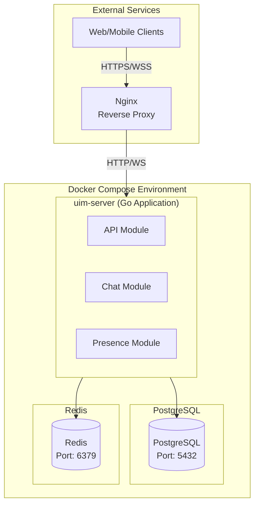
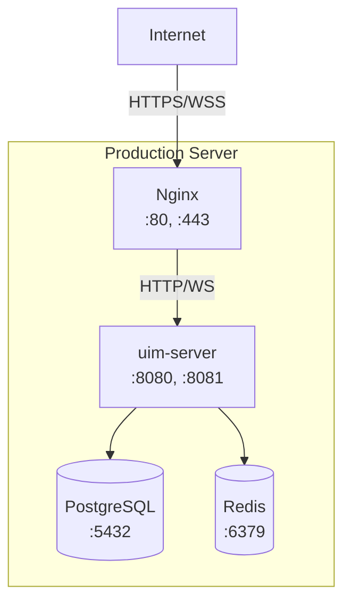

# UIM System Deployment Guide - v1.0 (Monolithic Architecture)

**Version**: 1.0 (Monolithic Architecture)

| Version | Date       | Author               | Changes                                    |
| ------- | ---------- | -------------------- | ------------------------------------------ |
| 1.0     | 2025-02-10 | `convexwf@gmail.com` | Initial v1.0 deployment guide (Monolithic) |

---

## Document Purpose

This deployment guide is for **UIM System v1.0**, which uses a **monolithic architecture** for development, learning, and small-scale personal projects.

**Version 1.0 Key Points**:

- **Architecture**: **Monolithic application** (single Go service)
- **Primary Use**: Local development and learning
- **Scale**: Suitable for < 10K DAU
- **Deployment**: Simple Docker Compose setup
- **No Microservices**: This is a single service application

**Note**: For future migration options, see [../design-document-guide.md](../design-document-guide.md)

---

## Table of Contents

1. [Overview](#1-overview)
2. [Prerequisites](#2-prerequisites)
3. [Architecture](#3-architecture)
4. [Setup (Development & Simple Deployment)](#4-setup-development--simple-deployment)
5. [Configuration](#5-configuration)
6. [Monitoring & Maintenance](#6-monitoring--maintenance)
7. [Troubleshooting](#7-troubleshooting)

---

## 1. Overview

### 1.1 Deployment Architecture

**v1.0 (Current)**:
- **Monolithic Application**: Single Go service handling all functionality
- **PostgreSQL**: Primary database
- **Redis**: Cache and message queue
- **Nginx**: Reverse proxy (production only)

**Future Migration**: When scaling beyond 10K DAU, see [../design-document-guide.md](../design-document-guide.md) for v2.0 microservices deployment guide

### 1.2 Deployment Options

**v1.0 = Monolithic Architecture**:
- **Single Service**: One Go application handles everything (API, WebSocket, Business Logic)
- **Docker Compose**: Simple setup with PostgreSQL and Redis
- **Same Setup**: Development and deployment use the same Docker Compose file
- **Only Difference**: Environment variables (passwords, secrets)

**This is NOT microservices** - it's a single monolithic application. For microservices migration options, see [../design-document-guide.md](../design-document-guide.md).

---

## 2. Prerequisites

### 2.1 System Requirements

**Minimum Requirements** (Development):
- CPU: 2 cores
- RAM: 4GB
- Disk: 20GB
- OS: Linux, macOS, or Windows (with WSL2)

**Recommended Requirements** (Production):
- CPU: 4+ cores
- RAM: 8GB+
- Disk: 100GB+ (SSD recommended)
- OS: Linux (Ubuntu 20.04+ or similar)

### 2.2 Software Requirements

**Required**:
- Docker: 20.10+
- Docker Compose: 2.0+
- Git: 2.30+

**Optional** (Production):
- Nginx: 1.18+
- Certbot: For SSL certificates
- Systemd: For service management

---

## 3. Architecture

### 3.1 Current Architecture (Monolithic)



### 3.2 Service Components

**uim-server** (Monolithic):
- **Port**: 8080 (HTTP), 8081 (WebSocket)
- **Functionality**: API, WebSocket, Business Logic
- **Dependencies**: PostgreSQL, Redis

**postgres**:
- **Port**: 5432
- **Database**: uim_db
- **Volume**: postgres_data

**redis**:
- **Port**: 6379
- **Volume**: redis_data
- **Usage**: Cache, Session Storage, Message Queue

**nginx** (Production only):
- **Port**: 80 (HTTP), 443 (HTTPS)
- **Function**: Reverse proxy, SSL termination

---

## 4. Setup (Development & Simple Deployment)

### 4.1 Quick Start

**Note**: v1.0 uses the same setup for development and deployment. The only difference is environment variables (like stronger passwords for deployment). This keeps things simple and focused on learning.

**Step 1: Clone Repository**
```bash
git clone https://github.com/convexwf/uim-go.git
cd uim-go
```

**Step 2: Create Environment File**
```bash
cp .env.example .env
# Edit .env with your configuration
```

**Step 3: Start Services**
```bash
docker-compose up -d
```

**Step 4: Run Migrations**
```bash
docker-compose exec uim-server go run cmd/migrate/main.go
```

**Step 5: Verify Services**
```bash
# Check service status
docker-compose ps

# Check logs
docker-compose logs -f uim-server
```

### 4.2 Docker Compose Configuration

**File: `docker-compose.yml`**

```yaml
version: '3.8'

services:
  # PostgreSQL Database
  postgres:
    image: postgres:15-alpine
    container_name: uim-postgres
    environment:
      POSTGRES_USER: ${POSTGRES_USER:-uim_user}
      POSTGRES_PASSWORD: ${POSTGRES_PASSWORD:-uim_password}
      POSTGRES_DB: ${POSTGRES_DB:-uim_db}
    ports:
      - "${POSTGRES_PORT:-5432}:5432"
    volumes:
      - postgres_data:/var/lib/postgresql/data
      - ./db/init:/docker-entrypoint-initdb.d
    healthcheck:
      test: ["CMD-SHELL", "pg_isready -U ${POSTGRES_USER:-uim_user}"]
      interval: 10s
      timeout: 5s
      retries: 5
    networks:
      - uim-network

  # Redis Cache and Queue
  redis:
    image: redis:7-alpine
    container_name: uim-redis
    command: redis-server --appendonly yes
    ports:
      - "${REDIS_PORT:-6379}:6379"
    volumes:
      - redis_data:/data
    healthcheck:
      test: ["CMD", "redis-cli", "ping"]
      interval: 10s
      timeout: 3s
      retries: 5
    networks:
      - uim-network

  # UIM Server (Monolithic Application)
  uim-server:
    build:
      context: .
      dockerfile: Dockerfile
    container_name: uim-server
    environment:
      # Database
      DB_HOST: postgres
      DB_PORT: 5432
      DB_USER: ${POSTGRES_USER:-uim_user}
      DB_PASSWORD: ${POSTGRES_PASSWORD:-uim_password}
      DB_NAME: ${POSTGRES_DB:-uim_db}
      DB_SSLMODE: disable
      
      # Redis
      REDIS_HOST: redis
      REDIS_PORT: 6379
      REDIS_PASSWORD: ${REDIS_PASSWORD:-}
      
      # Application
      APP_ENV: ${APP_ENV:-development}
      APP_PORT: 8080
      WS_PORT: 8081
      JWT_SECRET: ${JWT_SECRET:-your-secret-key-change-in-production}
      JWT_EXPIRY: ${JWT_EXPIRY:-15m}
      
      # Logging
      LOG_LEVEL: ${LOG_LEVEL:-debug}
    ports:
      - "${APP_PORT:-8080}:8080"
      - "${WS_PORT:-8081}:8081"
    depends_on:
      postgres:
        condition: service_healthy
      redis:
        condition: service_healthy
    volumes:
      - ./uim:/app
      - ./logs:/app/logs
    networks:
      - uim-network
    restart: unless-stopped

volumes:
  postgres_data:
    driver: local
  redis_data:
    driver: local

networks:
  uim-network:
    driver: bridge
```

### 4.3 Environment Variables

**File: `.env`** (Create from `.env.example`)

```bash
# Application
APP_ENV=development  # Change to 'production' only if deploying to server
APP_PORT=8080
WS_PORT=8081
LOG_LEVEL=debug  # Change to 'info' for deployment

# Database
POSTGRES_USER=uim_user
POSTGRES_PASSWORD=uim_password  # Use strong password for deployment
POSTGRES_DB=uim_db
POSTGRES_PORT=5432

# Redis
REDIS_HOST=redis
REDIS_PORT=6379
REDIS_PASSWORD=  # Set password for deployment

# JWT
JWT_SECRET=your-secret-key-change-this  # MUST change for deployment
JWT_EXPIRY=15m

# CORS
CORS_ALLOWED_ORIGINS=http://localhost:3000,http://localhost:5173  # Update for deployment
```

**For Deployment**: Just change passwords, JWT_SECRET, and CORS origins. Everything else stays the same.

### 4.4 Dockerfile

**File: `Dockerfile`**

```dockerfile
# Build stage
FROM golang:1.21-alpine AS builder

WORKDIR /app

# Install build dependencies
RUN apk add --no-cache git

# Copy go mod files
COPY go.mod go.sum ./
RUN go mod download

# Copy source code
COPY . .

# Build application
RUN CGO_ENABLED=0 GOOS=linux go build -a -installsuffix cgo -o uim-server ./uim/cmd/server

# Runtime stage
FROM alpine:latest

RUN apk --no-cache add ca-certificates tzdata

WORKDIR /app

# Copy binary from builder
COPY --from=builder /app/uim-server .

# Create logs directory
RUN mkdir -p /app/logs

# Expose ports
EXPOSE 8080 8081

# Health check
HEALTHCHECK --interval=30s --timeout=3s --start-period=5s --retries=3 \
  CMD wget --no-verbose --tries=1 --spider http://localhost:8080/health || exit 1

# Run application
CMD ["./uim-server"]
```

### 4.5 Development Commands

```bash
# Start all services
docker-compose up -d

# View logs
docker-compose logs -f uim-server
docker-compose logs -f postgres
docker-compose logs -f redis

# Stop all services
docker-compose down

# Stop and remove volumes (clean slate)
docker-compose down -v

# Rebuild and restart
docker-compose up -d --build

# Execute commands in container
docker-compose exec uim-server sh
docker-compose exec postgres psql -U uim_user -d uim_db

# Run migrations
docker-compose exec uim-server go run cmd/migrate/main.go

# Run tests
docker-compose exec uim-server go test ./...
```

---

## 5. Deploying to a Server (Optional)

### 5.1 Overview

**For v1.0**: Deployment is the same as local development. Just:
1. Copy the same Docker Compose setup to a server
2. Update environment variables (passwords, JWT secret)
3. Optionally add Nginx for SSL (if exposing to internet)

**This is optional** - v1.0 is primarily for development and learning.

**Architecture**: Monolithic application on single server



### 5.2 Server Setup

**Use the same `docker-compose.yml`** - no separate production file needed. Just update `.env` with:
- Strong passwords
- Production JWT secret
- Updated CORS origins
- `APP_ENV=production` (optional, mainly affects logging)

```yaml
version: '3.8'

services:
  postgres:
    image: postgres:15-alpine
    container_name: uim-postgres-prod
    environment:
      POSTGRES_USER: ${POSTGRES_USER}
      POSTGRES_PASSWORD: ${POSTGRES_PASSWORD}
      POSTGRES_DB: ${POSTGRES_DB}
    volumes:
      - postgres_data:/var/lib/postgresql/data
      - ./backups:/backups
    networks:
      - uim-network
    restart: always
    healthcheck:
      test: ["CMD-SHELL", "pg_isready -U ${POSTGRES_USER}"]
      interval: 30s
      timeout: 10s
      retries: 3

  redis:
    image: redis:7-alpine
    container_name: uim-redis-prod
    command: redis-server --appendonly yes --requirepass ${REDIS_PASSWORD}
    volumes:
      - redis_data:/data
    networks:
      - uim-network
    restart: always
    healthcheck:
      test: ["CMD", "redis-cli", "-a", "${REDIS_PASSWORD}", "ping"]
      interval: 30s
      timeout: 10s
      retries: 3

  uim-server:
    build:
      context: .
      dockerfile: Dockerfile.prod
    container_name: uim-server-prod
    environment:
      DB_HOST: postgres
      DB_PORT: 5432
      DB_USER: ${POSTGRES_USER}
      DB_PASSWORD: ${POSTGRES_PASSWORD}
      DB_NAME: ${POSTGRES_DB}
      DB_SSLMODE: require
      
      REDIS_HOST: redis
      REDIS_PORT: 6379
      REDIS_PASSWORD: ${REDIS_PASSWORD}
      
      APP_ENV: production
      APP_PORT: 8080
      WS_PORT: 8081
      JWT_SECRET: ${JWT_SECRET}
      JWT_EXPIRY: 15m
      
      LOG_LEVEL: info
    depends_on:
      postgres:
        condition: service_healthy
      redis:
        condition: service_healthy
    volumes:
      - ./logs:/app/logs
    networks:
      - uim-network
    restart: always

  nginx:
    image: nginx:alpine
    container_name: uim-nginx
    ports:
      - "80:80"
      - "443:443"
    volumes:
      - ./nginx/nginx.conf:/etc/nginx/nginx.conf:ro
      - ./nginx/ssl:/etc/nginx/ssl:ro
      - ./logs/nginx:/var/log/nginx
    depends_on:
      - uim-server
    networks:
      - uim-network
    restart: always

volumes:
  postgres_data:
  redis_data:

networks:
  uim-network:
    driver: bridge
```

### 5.3 Dockerfile (Same for Dev and Deployment)

**File: `Dockerfile`** (Use the same Dockerfile from section 4.4)

```dockerfile
FROM golang:1.21-alpine AS builder

WORKDIR /app

RUN apk add --no-cache git

COPY go.mod go.sum ./
RUN go mod download

COPY . .

# Build with optimizations
RUN CGO_ENABLED=0 GOOS=linux go build \
    -a -installsuffix cgo \
    -ldflags '-w -s' \
    -o uim-server ./uim/cmd/server

FROM alpine:latest

RUN apk --no-cache add ca-certificates tzdata wget

WORKDIR /app

COPY --from=builder /app/uim-server .

RUN mkdir -p /app/logs && \
    addgroup -g 1000 appuser && \
    adduser -D -u 1000 -G appuser appuser && \
    chown -R appuser:appuser /app

USER appuser

EXPOSE 8080 8081

HEALTHCHECK --interval=30s --timeout=3s --start-period=10s --retries=3 \
  CMD wget --no-verbose --tries=1 --spider http://localhost:8080/health || exit 1

CMD ["./uim-server"]
```

### 5.4 Nginx Configuration

**File: `nginx/nginx.conf`**

```nginx
user nginx;
worker_processes auto;
error_log /var/log/nginx/error.log warn;
pid /var/run/nginx.pid;

events {
    worker_connections 1024;
    use epoll;
}

http {
    include /etc/nginx/mime.types;
    default_type application/octet-stream;

    log_format main '$remote_addr - $remote_user [$time_local] "$request" '
                    '$status $body_bytes_sent "$http_referer" '
                    '"$http_user_agent" "$http_x_forwarded_for"';

    access_log /var/log/nginx/access.log main;

    sendfile on;
    tcp_nopush on;
    tcp_nodelay on;
    keepalive_timeout 65;
    types_hash_max_size 2048;

    # Gzip compression
    gzip on;
    gzip_vary on;
    gzip_proxied any;
    gzip_comp_level 6;
    gzip_types text/plain text/css text/xml text/javascript 
               application/json application/javascript application/xml+rss;

    # Rate limiting
    limit_req_zone $binary_remote_addr zone=api_limit:10m rate=10r/s;
    limit_req_zone $binary_remote_addr zone=ws_limit:10m rate=5r/s;

    # Upstream servers
    upstream uim_api {
        server uim-server:8080;
        keepalive 32;
    }

    upstream uim_ws {
        server uim-server:8081;
    }

    # HTTP to HTTPS redirect
    server {
        listen 80;
        server_name your-domain.com;
        
        location /.well-known/acme-challenge/ {
            root /var/www/certbot;
        }
        
        location / {
            return 301 https://$server_name$request_uri;
        }
    }

    # HTTPS server
    server {
        listen 443 ssl http2;
        server_name your-domain.com;

        ssl_certificate /etc/nginx/ssl/cert.pem;
        ssl_certificate_key /etc/nginx/ssl/key.pem;
        ssl_protocols TLSv1.2 TLSv1.3;
        ssl_ciphers HIGH:!aNULL:!MD5;
        ssl_prefer_server_ciphers on;

        # Security headers
        add_header X-Frame-Options "SAMEORIGIN" always;
        add_header X-Content-Type-Options "nosniff" always;
        add_header X-XSS-Protection "1; mode=block" always;

        # API endpoints
        location /api/ {
            limit_req zone=api_limit burst=20 nodelay;
            
            proxy_pass http://uim_api;
            proxy_http_version 1.1;
            proxy_set_header Upgrade $http_upgrade;
            proxy_set_header Connection 'upgrade';
            proxy_set_header Host $host;
            proxy_set_header X-Real-IP $remote_addr;
            proxy_set_header X-Forwarded-For $proxy_add_x_forwarded_for;
            proxy_set_header X-Forwarded-Proto $scheme;
            proxy_cache_bypass $http_upgrade;
            proxy_read_timeout 300s;
            proxy_connect_timeout 75s;
        }

        # WebSocket endpoint
        location /ws {
            limit_req zone=ws_limit burst=10 nodelay;
            
            proxy_pass http://uim_ws;
            proxy_http_version 1.1;
            proxy_set_header Upgrade $http_upgrade;
            proxy_set_header Connection "upgrade";
            proxy_set_header Host $host;
            proxy_set_header X-Real-IP $remote_addr;
            proxy_set_header X-Forwarded-For $proxy_add_x_forwarded_for;
            proxy_set_header X-Forwarded-Proto $scheme;
            proxy_read_timeout 3600s;
            proxy_send_timeout 3600s;
        }

        # Health check
        location /health {
            proxy_pass http://uim_api/health;
            access_log off;
        }
    }
}
```

### 5.5 Deployment Steps

**Step 1: Server Setup**
```bash
# Update system
sudo apt update && sudo apt upgrade -y

# Install Docker and Docker Compose
curl -fsSL https://get.docker.com -o get-docker.sh
sudo sh get-docker.sh
sudo usermod -aG docker $USER

# Install Docker Compose
sudo curl -L "https://github.com/docker/compose/releases/latest/download/docker-compose-$(uname -s)-$(uname -m)" -o /usr/local/bin/docker-compose
sudo chmod +x /usr/local/bin/docker-compose
```

**Step 2: Clone and Configure**
```bash
# Clone repository
git clone https://github.com/yourusername/uim-go.git
cd uim-go

# Create environment file
cp .env.example .env
# Edit .env with stronger passwords and secrets
nano .env
```

**Step 3: SSL Certificate (Let's Encrypt)**
```bash
# Install Certbot
sudo apt install certbot

# Generate certificate
sudo certbot certonly --standalone -d your-domain.com

# Copy certificates to nginx directory
sudo mkdir -p nginx/ssl
sudo cp /etc/letsencrypt/live/your-domain.com/fullchain.pem nginx/ssl/cert.pem
sudo cp /etc/letsencrypt/live/your-domain.com/privkey.pem nginx/ssl/key.pem
sudo chmod 644 nginx/ssl/cert.pem
sudo chmod 600 nginx/ssl/key.pem
```

**Step 4: Deploy**
```bash
# Build and start services (same as local development)
docker-compose up -d --build

# Run migrations
docker-compose exec uim-server ./uim-server migrate

# Check status
docker-compose ps
docker-compose logs -f
```

**Step 5: Verify**
```bash
# Check health
curl https://your-domain.com/health

# Check API
curl https://your-domain.com/api/health
```

---

**Note**: For future migration to microservices architecture, see [design-document-guide.md](./design-document-guide.md)

---

## 5. Configuration

### 5.1 Environment Variables

**`.env` file** (Same file for dev and deployment, just update values):

```bash
# Application
APP_ENV=development  # or 'production' if deploying
APP_PORT=8080
WS_PORT=8081
LOG_LEVEL=debug  # or 'info' for deployment

# Database
POSTGRES_USER=uim_user
POSTGRES_PASSWORD=uim_password  # Use strong password for deployment
POSTGRES_DB=uim_db
POSTGRES_PORT=5432

# Redis
REDIS_HOST=redis
REDIS_PORT=6379
REDIS_PASSWORD=  # Set password for deployment

# JWT
JWT_SECRET=your-secret-key-change-this  # MUST change for deployment
JWT_EXPIRY=15m

# CORS
CORS_ALLOWED_ORIGINS=http://localhost:3000  # Update for deployment domain

# Rate Limiting (optional)
RATE_LIMIT_MESSAGES=50
RATE_LIMIT_REQUESTS=100
```

**For Deployment**: Just update passwords, JWT_SECRET, and CORS. Everything else can stay the same.

### 5.2 Database Configuration

**PostgreSQL Tuning** (`postgresql.conf`):

```ini
# Connection settings
max_connections = 200
shared_buffers = 256MB
effective_cache_size = 1GB

# Performance
maintenance_work_mem = 64MB
checkpoint_completion_target = 0.9
wal_buffers = 16MB
default_statistics_target = 100
random_page_cost = 1.1
effective_io_concurrency = 200
```

### 5.3 Redis Configuration

**Redis Tuning** (`redis.conf`):

```ini
# Memory
maxmemory 2gb
maxmemory-policy allkeys-lru

# Persistence
appendonly yes
appendfsync everysec

# Performance
tcp-backlog 511
timeout 0
tcp-keepalive 300
```

---

## 6. Monitoring & Maintenance

### 6.1 Health Checks

**Application Health Endpoint**:
```bash
curl http://localhost:8080/health
```

**Response**:
```json
{
  "status": "healthy",
  "checks": {
    "database": {
      "status": "healthy"
    },
    "redis": {
      "status": "healthy"
    }
  }
}
```

### 6.2 Logging

**View Logs**:
```bash
# Application logs
docker-compose logs -f uim-server

# Database logs
docker-compose logs -f postgres

# Redis logs
docker-compose logs -f redis

# Nginx logs
docker-compose logs -f nginx
```

**Log Locations**:
- Application: `./logs/app.log`
- Nginx: `./logs/nginx/access.log`, `./logs/nginx/error.log`

### 6.3 Backup

**Database Backup**:
```bash
# Manual backup
docker-compose exec postgres pg_dump -U uim_user uim_db > backup_$(date +%Y%m%d).sql

# Automated backup (cron)
0 2 * * * docker-compose exec -T postgres pg_dump -U uim_user uim_db > /backups/backup_$(date +\%Y\%m\%d).sql
```

**Redis Backup**:
```bash
# Redis persistence is automatic with AOF
# Manual snapshot
docker-compose exec redis redis-cli BGSAVE
```

### 6.4 Updates

**Update Application**:
```bash
# Pull latest code
git pull

# Rebuild and restart (same as local)
docker-compose up -d --build

# Run migrations if needed
docker-compose exec uim-server ./uim-server migrate
```

**Note**: For v1.0, zero-downtime deployment is not necessary. Just restart the service.

---

## 7. Troubleshooting

### 7.1 Common Issues

**Issue: Services won't start**
```bash
# Check logs
docker-compose logs

# Check container status
docker-compose ps

# Restart services
docker-compose restart
```

**Issue: Database connection errors**
```bash
# Check database is running
docker-compose ps postgres

# Check connection
docker-compose exec postgres psql -U uim_user -d uim_db

# Check environment variables
docker-compose exec uim-server env | grep DB
```

**Issue: Redis connection errors**
```bash
# Check Redis is running
docker-compose ps redis

# Test Redis connection
docker-compose exec redis redis-cli ping

# Check Redis memory
docker-compose exec redis redis-cli INFO memory
```

**Issue: WebSocket connections failing**
```bash
# Check Nginx configuration
docker-compose exec nginx nginx -t

# Check WebSocket endpoint
curl -i -N -H "Connection: Upgrade" -H "Upgrade: websocket" \
  -H "Sec-WebSocket-Version: 13" -H "Sec-WebSocket-Key: test" \
  http://localhost/ws
```

### 7.2 Performance Issues

**High Database Load**:
- Check slow queries: `docker-compose exec postgres psql -U uim_user -d uim_db -c "SELECT * FROM pg_stat_statements ORDER BY total_time DESC LIMIT 10;"`
- Review indexes
- Consider connection pooling

**High Redis Memory**:
- Check memory usage: `docker-compose exec redis redis-cli INFO memory`
- Review TTL settings
- Consider increasing maxmemory

**High CPU Usage**:
- Check container stats: `docker stats`
- Review application logs for errors
- Consider scaling options (see [../design-document-guide.md](../design-document-guide.md) for migration paths)

---

## 9. Security Considerations

### 9.1 Security Checklist (If Deploying to Server)

**For Development**: Basic security is fine (default passwords OK)

**For Deployment** (if exposing to internet):
- [ ] Use strong passwords for database and Redis
- [ ] Enable SSL/TLS (via Nginx)
- [ ] Use environment variables for secrets (never commit to git)
- [ ] Enable firewall (only allow 80, 443, 22)
- [ ] Change JWT_SECRET to a strong random value
- [ ] Update CORS_ALLOWED_ORIGINS to your domain
- [ ] Enable rate limiting in Nginx (optional)
- [ ] Regular backups (optional, but recommended)

### 9.2 Secrets Management

**Never commit secrets to git!**

Use:
- Environment variables (`.env.prod` - in `.gitignore`)
- Docker secrets (for Docker Swarm)
- External secret management (HashiCorp Vault, AWS Secrets Manager)

---

## References

- **System Design v1.0**: [uim-system-design-v1.0.md](./uim-system-design-v1.0.md)
- **Roadmap**: [roadmap-v1.0.md](./roadmap-v1.0.md)
- **Design Guide**: [../design-document-guide.md](../design-document-guide.md)

---

**Document Change Log**:

| Version | Date       | Author             | Changes                  |
| ------- | ---------- | ------------------ | ------------------------ |
| 1.0     | 2026-01-05 | convexwf@gmail.com | Initial deployment guide |

---

*End of Document*

