# UIM System Design - v1.0

**Version**: 1.0 (Monolithic Architecture)

| Version | Date       | Author               | Changes                                         |
| ------- | ---------- | -------------------- | ----------------------------------------------- |
| 1.0     | 2025-02-10 | `convexwf@gmail.com` | Initial v1.0 design document (Monolithic) |

---

## Document Purpose & Scope

This document describes **Version 1.0** of the UIM system design, which uses a **monolithic architecture**. This version is suitable for:

- **Personal projects** and learning purposes
- **MVP development** with 1K-10K DAU target
- **Single-server deployment**
- **Rapid iteration** (10-12 weeks development timeline)

**Version 1.0 Key Characteristics**

- **Monolithic architecture** (single Go service application)
- **Tech stack**: PostgreSQL + Redis (simpler than Cassandra + Kafka)
- Single-region deployment
- Basic observability
- Focus on core functionality first

**When to Use This Document**

- Starting a new IM project
- Learning IM system fundamentals
- Building MVP for personal use
- When DAU < 10K

**For enterprise-scale design**, please refer to: [`../uim-system-design.md`](../uim-system-design.md)

---

## Table of Contents

1. [Background & Goals](#1-background--goals)
2. [Requirements](#2-requirements)
3. [Terminology](#3-terminology)
4. [High-Level Architecture](#4-high-level-architecture)
5. [Core Components](#5-core-components)
6. [Key Flows](#6-key-flows)
7. [Data Model](#7-data-model)
8. [Reliability & Consistency](#8-reliability--consistency)
9. [Scalability](#9-scalability)
10. [Availability & Disaster Recovery](#10-availability--disaster-recovery)
11. [Security](#11-security)
12. [Observability](#12-observability)
13. [Milestones & Roadmap](#13-milestones--roadmap)
14. [Acceptance Criteria](#14-acceptance-criteria)
15. [Trade-offs & Risks](#15-trade-offs--risks)
16. [Future Work](#16-future-work)

---

## 1. Background & Goals

### 1.1 Background

This project aims to build a practical instant messaging system for personal use and learning purposes. Unlike enterprise-scale systems that need to handle millions of users, this design focuses on:

- **Practical implementation** that can be built and deployed quickly
- **Learning distributed systems** concepts through hands-on experience
- **MVP functionality** that demonstrates core IM capabilities
- **Cost-effective deployment** suitable for personal projects

### 1.2 Design Goals

#### Functional Goals

- Support **one-on-one chat** with message history
- Support **group chat** with up to 50 participants per group (initially)
- Provide **online presence indicators** (online/offline status)
- Enable **multi-device synchronization** (basic support)
- Support **offline message delivery** via message queue
- Deliver **text messages** up to 10,000 characters
- Maintain **message delivery confirmations** (sent, delivered status)

#### Performance Goals

- **Message delivery latency**: < 500ms P95 for online users
- **WebSocket connection establishment**: < 2 seconds
- **Historical message retrieval**: < 200ms for recent messages (last 30 days)
- **Throughput**: Support 1K-10K daily active users (DAU)
- **Peak capacity**: Handle 100-1K concurrent WebSocket connections per server

#### Availability Goals

- **System uptime**: 99% availability (SLA target for MVP)
- **Message delivery success rate**: 99% for online users
- **Zero message loss**: All messages must be persisted durably
- **Graceful degradation**: Basic error handling and retry logic

#### Scalability Goals

- **Horizontal scaling**: Architecture allows future expansion (see [../design-document-guide.md](../design-document-guide.md) for migration path)
- **Database scalability**: PostgreSQL with proper indexing can handle initial load
- **Storage scalability**: Efficiently store and retrieve millions of messages
- **Connection scalability**: Single server can handle 1K+ concurrent connections

### 1.3 Non-Goals

The following are explicitly **out of scope** for the initial release:

- **End-to-end encryption**: Security layer will be addressed in Phase 2
- **Rich media support**: Images, videos, files (Phase 2 feature)
- **Voice and video calls**: Real-time communication beyond text
- **Message editing**: Ability to modify sent messages
- **Threaded conversations**: Nested reply structures
- **Bot integration**: Third-party bot framework
- **Advanced search**: Full-text search across all messages
- **Multi-region deployment**: Single-region only initially
- **Architecture**: Monolithic (single service)

---

## 2. Requirements

### 2.1 Functional Requirements

#### Must Have (P0)

1. **User Authentication**
   - Users must authenticate before establishing connections
   - Support JWT token-based authentication
   - Session management with token refresh

2. **One-on-One Messaging**
   - Send text messages between two users
   - Receive messages in real-time when online
   - Store messages for offline delivery
   - Message size limit: 10,000 characters

3. **Group Messaging**
   - Create and manage group conversations
   - Support up to 50 participants per group (initially)
   - Deliver messages to all group members
   - Track group membership changes

4. **Online Presence**
   - Display user online/offline status to friends
   - Update presence status in real-time
   - Handle temporary disconnections gracefully

5. **Message History**
   - Store all messages permanently
   - Retrieve message history on demand
   - Synchronize messages across multiple devices (basic)
   - Maintain message ordering consistency

6. **Delivery Confirmation**
   - Track message states: sent, delivered
   - Update delivery status in real-time
   - Persist delivery status for reliability

#### Should Have (P1)

1. **Message Search**: Search within recent conversations (last 30 days)
2. **Typing Indicators**: Show when users are composing messages
3. **User Blocking**: Prevent unwanted communication
4. **Read Receipts**: Optional read receipt privacy settings

#### Nice to Have (P2)

1. **Message Deletion**: Delete messages from conversation history
2. **User Profiles**: Rich user profile information
3. **Status Messages**: Custom status text and availability

### 2.2 Non-Functional Requirements

#### Performance Requirements

- **Latency**:
  - P50: < 200ms for message delivery
  - P95: < 500ms for message delivery
  - P99: < 1s for message delivery
  - Message persistence: < 100ms
  
- **Throughput**:
  - 1K-10K DAU
  - Estimated 20 messages per user per day
  - Peak load: 200K messages/day
  - Peak QPS: ~100 messages/second (assuming peak is 2x average)

- **Connection Capacity**:
  - 100-1K concurrent WebSocket connections per server
  - Average 10-20% of DAU online simultaneously

#### Reliability Requirements

- **Availability**: 99% uptime (< 7.2 hours downtime per month)
- **Durability**: 99.9% message durability
- **Message Delivery**: At-least-once delivery guarantee
- **Data Retention**: Store messages for at least 1 year
- **Disaster Recovery**: Basic backup and restore procedures

#### Scalability Requirements

- **Future expansion**: See [../design-document-guide.md](../design-document-guide.md) for migration options
- **Database Scaling**: PostgreSQL with read replicas if needed
- **Cache Layer**: Redis for hot data and session storage

#### Security Requirements

- **Authentication**: JWT tokens with expiration
- **Authorization**: Basic role-based access control
- **Transport Security**: TLS 1.2+ for all client-server communication
- **Data Protection**: Basic encryption at rest for stored messages
- **Rate Limiting**: Protect against abuse and DoS attacks

---

## 3. Terminology

| Term                     | Definition                                                                                                               |
| ------------------------ | ------------------------------------------------------------------------------------------------------------------------ |
| **User**                 | An authenticated entity that can send and receive messages. Each user has a unique user ID.                              |
| **Message**              | A text communication sent from one user to one or more recipients. Contains content, metadata, and delivery status.      |
| **Conversation**         | A messaging context between users. Can be one-on-one (2 participants) or group (3-50 participants).                      |
| **Channel**              | Same as conversation. Often used in the context of group messaging.                                                      |
| **Session**              | A persistent WebSocket connection between a client and chat server. Multiple sessions per user for multi-device support. |
| **Presence**             | The online/offline status of a user. Includes availability indicators (online, offline).                                 |
| **ACK (Acknowledgment)** | A confirmation message indicating receipt or processing of a message. Types: sent ACK, delivered ACK.                    |
| **Message ID**           | A globally unique, time-sortable identifier for each message. Used for ordering and deduplication.                       |
| **Sequence Number**      | A monotonically increasing number within a conversation, used for maintaining message order.                             |
| **Sync Queue**           | A per-user message queue that stores messages to be delivered when the user comes online (stored in Redis).              |
| **Heartbeat**            | A periodic ping sent by clients to maintain connection and indicate online status.                                       |
| **Fanout**               | The process of distributing a message to multiple recipients (used in group chat).                                       |
| **Chat Server**          | Server that maintains WebSocket connections with clients and handles message routing.                                    |
| **API Server**           | Server handling HTTP REST API requests (login, signup, profile management).                                              |
| **Presence Server**      | Component managing user online/offline status (can be part of chat server initially).                                    |
| **DAU**                  | Daily Active Users - unique users who interact with the system in a 24-hour period.                                      |
| **QPS**                  | Queries Per Second - measure of request throughput.                                                                      |
| **P50/P95/P99**          | Percentile latency metrics (50th, 95th, 99th percentile).                                                                |

---

## 4. High-Level Architecture

### 4.1 Architecture Overview

**Version 1.0**: The UIM system uses a **monolithic architecture** - a single Go application that handles all functionality (API, WebSocket, Business Logic).

**Architecture Style**

- Monolithic application with modular design
- Event-driven for asynchronous message processing (using Redis)
- Real-time WebSocket-based communication for chat
- RESTful HTTP for stateless operations

**System Layers**

1. **Client Layer**: Web, iOS, Android applications
2. **Edge Layer**: Load balancer (optional, can use Nginx for production)
3. **Service Layer**: Single server handling both API and WebSocket connections
4. **Message Processing Layer**: Redis-based message queues
5. **Storage Layer**: PostgreSQL (primary database) and Redis (cache/queue)
6. **Infrastructure Layer**: Basic monitoring and logging

**Key Architectural Principles**

- **Monolithic initially**: Simpler deployment and debugging
- **Modular design**: Code organized in modules, but runs as single service
- **Asynchronous processing**: Decouple message persistence from delivery using Redis
- **Single database**: PostgreSQL for all data, Redis for caching and queues
- **Stateless API**: JWT-based authentication allows horizontal scaling later

### 4.2 Architecture Diagram

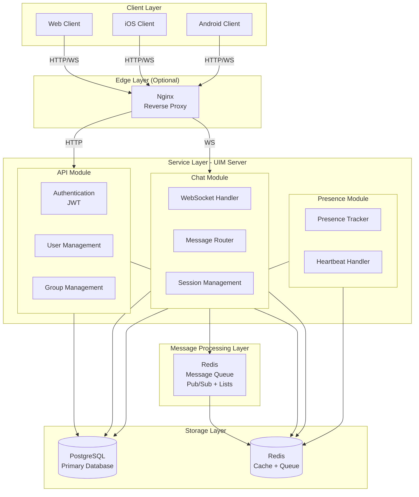

### 4.3 Component Responsibilities

#### Client Layer

- **Responsibility**: User interface and WebSocket connection management
- **Technologies**: React (Web), Swift (iOS), Kotlin (Android)
- **Key Functions**: Render UI, maintain WebSocket connection, handle reconnection

#### Edge Layer (Optional)

- **Nginx**: Reverse proxy, SSL termination, basic load balancing
- **Responsibilities**: SSL termination, static file serving, rate limiting

#### Service Layer (UIM Server)

- **API Module**: 
  - Authentication (JWT token generation and validation)
  - User Profile Service (User information CRUD operations)
  - Group Management Service (Create, update, delete groups; manage membership)
  
- **Chat Module**:
  - WebSocket Management (Maintain persistent connections with clients)
  - Message Routing (Route incoming messages to appropriate recipients)
  - Session Management (Track user sessions and device connections)
  
- **Presence Module**:
  - Online Status (Track and broadcast user online/offline status)
  - Heartbeat Handler (Process client heartbeats, update presence)

#### Message Processing Layer

- **Redis Pub/Sub**: Real-time message delivery to online users
- **Redis Lists**: Offline message queues per user
- **Event Processing**: Asynchronous message persistence and fanout

#### Storage Layer

- **PostgreSQL**:
  - User profiles, authentication, relationships
  - Conversations and participants
  - Messages (all messages stored here)
  
- **Redis**
  - Session storage
  - Presence cache
  - Offline message queues
  - Hot data caching

### 4.4 Technology Stack

| Component              | Technology Choices       | Rationale                                                               |
| ---------------------- | ------------------------ | ----------------------------------------------------------------------- |
| **Backend Language**   | Go                       | High performance, excellent concurrency support, efficient memory usage |
| **Web Framework**      | Gin                      | Lightweight, fast HTTP routing, middleware support                      |
| **WebSocket Library**  | Gorilla WebSocket        | Mature, RFC 6455 compliant, production-proven                           |
| **Message Queue**      | Redis Pub/Sub + Lists    | Lightweight, sufficient for initial scale, easy to deploy               |
| **Primary Database**   | PostgreSQL               | ACID compliance, rich feature set, excellent for relational data        |
| **Cache & Queue**      | Redis                    | In-memory performance, pub/sub support, list operations                 |
| **ORM**                | GORM                     | Simplifies database operations, migrations support                      |
| **Load Balancer**      | Nginx (optional)         | Simple reverse proxy, SSL termination                                   |
| **Container Platform** | Docker Compose           | Local development and simple deployment                                 |
| **Monitoring**         | Basic logging (optional) | Start simple, add Prometheus later if needed                            |

**Why Not Enterprise Stack?**

- **Cassandra**: Too complex for initial scale, PostgreSQL can handle millions of messages
- **Kafka**: Overkill for initial requirements, Redis Pub/Sub sufficient
- **Kubernetes**: Not needed for single-server deployment, Docker Compose enough
- **Monolithic**: Single service application

---

## 5. Core Components

### 5.1 Connection Layer (WebSocket Handler)

The connection layer is responsible for managing WebSocket connections and handling real-time bidirectional communication.

#### 5.1.1 Connection Management

**WebSocket Connection Lifecycle**

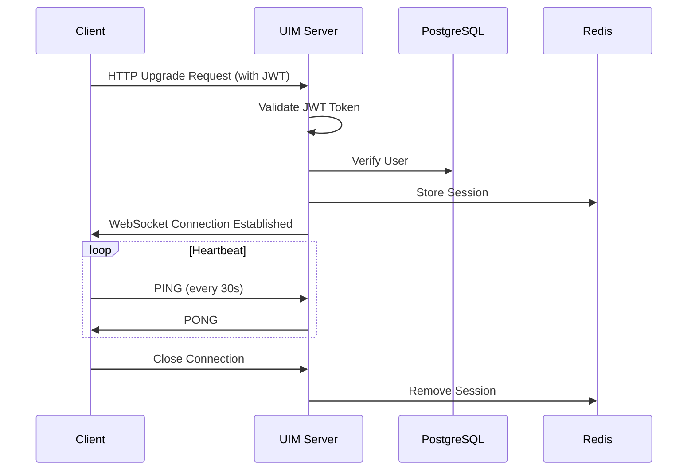

**Key Design Decisions**

- **Single connection per device**: Each device maintains one WebSocket connection
- **Connection limits**: Max 1K connections per server instance (can be increased)
- **Memory per connection**: ~10KB overhead per WebSocket connection
- **Reconnection**: Client auto-reconnects with exponential backoff

#### 5.1.2 Protocol Design

**Message Frame Structure** (JSON over WebSocket Text Frame):

```json
{
  "type": "MESSAGE_SEND",
  "request_id": "req_123456",
  "timestamp": 1609459200000,
  "payload": {
    "message_id": "msg_789",
    "conversation_id": "conv_456",
    "sender_id": "user_123",
    "content": "Hello, world!",
    "message_type": "text"
  }
}
```

**Message Types**

- `HEARTBEAT_PING`: Client heartbeat
- `HEARTBEAT_PONG`: Server heartbeat response
- `MESSAGE_SEND`: Send message
- `MESSAGE_RECEIVE`: Receive message
- `MESSAGE_ACK`: Message acknowledgment
- `PRESENCE_UPDATE`: Presence status update
- `TYPING_INDICATOR`: Typing indicator
- `ERROR`: Error response

#### 5.1.3 Heartbeat & Keep-Alive

**Heartbeat Mechanism**

- **Interval**: Client sends PING every 30 seconds
- **Timeout**: Server marks connection as stale after 90 seconds without PING
- **Reconnection**: Client auto-reconnects on connection loss

**Presence Inference**

- User marked **online** while receiving regular heartbeats
- User marked **offline** after 90-second heartbeat timeout
- Presence state stored in Redis with TTL

### 5.2 Messaging Layer

#### 5.2.1 Message Validation

**Input Validation**

- Content length: 1 ≤ length ≤ 10,000 characters
- Conversation existence check
- Sender authorization (user is member of conversation)
- Rate limiting: Max 50 messages per minute per user
- Basic spam detection (duplicate message detection)

#### 5.2.2 Message Routing

**One-on-One Routing Flow**

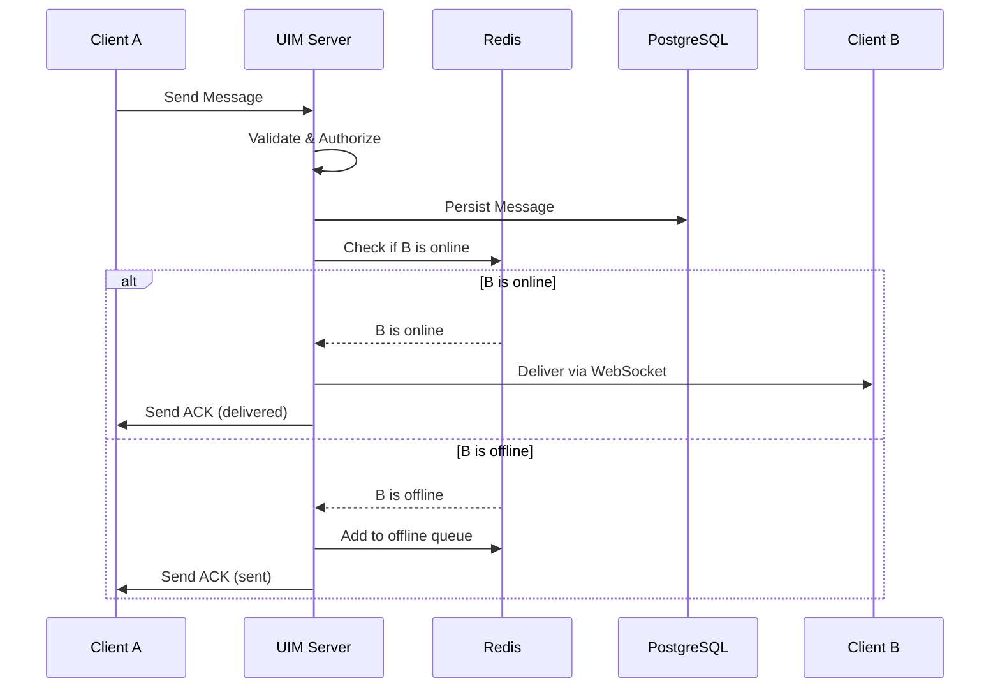

**Group Routing** (Fan-out pattern)

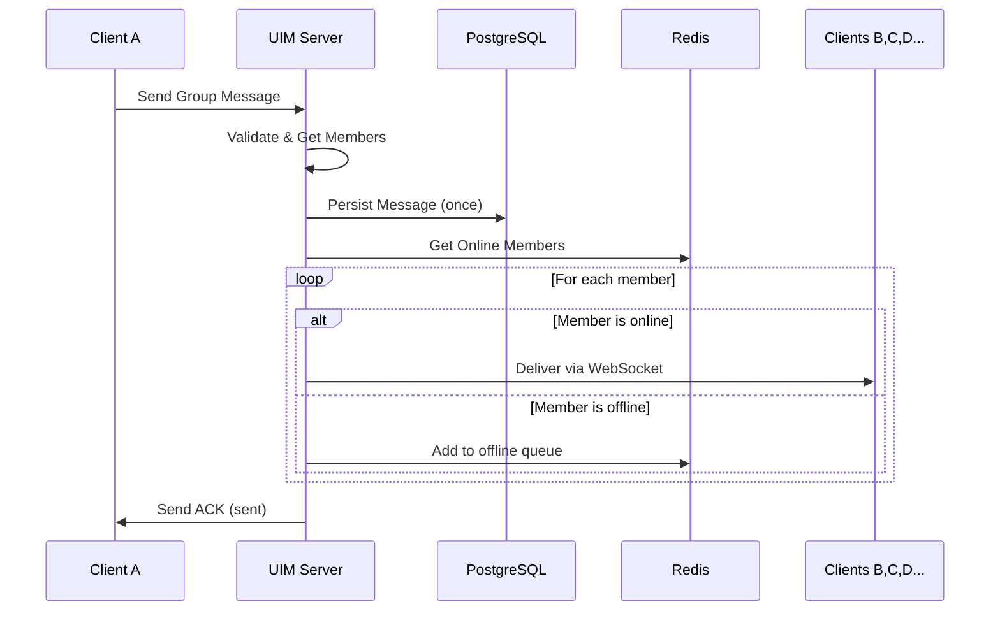

**Routing Strategy**

- **Direct routing**: For online users connected to same server
- **Queue-based routing**: For offline users (Redis List)
- **Batch delivery**: Group multiple messages when possible

#### 5.2.3 Message Delivery

**Delivery Guarantees**

- **At-least-once delivery**: Messages may be delivered multiple times
- **Idempotency**: Clients must handle duplicate messages (dedupe by message_id)
- **Ordering**: Messages within conversation maintain timestamp order

**Delivery Acknowledgments**

1. **Sent ACK**: Server confirms message received and persisted
2. **Delivered ACK**: Recipient's device confirms message received

**Retry Logic**

- Exponential backoff: 1s, 2s, 4s, 8s, 16s, 30s (max)
- Max retry attempts: 5
- Dead letter handling: Log failed messages for manual review

### 5.3 Session & Presence Management

#### 5.3.1 Session Tracking

**Session Data Structure**

```go
type Session struct {
    SessionID     string
    UserID        string
    DeviceID      string
    ConnectedAt   time.Time
    LastHeartbeat time.Time
    ClientInfo    ClientInfo
}

type ClientInfo struct {
    Platform      string // "web", "ios", "android"
    AppVersion    string
    IPAddress     string
    UserAgent     string
}
```

**Session Storage**

- **Primary**: Redis with TTL (90 seconds, refreshed on heartbeat)
- **Indexed by**: user_id → []session_id (support multiple devices)
- **Key format**: `session:{user_id}:{device_id}`

#### 5.3.2 Online Presence

**Presence States**

- `ONLINE`: User actively connected and sending heartbeats
- `OFFLINE`: No active connections

**Presence Update Flow**

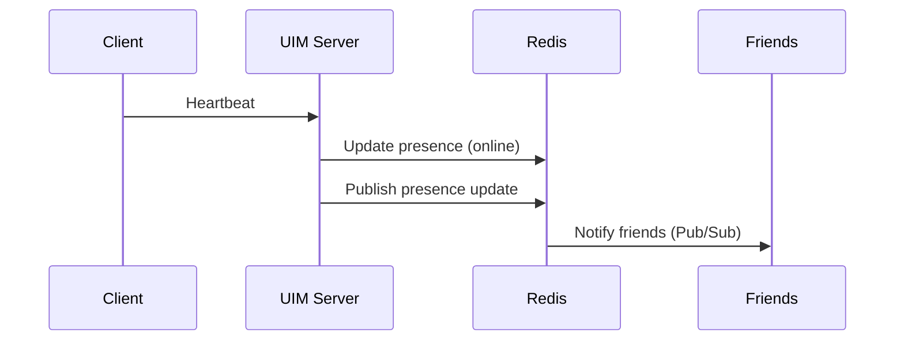

**Presence Storage**

- **Redis Key**: `presence:{user_id}`
- **Value**: `{"status": "online", "last_seen": timestamp}`
- **TTL**: 90 seconds (refreshed on heartbeat)
- **Pub/Sub**: `presence:updates` channel for real-time notifications

### 5.4 Storage System

#### 5.4.1 Message Store (PostgreSQL)

**Schema Design**

```sql
-- Messages table
CREATE TABLE messages (
    message_id BIGSERIAL PRIMARY KEY,
    conversation_id UUID NOT NULL,
    sender_id UUID NOT NULL,
    content TEXT NOT NULL,
    message_type VARCHAR(20) DEFAULT 'text',
    created_at TIMESTAMP DEFAULT NOW(),
    metadata JSONB,
    
    INDEX idx_conversation_time (conversation_id, created_at DESC),
    INDEX idx_sender (sender_id),
    FOREIGN KEY (conversation_id) REFERENCES conversations(conversation_id)
);

-- Conversations table
CREATE TABLE conversations (
    conversation_id UUID PRIMARY KEY DEFAULT gen_random_uuid(),
    type VARCHAR(20) NOT NULL, -- 'one_on_one' or 'group'
    name VARCHAR(255), -- For group chats
    created_by UUID NOT NULL,
    created_at TIMESTAMP DEFAULT NOW(),
    updated_at TIMESTAMP DEFAULT NOW()
);

-- Conversation participants
CREATE TABLE conversation_participants (
    conversation_id UUID NOT NULL,
    user_id UUID NOT NULL,
    role VARCHAR(20) DEFAULT 'member',
    joined_at TIMESTAMP DEFAULT NOW(),
    last_read_message_id BIGINT,
    PRIMARY KEY (conversation_id, user_id),
    FOREIGN KEY (conversation_id) REFERENCES conversations(conversation_id),
    FOREIGN KEY (user_id) REFERENCES users(user_id)
);
```

**Write Pattern**

- **Single write** per message to messages table
- **Transaction**: Ensure message and delivery status are consistent
- **Batch writes**: For group messages, single message write, multiple participant updates

**Read Pattern**

- **Recent messages**: Query by conversation_id with LIMIT and ORDER BY
- **Pagination**: Use message_id as cursor for infinite scroll
- **User conversations**: Query conversation_participants for user's conversations

#### 5.4.2 User Store (PostgreSQL)

**Schema Design**

```sql
-- Users table
CREATE TABLE users (
    user_id UUID PRIMARY KEY DEFAULT gen_random_uuid(),
    username VARCHAR(50) UNIQUE NOT NULL,
    email VARCHAR(255) UNIQUE NOT NULL,
    password_hash VARCHAR(255) NOT NULL,
    display_name VARCHAR(100),
    avatar_url TEXT,
    created_at TIMESTAMP DEFAULT NOW(),
    updated_at TIMESTAMP DEFAULT NOW(),
    
    INDEX idx_username (username),
    INDEX idx_email (email)
);

-- Friendships table
CREATE TABLE friendships (
    user_id UUID NOT NULL,
    friend_id UUID NOT NULL,
    status VARCHAR(20) DEFAULT 'pending',
    created_at TIMESTAMP DEFAULT NOW(),
    PRIMARY KEY (user_id, friend_id),
    FOREIGN KEY (user_id) REFERENCES users(user_id),
    FOREIGN KEY (friend_id) REFERENCES users(user_id)
);
```

#### 5.4.3 Cache & Queue (Redis)

**Data Structures**

```redis
# User presence status
SET presence:user:{user_id} "online" EX 90

# User's online friends (cached)
SADD presence:online_friends:{user_id} {friend_id1} {friend_id2}
EXPIRE presence:online_friends:{user_id} 60

# Offline message queue (per user)
LPUSH offline:user:{user_id} {message_json}
EXPIRE offline:user:{user_id} 86400  # 24 hours

# Session storage
SET session:{user_id}:{device_id} {session_json} EX 90

# Pub/Sub for presence updates
PUBLISH presence:updates '{"user_id": "123", "status": "online"}'
```

### 5.5 Supporting Services

#### 5.5.1 Authentication & Authorization

**Authentication Flow**

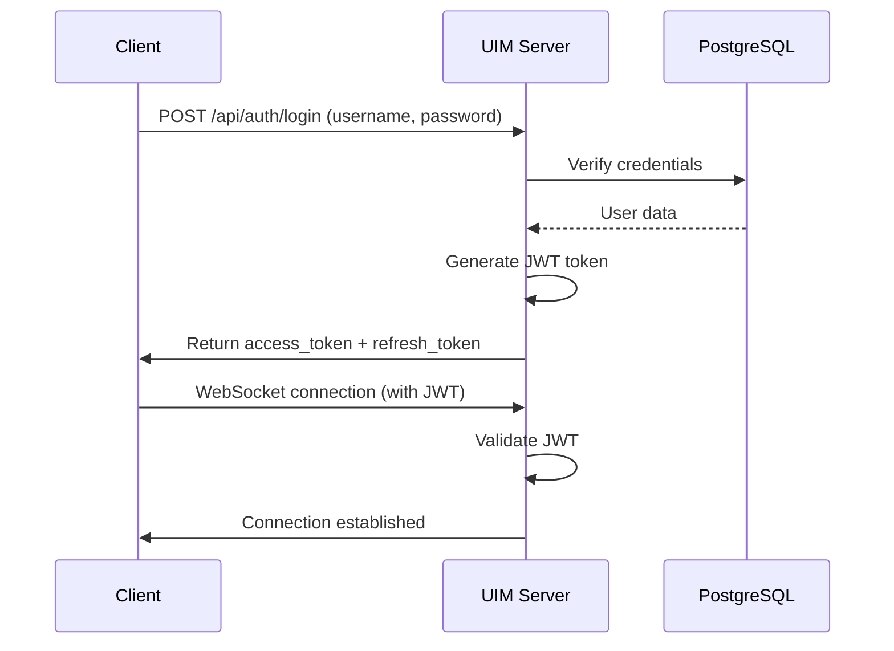

**JWT Token Structure**

```json
{
  "user_id": "550e8400-e29b-41d4-a716-446655440000",
  "username": "john_doe",
  "exp": 1609545600,
  "iat": 1609459200
}
```

**Authorization Checks**

- WebSocket connection: Validate JWT before upgrading connection
- Message send: Verify sender is participant in conversation
- Message read: Verify user is participant in conversation

#### 5.5.2 Rate Limiting & Abuse Prevention

**Rate Limiting Tiers**

- **Per User**: 50 messages per minute, 500 per hour
- **Per Connection**: 10 requests per second (for API calls)
- **Per IP**: 100 requests per minute (DDoS protection)

**Implementation**

- **Algorithm**: Token bucket with Redis
- **Enforcement**: Middleware in Gin framework
- **Response**: HTTP 429 (Too Many Requests) with Retry-After header

---

## 6. Key Flows

### 6.1 User Connection Flow

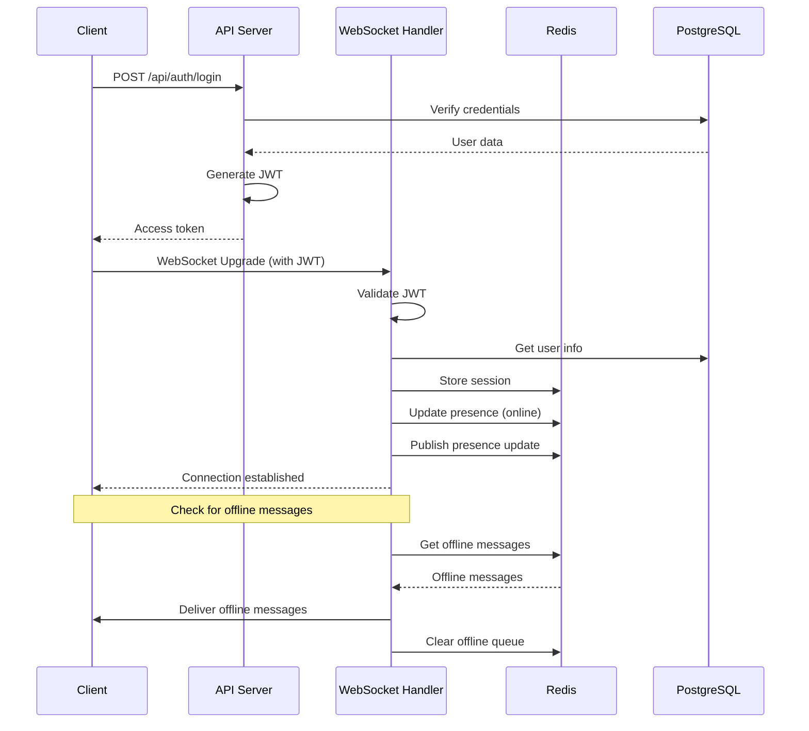

### 6.2 Message Send Flow (One-on-One)

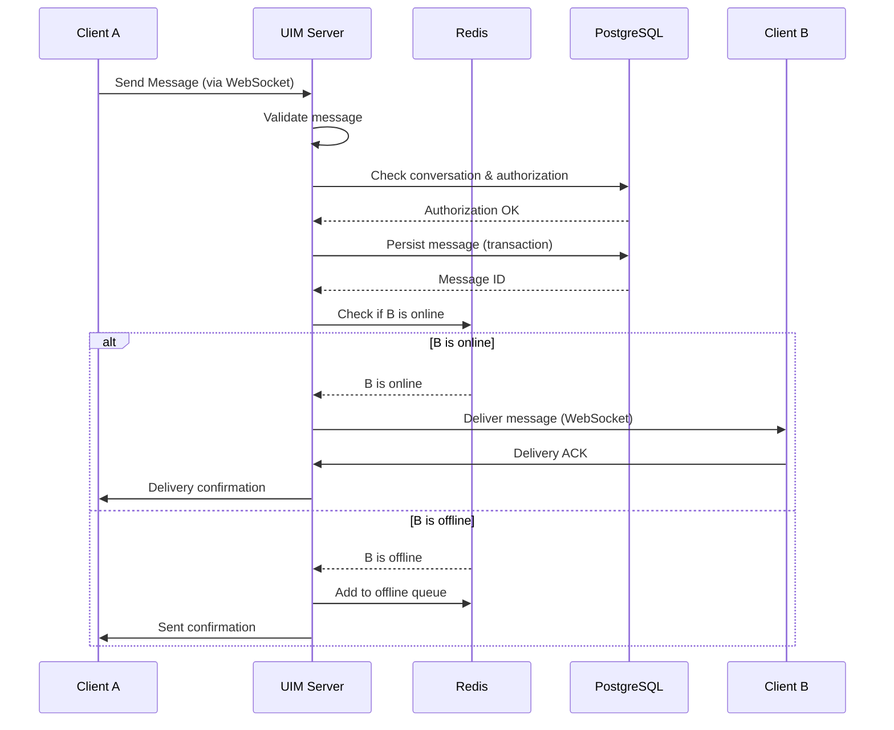

### 6.3 Message Send Flow (Group)

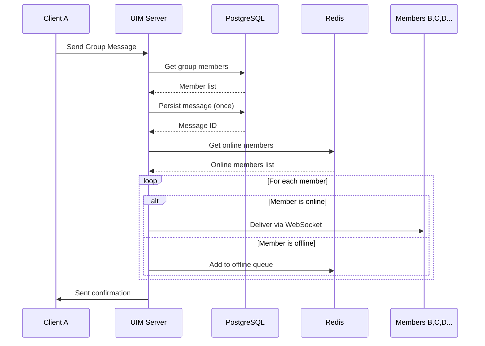

### 6.4 Offline Message Sync Flow

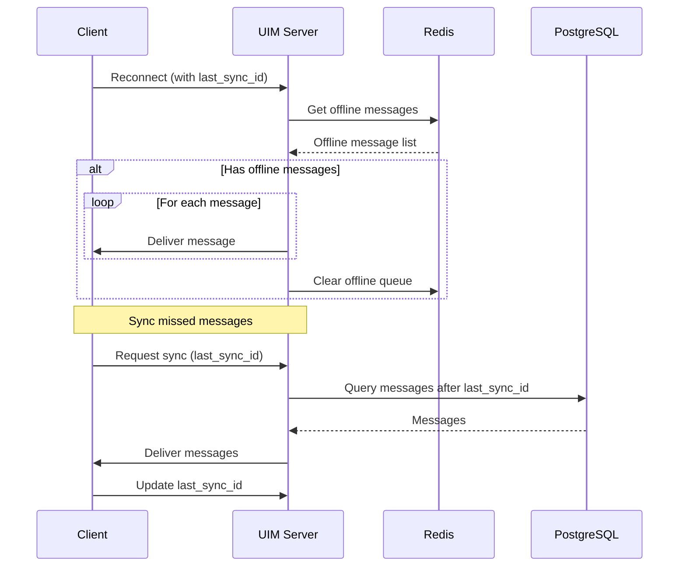

### 6.5 Multi-Device Synchronization

**Sync Strategy**

- Track `last_synced_message_id` per device
- Fetch all messages with `message_id > last_synced_message_id`
- Batch delivery to reduce network overhead
- Update sync cursor after successful delivery

**Example**

```
Device A (Phone): last_sync_msg_id = 850
Device B (Laptop): last_sync_msg_id = 920

New message arrives: msg_id = 950

Device A receives: messages 850-950
Device B receives: message 950
```

---

## 7. Data Model

### 7.1 Core Entities

#### 7.1.1 User Entity

```go
type User struct {
    UserID       UUID      `json:"user_id" db:"user_id"`
    Username     string    `json:"username" db:"username"`
    Email        string    `json:"email" db:"email"`
    PasswordHash string    `json:"-" db:"password_hash"`
    DisplayName  string    `json:"display_name" db:"display_name"`
    AvatarURL    string    `json:"avatar_url" db:"avatar_url"`
    CreatedAt    time.Time `json:"created_at" db:"created_at"`
    UpdatedAt    time.Time `json:"updated_at" db:"updated_at"`
}
```

**Attributes**

- `UserID`: Primary key, UUID v4
- `Username`: Unique, 3-50 characters, alphanumeric + underscore
- `Email`: Unique, RFC 5322 compliant
- `PasswordHash`: bcrypt hash with cost factor 10

#### 7.1.2 Conversation Entity

```go
type Conversation struct {
    ConversationID UUID             `json:"conversation_id" db:"conversation_id"`
    Type           ConversationType `json:"type" db:"type"`
    Name           string           `json:"name,omitempty" db:"name"`
    CreatedBy      UUID             `json:"created_by" db:"created_by"`
    CreatedAt      time.Time        `json:"created_at" db:"created_at"`
    UpdatedAt      time.Time        `json:"updated_at" db:"updated_at"`
    Participants   []Participant    `json:"participants" db:"-"`
}

type ConversationType string

const (
    ConversationTypeOneOnOne ConversationType = "one_on_one"
    ConversationTypeGroup    ConversationType = "group"
)

type Participant struct {
    UserID            UUID      `json:"user_id" db:"user_id"`
    Role              string    `json:"role" db:"role"` // owner, admin, member
    JoinedAt          time.Time `json:"joined_at" db:"joined_at"`
    LastReadMessageID int64     `json:"last_read_message_id" db:"last_read_message_id"`
}
```

**Conversation Rules**

- One-on-one: Exactly 2 participants, no name required
- Group: 3-50 participants, name required
- Only one active one-on-one conversation per user pair

#### 7.1.3 Message Entity

```go
type Message struct {
    MessageID      int64              `json:"message_id" db:"message_id"`
    ConversationID UUID               `json:"conversation_id" db:"conversation_id"`
    SenderID       UUID               `json:"sender_id" db:"sender_id"`
    Content        string             `json:"content" db:"content"`
    MessageType    MessageType        `json:"type" db:"message_type"`
    CreatedAt      time.Time          `json:"created_at" db:"created_at"`
    Metadata       map[string]string  `json:"metadata,omitempty" db:"metadata"`
    DeliveryStatus DeliveryStatus     `json:"delivery_status" db:"-"`
}

type MessageType string

const (
    MessageTypeText MessageType = "text"
)

type DeliveryStatus struct {
    Sent      time.Time            `json:"sent"`
    Delivered map[UUID]time.Time   `json:"delivered"` // user_id -> timestamp
}
```

**Message ID Generation**

- Use PostgreSQL `BIGSERIAL` (auto-increment)
- Simple and sufficient for initial scale
- Can migrate to Snowflake ID later if needed

### 7.2 Data Relationships

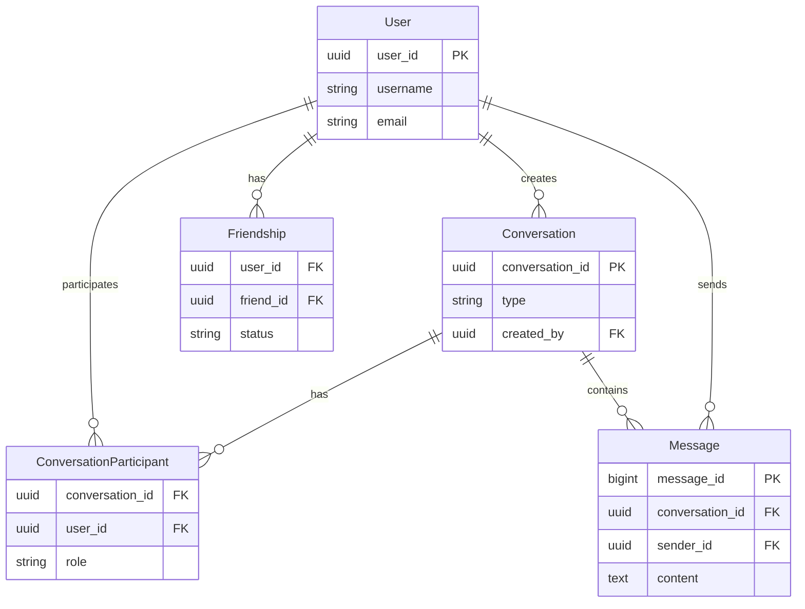

**Relationship Descriptions**

1. **User ↔ Conversation**: Many-to-many via `conversation_participants`
2. **User → Conversation**: User creates conversations (one-to-many)
3. **Conversation → Message**: One conversation has many messages (one-to-many)
4. **User → Message**: User sends many messages (one-to-many)
5. **User ↔ User**: Friendship (many-to-many via `friendships`)

### 7.3 Indexing Strategy

**PostgreSQL Indexes**

```sql
-- User lookups
CREATE INDEX idx_users_username ON users(username);
CREATE INDEX idx_users_email ON users(email);

-- Conversation queries
CREATE INDEX idx_conversations_type ON conversations(type);
CREATE INDEX idx_conversation_participants_user_id ON conversation_participants(user_id);
CREATE INDEX idx_conversation_participants_conv_id ON conversation_participants(conversation_id);

-- Message queries (most important)
CREATE INDEX idx_messages_conversation_time ON messages(conversation_id, created_at DESC);
CREATE INDEX idx_messages_sender ON messages(sender_id);

-- Friendship lookups
CREATE INDEX idx_friendships_user_id ON friendships(user_id);
CREATE INDEX idx_friendships_friend_id ON friendships(friend_id);
```

---

## 8. Reliability & Consistency

### 8.1 Message Delivery Semantics

**Delivery Guarantee** **At-Least-Once**

The system guarantees that every message will be delivered at least once to each recipient. Messages may be delivered more than once due to retries, network partitions, or failover scenarios.

**Implications**

- **Idempotency Required**: Clients must deduplicate messages using `message_id`
- **Message Ordering**: Preserved within a conversation using timestamp-ordered IDs
- **No Message Loss**: All messages are durably persisted before acknowledgment

**Client-Side Deduplication**

```go
// Client maintains a set of received message IDs
receivedMessages := make(map[int64]bool)

func handleMessage(msg Message) {
    if receivedMessages[msg.MessageID] {
        return // Duplicate, ignore
    }
    receivedMessages[msg.MessageID] = true
    // Process message
}
```

### 8.2 Ordering Guarantees

**Within Conversation**

- Messages are ordered by `created_at` timestamp
- PostgreSQL ensures consistent ordering
- Clients receive messages in order

**Across Conversations**:
- No ordering guarantee across different conversations
- Each conversation maintains its own ordering

**Error Handling**

**Retry Strategy**:
- **Transient errors**: Retry with exponential backoff
- **Permanent errors**: Log and notify admin
- **Network errors**: Client handles reconnection

**Failure Scenarios**
1. **Database failure**: Messages queued in Redis, retry when DB recovers
2. **Redis failure**: Fallback to direct database writes (slower but functional)
3. **WebSocket disconnection**: Messages queued, delivered on reconnect

---

## 9. Scalability

### 9.1 Horizontal Scaling Path

**Version 1.0 (Current)**: Monolithic application - single service

**Version 1.0 Scaling Options** (within monolithic):

1. **Vertical Scaling**: Increase server resources (CPU, RAM)
2. **Database Scaling**:
   - Read replicas for read-heavy operations
   - Connection pooling
   - Query optimization
3. **Cache Scaling**:
   - Redis Cluster when single instance insufficient
   - Cache warming strategies

**Note**: For migration to microservices architecture, see [../design-document-guide.md](../design-document-guide.md)

### 9.2 Performance Optimization

**Database Optimization**

- Proper indexing (already covered)
- Connection pooling
- Query optimization
- Batch operations where possible

**Caching Strategy**

- Cache frequently accessed data (user profiles, conversation metadata)
- Cache presence information
- Cache recent messages (last 50 per conversation)

**Connection Optimization**

- WebSocket connection pooling
- Efficient message batching
- Compression for large messages

### 9.3 When to Scale

**Indicators for Scaling**

- Database CPU > 70% consistently
- Response time P95 > 500ms
- Connection count approaching server limits
- Message queue lag > 1 second

**v1.0 Scaling Actions** (monolithic):

1. **Vertical scaling**: Increase server resources first
2. **Read replicas**: Add PostgreSQL read replicas
3. **Database sharding**: When single DB insufficient (advanced)

**Note**: When v1.0 limits are reached, consider migration options. See [../design-document-guide.md](../design-document-guide.md) for migration path.

---

## 10. Availability & Disaster Recovery

### 10.1 Fault Tolerance

**Single Server Failure**

- **Impact**: Service unavailable
- **Mitigation**: 
  - Regular backups
  - Quick recovery procedures
  - Health monitoring

**Database Failure**

- **Impact**: Cannot persist new messages
- **Mitigation**:
  - Messages queued in Redis
  - Automatic retry when DB recovers
  - Database replication (future)

**Redis Failure**

- **Impact**: Loss of cache and offline queues
- **Mitigation**:
  - Fallback to direct database access
  - Rebuild cache on restart
  - Redis persistence (RDB + AOF)

### 10.2 Backup Strategy

**Database Backups**

- **Frequency**: Daily full backup
- **Retention**: 7 days
- **Method**: PostgreSQL pg_dump

**Redis Backups**

- **Frequency**: Every 6 hours
- **Retention**: 24 hours
- **Method**: Redis RDB snapshots

### 10.3 Disaster Recovery

**Recovery Procedures**

1. **Database restore**: From latest backup
2. **Application restart**: Automatic on server restart
3. **Data validation**: Verify message integrity after restore

**Recovery Time Objective (RTO)**: < 1 hour
**Recovery Point Objective (RPO)**: < 24 hours (daily backup)

---

## 11. Security

### 11.1 Authentication

**JWT Token Authentication**

- **Access token**: 15-minute expiration
- **Refresh token**: 7-day expiration
- **Token storage**: HTTP-only cookies (web) or secure storage (mobile)

**Password Security**

- **Hashing**: bcrypt with cost factor 10
- **Requirements**: Minimum 8 characters, complexity requirements

### 11.2 Authorization

**Access Control**

- Users can only access conversations they're part of
- Group admins can manage group membership
- Authorization checks on every request

### 11.3 Transport Security

**TLS/SSL**

- **Protocol**: TLS 1.2+ required
- **Certificates**: Let's Encrypt (free) or commercial
- **HTTPS**: All HTTP traffic encrypted
- **WSS**: All WebSocket traffic encrypted

### 11.4 Data Protection

**Encryption at Rest**

- **Database**: PostgreSQL encryption (if supported by hosting)
- **Backups**: Encrypted backup files

**Data Privacy**

- **PII Protection**: User data handled according to privacy requirements
- **Log Sanitization**: Remove sensitive data from logs

### 11.5 Rate Limiting & DDoS Protection

**Rate Limiting** (as covered in 5.5.2)

- Per-user limits
- Per-IP limits
- Connection rate limits

**DDoS Mitigation**

- Basic rate limiting
- Connection limits
- Consider cloud DDoS protection for production

---

## 12. Observability

### 12.1 Logging

**Log Levels**

- **ERROR**: System errors, failures
- **WARN**: Recoverable issues, retries
- **INFO**: Important events (message sent, user connected)
- **DEBUG**: Detailed debugging information

**Log Format**

Structured JSON logs

```json
{
  "timestamp": "2026-01-05T10:00:00Z",
  "level": "INFO",
  "service": "uim-server",
  "message": "Message sent",
  "user_id": "123",
  "conversation_id": "456",
  "message_id": "789"
}
```

**Log Storage**: 
- **Development**: Console output
- **Production**: File-based logging (rotate daily)
- **Future**: Centralized logging (ELK stack) when needed

### 12.2 Metrics

**Key Metrics to Track**

- **Message throughput**: Messages per second
- **Connection count**: Active WebSocket connections
- **Response time**: P50, P95, P99 latencies
- **Error rate**: Errors per second
- **Database performance**: Query time, connection pool usage
- **Redis performance**: Hit rate, memory usage

**Metrics Collection**

- **Development**: Basic logging
- **Production**: Simple metrics endpoint (`/metrics`)
- **Future**: Prometheus when needed

### 12.3 Health Checks

**Health Check Endpoint**: `GET /health`

```go
type HealthStatus struct {
    Status string                    `json:"status"`
    Checks map[string]ComponentHealth `json:"checks"`
}

type ComponentHealth struct {
    Status string `json:"status"`
    Error  string `json:"error,omitempty"`
}
```

**Health Check Types**

- **Liveness**: Is the service running? (HTTP 200 OK)
- **Readiness**: Is the service ready to accept traffic? (Check dependencies)

**Dependency Checks**

- PostgreSQL connectivity
- Redis connectivity
- Disk space
- Memory usage

---

## 13. Milestones & Roadmap

### 13.1 Phase 1: MVP (Minimum Viable Product) - 6 weeks

**Goal**: Launch basic one-on-one chat functionality

#### Week 1-2: Foundation

- [ ] Project setup and database schema
- [ ] User registration and login (JWT)
- [ ] Basic API server with authentication
- [ ] WebSocket connection handler

#### Week 3-4: Core Messaging

- [ ] One-on-one message send/receive
- [ ] Message persistence to PostgreSQL
- [ ] Basic message delivery acknowledgments
- [ ] Simple Web client (React)

#### Week 5-6: Reliability & Polish

- [ ] Offline message queue (Redis)
- [ ] Message sync on reconnection
- [ ] Online presence tracking
- [ ] Error handling and retry logic
- [ ] Basic testing and deployment

**Deliverables**

- Functional one-on-one chat
- Web client
- RESTful API for user management
- WebSocket-based real-time messaging
- 99% uptime target
- Support for 100+ concurrent users

### 13.2 Phase 2: Group Chat & Features - 4 weeks

**Goal**: Add group messaging and improve system reliability

#### Week 7-8: Group Chat

- [ ] Group creation and management APIs
- [ ] Group message fanout logic
- [ ] Group member synchronization
- [ ] Group message persistence

#### Week 9-10: Features & Optimization

- [ ] Message search (basic)
- [ ] Typing indicators
- [ ] Read receipts
- [ ] Performance optimization
- [ ] Load testing

**Deliverables**

- Group chat up to 50 members
- Message search
- Enhanced user experience
- Support for 1K+ concurrent users

### 13.3 Phase 3: Production Readiness - 2 weeks

**Goal**: Prepare for production deployment

#### Week 11-12: Production Features

- [ ] Comprehensive error handling
- [ ] Monitoring and alerting setup
- [ ] Backup and recovery procedures
- [ ] Security audit
- [ ] Documentation
- [ ] Production deployment

**Deliverables**

- Production-ready system
- Monitoring dashboard
- Backup procedures
- Documentation
- Support for 10K+ DAU

---

## 14. Acceptance Criteria

### 14.1 Functional Acceptance

**One-on-One Messaging**:
- ✓ User can send text message to another online user
- ✓ Message delivered in < 500ms (P95)
- ✓ Recipient receives message in real-time
- ✓ Message persisted to database durably
- ✓ Sender receives delivery confirmation
- ✓ Message history retrievable after 30 days

**Group Messaging** (Phase 2):
- ✓ User can create group with up to 50 members
- ✓ Message delivered to all online members in < 1s (P95)
- ✓ Offline members receive messages upon reconnection
- ✓ Group admin can add/remove members

**Multi-Device Support**:
- ✓ User can login on multiple devices simultaneously
- ✓ Messages synchronized across all devices
- ✓ Consistent message ordering on all devices

**Offline Messaging**:
- ✓ Messages queued for offline users
- ✓ Messages delivered upon reconnection
- ✓ No messages lost even if user offline for 7 days

### 14.2 Performance Acceptance

**Latency**:
- ✓ P50 message delivery < 200ms
- ✓ P95 message delivery < 500ms
- ✓ P99 message delivery < 1s
- ✓ API response time P95 < 200ms
- ✓ WebSocket connection establishment < 2 seconds

**Throughput**:
- ✓ System handles 1K-10K DAU
- ✓ System handles 100 messages per second (sustained)
- ✓ System handles 200 messages per second (peak burst)
- ✓ Individual server handles 1K concurrent connections

**Scalability**:
- ✓ Architecture allows horizontal scaling
- ✓ Database supports 10 million messages
- ✓ System can scale without downtime (with proper planning)

### 14.3 Reliability Acceptance

**Availability**:
- ✓ 99% uptime (monthly measurement)
- ✓ No more than 7.2 hours downtime per month
- ✓ Graceful error handling

**Durability**:
- ✓ Zero message loss (100% durability for persisted messages)
- ✓ All messages persisted before acknowledgment
- ✓ Automatic retry on transient failures

**Fault Tolerance**:
- ✓ System survives database temporary unavailability (queues messages)
- ✓ System survives Redis temporary unavailability (falls back to DB)
- ✓ Graceful degradation under partial failure

### 14.4 Security Acceptance

**Authentication**:
- ✓ All endpoints require authentication (except public API)
- ✓ JWT tokens with 15-minute expiration
- ✓ Refresh tokens with 7-day expiration
- ✓ Passwords hashed with bcrypt (cost 10)

**Authorization**:
- ✓ Users can only send messages to authorized conversations
- ✓ Users can only read messages in conversations they're part of
- ✓ Authorization checks on every request

**Transport Security**:
- ✓ All traffic encrypted with TLS 1.2+
- ✓ HTTPS for API endpoints
- ✓ WSS for WebSocket connections

---

## 15. Trade-offs & Risks

### 15.1 Architectural Trade-offs

#### 15.1.1 Monolithic Architecture (v1.0)

**Version 1.0 Decision**: Monolithic

**Rationale**:
- **Pros**: Simpler development, easier debugging, faster iteration
- **Cons**: Harder to scale individual components
- **Trade-off**: Development speed vs. scalability (acceptable for MVP and learning)

**Future Migration**: When DAU > 10K or performance requires it, see [../design-document-guide.md](../design-document-guide.md) for migration options

#### 15.1.2 PostgreSQL vs. NoSQL for Messages

**Decision**: PostgreSQL

**Rationale**:
- **Pros**: ACID transactions, SQL queries, simpler operations
- **Cons**: May need sharding at very large scale
- **Trade-off**: Simplicity vs. ultimate scalability (PostgreSQL can handle millions of messages)

#### 15.1.3 Redis vs. Kafka for Message Queue

**Decision**: Redis Pub/Sub + Lists

**Rationale**:
- **Pros**: Lightweight, easy to deploy, sufficient for initial scale
- **Cons**: Less durable than Kafka, limited retention
- **Trade-off**: Simplicity vs. durability (acceptable for MVP, can migrate to Kafka later)

### 15.2 Performance vs. Consistency

**Chosen**: **Strong Consistency** for most operations

**Impacts**:
- Messages always in order
- Presence status may be slightly stale (< 1 second)
- Acceptable for chat semantics

### 15.3 Cost vs. Scalability

**Current Architecture**: Optimized for simplicity, not cost

**Cost Drivers**:
- **Server**: $20-50/month (single server)
- **Database**: $0-20/month (managed PostgreSQL or self-hosted)
- **Redis**: $0-10/month (managed Redis or self-hosted)
- **Total**: ~$50-100/month for MVP

**Cost Optimizations**:
- Use free tiers where possible (Vercel, Railway, Supabase)
- Self-host on VPS for lower cost
- Optimize resource usage

### 15.4 Risks & Mitigation

#### Risk 1: Database Performance Degradation

**Risk**: PostgreSQL performance degrades with message volume

**Impact**: Slow queries, increased latency

**Mitigation**:
- Proper indexing
- Query optimization
- Connection pooling
- Consider read replicas when needed

#### Risk 2: Redis Memory Usage

**Risk**: Redis memory fills up with offline messages

**Impact**: Redis eviction or OOM

**Mitigation**:
- Set TTL on offline message queues (24 hours)
- Monitor Redis memory usage
- Implement message expiration
- Consider persistent storage for long-term offline messages

#### Risk 3: Single Point of Failure

**Risk**: Single server failure causes complete outage

**Impact**: Service unavailable

**Mitigation**:
- Regular backups
- Quick recovery procedures
- Health monitoring
- Plan for multi-server deployment when needed

---

## 16. Future Work

### 16.1 Planned Enhancements

#### 16.1.1 Rich Media Support

**Media Types**:
- Images (JPEG, PNG, GIF)
- Videos (MP4)
- Audio files (MP3)
- Documents (PDF)

**Architecture**:
- Object storage (S3-compatible)
- CDN for media delivery
- Image processing (resize, thumbnail)

#### 16.1.2 Advanced Features

- **Message Reactions**: Emoji reactions on messages
- **Message Editing**: Edit sent messages
- **Message Deletion**: Delete messages
- **Voice Messages**: Audio message recording
- **File Sharing**: Share files in conversations

#### 16.1.3 Scalability Improvements

**v1.0 Improvements**:
- **Database Sharding**: Shard messages by conversation_id (advanced)
- **Redis Cluster**: Scale Redis horizontally
- **Read Replicas**: Add PostgreSQL read replicas

**Note**: For microservices architecture migration, see [design-document-guide.md](./design-document-guide.md)

### 16.2 Architecture Evolution

**Version 1.0 (Current)**: Monolithic
- Single Go service
- PostgreSQL + Redis
- Simple Docker Compose deployment
- Focus: Development and learning

**Future Versions**: For migration to microservices or enterprise-scale architecture, see:
- [../design-document-guide.md](../design-document-guide.md) - Migration guide
- [../uim-system-design.md](../uim-system-design.md) - Extended design reference

---

## 17. References

### 17.1 Industry Resources

1. **ByteByteGo**: [Design a Chat System](https://bytebytego.com/courses/system-design-interview/design-a-chat-system)
2. **Discord Architecture**: [How Discord Stores Billions of Messages](https://discord.com/blog/how-discord-stores-billions-of-messages)
3. **IM Fundamentals (Chinese)**: [零基础IM开发入门：什么是IM系统？](http://www.52im.net/thread-3065-1-1.html)
4. **IM Message Delivery (Chinese)**: [IM聊天应用是如何将消息发送给对方的？](http://www.52im.net/thread-2433-1-1.html)

### 17.2 Technology Documentation

1. **Go (Golang)**: [https://golang.org/doc/](https://golang.org/doc/)
2. **Gin Framework**: [https://gin-gonic.com/docs/](https://gin-gonic.com/docs/)
3. **Gorilla WebSocket**: [https://github.com/gorilla/websocket](https://github.com/gorilla/websocket)
4. **PostgreSQL**: [https://www.postgresql.org/docs/](https://www.postgresql.org/docs/)
5. **Redis**: [https://redis.io/documentation](https://redis.io/documentation)
6. **GORM**: [https://gorm.io/docs/](https://gorm.io/docs/)

### 17.3 Open Source Projects & Examples

1. **woodylan/go-websocket**: [分布式WebSocket服务、IM服务 (Go实现)](https://github.com/woodylan/go-websocket) - Reference implementation for distributed WebSocket service
2. **tinode/chat**: [Instant messaging platform (Go backend)](https://github.com/tinode/chat) - Production-ready IM server in Go
3. **tinode/webapp**: [Tinode web chat using React](https://github.com/tinode/webapp/) - Reference web client implementation

---

## Appendix

### A. API Specifications

**REST API Endpoints**:

- `POST /api/auth/register` - User registration
- `POST /api/auth/login` - User login
- `POST /api/auth/refresh` - Refresh JWT token
- `GET /api/users/me` - Get current user profile
- `PUT /api/users/me` - Update user profile
- `GET /api/conversations` - List user's conversations
- `POST /api/conversations` - Create conversation
- `GET /api/conversations/:id/messages` - Get conversation messages
- `POST /api/conversations/:id/messages` - Send message (HTTP fallback)

**WebSocket Protocol**:
- Connection: `wss://example.com/ws?token={jwt_token}`
- Message types: See section 5.1.2

### B. Database Schemas

Complete schema DDL available in repository: `./db/migrations/`

### C. Deployment Guides

For detailed deployment instructions, please refer to the **Deployment Guide**: [`deployment-guide-v1.0.md`](./deployment-guide-v1.0.md)

The deployment guide includes:
- **Local Development**: Docker Compose setup, environment configuration
- **Production Deployment**: Single server deployment with Docker Compose
- **Future Migration**: See [design-document-guide.md](./design-document-guide.md) for migration options
- **Configuration**: Environment variables, database tuning, Redis configuration
- **Monitoring & Maintenance**: Health checks, logging, backups, updates
- **Troubleshooting**: Common issues and solutions
