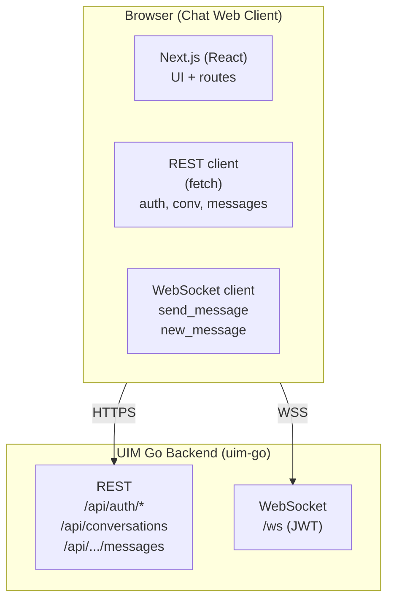
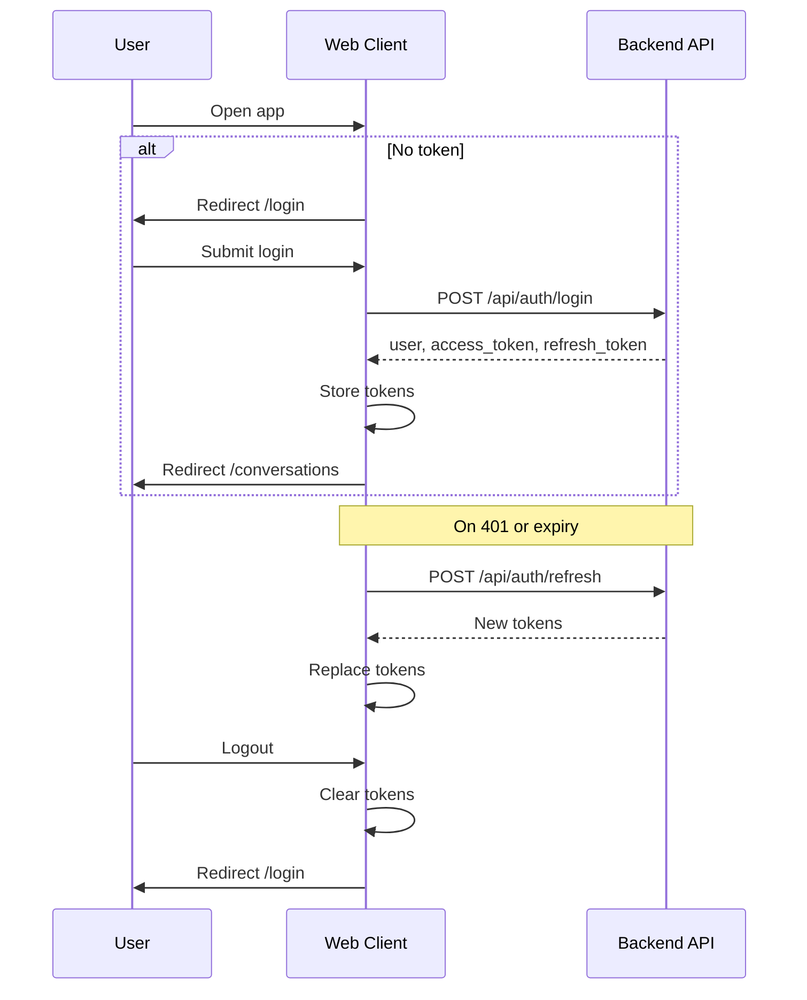
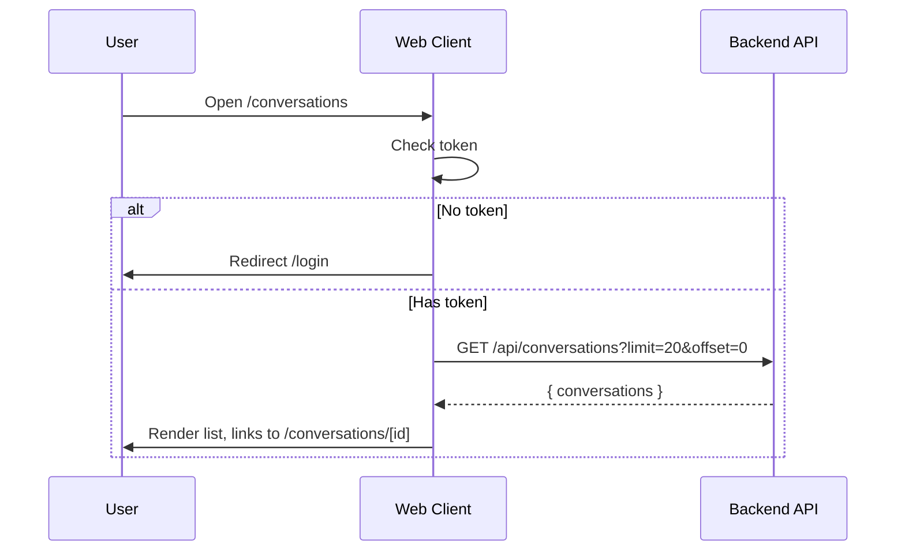
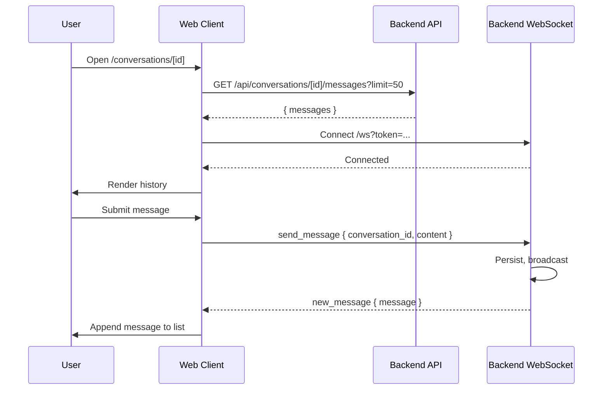
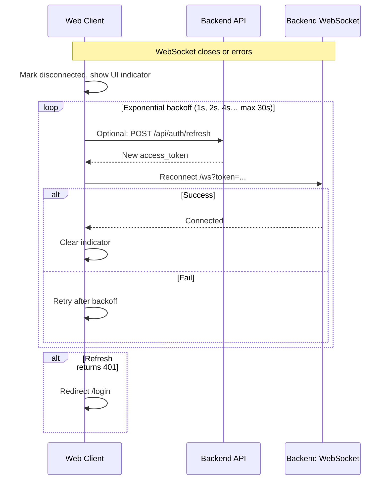

# Chat Frontend Technical Specification – v1.0

**Document Version:** 1.0  
**Last Updated:** 2026-01-26  
**Author:** convexwf@gmail.com  
**Backend Reference:** UIM Go backend (uim-go); [Core Messaging](../feature/core-messaging.md), [UIM System Design v1.0](../design/v1.0/uim-system-design-v1.0.md)

---

## Document Purpose & Scope

This document specifies the **technical design of the chat web client** for the UIM system v1.0. It defines architecture, technology choices, user flows, API integration, security, performance, testing, and deployment so that the frontend can be implemented and maintained to industry standards.

**In Scope** (all of the following are to be implemented; see [§3 Functional Areas and Scope](#3-functional-areas-and-scope))

- Web client: React + TypeScript + Next.js + Tailwind CSS; integration with Go backend (REST + WebSocket `/ws`); static or Node-hosted deployment.
- **Auth & account**: Register, login, refresh token, logout; token storage and auth headers.
- **Conversations & 1:1 chat**: Conversation list (paginated), open or start 1:1 chat, message history (paginated/cursor), display names.
- **Message send/receive**: Send and receive text messages over WebSocket; align with REST history fetch.
- **Connection & reconnection**: Show WebSocket connection status; exponential backoff reconnect on disconnect; reconnect after token refresh.
- **Offline message sync**: Optional local queue while disconnected; on reconnect fetch or receive server offline queue; show “syncing” state.
- **Online presence**: Call presence API; show online/offline in conversation list or chat header.
- **Group chat**: Group conversation list items, create group, group detail (name, members, roles), group chat pane, member list and add/remove (per backend API).
- **Message search**: Search entry and filters; call search API; result list and highlighting.
- **Typing indicators & read receipts**: Show “X is typing”; show read state (per backend); optional privacy settings.
- **Quality & operations**: Security (XSS/CSP, token); performance (e.g. virtual lists); testing; build & deployment; observability.

**Out of Scope (v1.0)**

- Native mobile (iOS/Android), desktop standalone (Electron); dedicated mobile via Flutter.
- Rich media (images, files), E2E encryption, voice/video.
- PWA, i18n, theming beyond light/dark.

---

## Table of Contents

- [1. Background & Goals](#1-background--goals)
  - [1.1 Business Context](#11-business-context)
  - [1.2 Design Goals](#12-design-goals)
  - [1.3 Non-Goals](#13-non-goals)
- [2. Requirements](#2-requirements)
  - [2.1 Functional Requirements](#21-functional-requirements)
  - [2.2 Non-Functional Requirements](#22-non-functional-requirements)
- [3. Functional Areas and Scope](#3-functional-areas-and-scope)
- [4. Terminology](#4-terminology)
- [5. High-Level Architecture](#5-high-level-architecture)
  - [5.1 Client-Server Model](#51-client-server-model)
  - [5.2 Frontend Layers](#52-frontend-layers)
- [6. Technology Stack](#6-technology-stack)
  - [6.1 Core Stack](#61-core-stack)
  - [6.2 Supporting Libraries](#62-supporting-libraries)
- [7. Key User Flows](#7-key-user-flows)
  - [7.1 Authentication Flow](#71-authentication-flow)
  - [7.2 Conversation List Flow](#72-conversation-list-flow)
  - [7.3 Chat Flow (Send / Receive)](#73-chat-flow-send--receive)
  - [7.4 Reconnection & Offline Handling](#74-reconnection--offline-handling)
- [8. API & Protocol Contract](#8-api--protocol-contract)
  - [8.1 REST API Usage](#81-rest-api-usage)
  - [8.2 WebSocket Protocol](#82-websocket-protocol)
  - [8.3 TypeScript Types](#83-typescript-types)
- [9. Directory Structure](#9-directory-structure)
- [10. State Management](#10-state-management)
- [11. UI/UX Requirements](#11-uiux-requirements)
  - [11.1 Accessibility](#111-accessibility)
  - [11.2 Loading & Error States](#112-loading--error-states)
  - [11.3 Responsive Design (PC vs Mobile)](#113-responsive-design-pc-vs-mobile)
- [12. Security](#12-security)
  - [12.1 Token Storage](#121-token-storage)
  - [12.2 Transport & Hardening](#122-transport--hardening)
- [13. Performance](#13-performance)
- [14. Testing Strategy](#14-testing-strategy)
- [15. Build & Deployment](#15-build--deployment)
- [16. Observability](#16-observability)
- [17. Acceptance Criteria](#17-acceptance-criteria)
- [18. Risks & Trade-offs](#18-risks--trade-offs)
- [References](#references)

---

## 1. Background & Goals

### 1.1 Business Context

The UIM system provides instant messaging for personal or small-team use. The web client is the primary way users access the product. It must:

- Let users **register and log in** and obtain a JWT.
- Show a **conversation list** and open **one-on-one chats**.
- **Send and receive messages** in real time via WebSocket, with history loaded via REST.
- Work reliably on modern browsers and degrade gracefully on disconnect or backend errors.

### 1.2 Design Goals

- **Simplicity**: Minimal dependencies, clear structure, easy to onboard new developers.
- **Alignment with backend**: Use backend REST and WebSocket contracts as single source of truth (see [Core Messaging](../feature/core-messaging.md)).
- **Maintainability**: TypeScript, consistent patterns, documented decisions.
- **Deployability**: Support static export or Node server, environment-based config, and simple CI/CD.

### 1.3 Non-Goals

- No SSR/SSG for chat content (client-side rendering is acceptable for MVP).
- No PWA/offline-first requirement in v1.0.
- No internationalization (i18n) in v1.0.
- No theming beyond light/dark if time permits.
- **No full mobile UX parity for the web client**: dedicated mobile experience will be delivered by a **Flutter app** (planned). The React web app does not need to invest heavily in mobile-specific adaptation.

---

## 2. Requirements

### 2.1 Functional Requirements

| ID   | Requirement | Priority |
| ---- | ----------- | -------- |
| F1   | User can register (username, email, password) and receive JWT. | P0 |
| F2   | User can log in and receive access + refresh tokens. | P0 |
| F3   | User can refresh access token using refresh token. | P0 |
| F4   | Authenticated user can list their conversations (paginated). | P0 |
| F5   | User can start or open a one-on-one conversation (by other user ID or existing conversation). | P0 |
| F6   | User can view message history for a conversation (paginated, cursor-based). | P0 |
| F7   | User can send a text message in a conversation via WebSocket. | P0 |
| F8   | User receives new messages in real time via WebSocket for open conversation. | P0 |
| F9   | UI shows clear loading and error states for API and WebSocket. | P0 |
| F10  | On WebSocket disconnect, client attempts reconnection with backoff; UI reflects connection status. | P0 |
| F11  | Session persists across page refresh (e.g. token in storage). | P0 |
| F12  | Offline message sync: optional local queue while disconnected; on reconnect fetch or receive queue; show “syncing” state. | P0 |
| F13  | Online presence: call presence API; show online/offline in conversation list or chat header. | P0 |
| F14  | Group chat: group list, create group, group detail (name, members, roles), group chat pane, member list and add/remove (per backend API). | P0 |
| F15  | Message search: search entry and filters; call `GET /api/conversations/:id/messages/search`; result list and highlighting. | P0 |
| F16  | Typing indicators: subscribe to typing events; show “X is typing” in chat. | P0 |
| F17  | Read receipts: show message read state (per backend); optional privacy settings UI. | P0 |

### 2.2 Non-Functional Requirements

| ID   | Requirement | Target |
| ---- | ----------- | ------ |
| NF1  | First Contentful Paint (FCP) | &lt; 2s on 3G-like. |
| NF2  | Time to Interactive (TTI) | &lt; 4s. |
| NF3  | Bundle size (initial) | &lt; 300 KB gzipped where feasible. |
| NF4  | Support browsers | Last 2 versions of Chrome, Firefox, Safari, Edge. |
| NF5  | Accessibility | WCAG 2.1 Level A minimum. |
| NF6  | Security | No tokens in URLs; HTTPS in production. |
| NF7  | Target devices | **Desktop/laptop primary**; mobile browser **basic usable** (layout, tap targets); **dedicated mobile**: Flutter app (planned). React web does not require full mobile UX investment. |

---

## 3. Functional Areas and Scope

This section lists **all work to be implemented** for v1.0, organized by **frontend functional area**. Each row is in scope; details are in the referenced sections.

| Area | What to implement | See |
| ----- | ----------------- | --- |
| **3.1 Auth & account** | Register, login, refresh token, logout; persist access/refresh token; auth headers and WebSocket auth; on 401 refresh or redirect to login. | §7.1 Auth flow, §8.1 REST, §12 Security |
| **3.2 Conversation list & 1:1 chat** | List conversations (GET /api/conversations, paginated); start or open 1:1 (POST create or from list); show other party display name; routes `/conversations`, `/conversations/[id]`. | §7.2 Conversation list flow, §8.1 REST |
| **3.3 Message send/receive & history** | Message history with cursor (GET messages, before_id); send via WebSocket (send_message), receive (new_message); optional optimistic update, merge with server new_message. | §7.3 Chat flow, §8.2 WebSocket, §8.3 Types |
| **3.4 Connection, reconnection & offline** | Show WebSocket connection status in UI; exponential backoff on disconnect (e.g. 1s, 2s, 4s, max 30s); refresh token then reconnect when needed; offline queue: optional local queue while disconnected, on reconnect fetch or receive server queue, show “syncing” state. | §7.4 Reconnection & offline, §8.2 WebSocket |
| **3.5 Online presence** | Call `GET /api/users/:id/presence` (or backend equivalent); show online/offline in conversation list or chat header; cache/poll per backend. | §8 API contract (presence as per backend) |
| **3.6 Group chat** | Group conversations in list (distinct from 1:1); create group UI (per POST /api/conversations/group or equivalent); group detail: name, members, roles; group chat pane reusing message list pattern; member list and add/remove (per GET/POST/DELETE .../members). | §8 REST (group APIs as per backend) |
| **3.7 Message search** | In-conversation or global search entry; call `GET /api/conversations/:id/messages/search` (or equivalent); filters (date, sender); result list and highlighting. | §8 REST (search API as per backend) |
| **3.8 Typing indicators & read receipts** | Typing: subscribe to backend typing events (WebSocket or API), show “X is typing” in chat; read receipts: show read state (per backend protocol); optional privacy settings UI. | §8 WebSocket/API (protocol as per backend) |
| **3.9 Quality & operations** | Security: token storage and transport, XSS/CSP, no token in URL/logs; performance: virtualize long lists, lazy-load; testing: unit and integration; build & deploy: static or Node, env vars; observability: error boundary, connection status, optional Sentry. | §12 Security, §13 Performance, §14 Testing, §15 Build & Deployment, §16 Observability |

---

## 4. Terminology

| Term | Definition |
| ---- | ---------- |
| **Access token** | JWT used for REST `Authorization: Bearer` and WebSocket auth. Short-lived. |
| **Refresh token** | JWT used to obtain a new access (and refresh) token. Long-lived. |
| **Conversation** | A one-on-one chat between two users. Identified by `conversation_id` (UUID). |
| **Message** | A single text message in a conversation; has `message_id`, `sender_id`, `content`, `created_at`. |
| **WebSocket connection** | Persistent connection to backend `GET /ws?token=&lt;access_token&gt;` for real-time send/receive. |
| **Reconnection** | Client re-establishes WebSocket after disconnect (with backoff). |

---

## 5. High-Level Architecture

### 5.1 Client-Server Model



- **REST**: Login, register, refresh, list conversations, get messages (history).
- **WebSocket**: Send message (`send_message`), receive message (`new_message`). Token from access token.

### 5.2 Frontend Layers

| Layer | Responsibility |
| ----- | -------------- |
| **Pages / Routes** | Next.js App Router: `/`, `/login`, `/register`, `/conversations`, `/conversations/[id]`. |
| **Components** | UI (buttons, inputs, list items), layout (header, sidebar), feature (conversation list, chat pane). |
| **Lib / Services** | API client (REST), WebSocket client, auth (token read/write, login/logout). |
| **State** | React state + context or lightweight store; sync with REST and WebSocket. |
| **Types** | TypeScript interfaces aligned with backend (User, Conversation, Message). |

---

## 6. Technology Stack

### 6.1 Core Stack

| Choice | Version / Notes |
| ------ | ----------------- |
| **React** | 18.x (with Next.js). |
| **TypeScript** | 5.x, strict mode. |
| **Next.js** | 14.x or 15.x; App Router. |
| **Tailwind CSS** | 3.x for styling. |

### 6.2 Supporting Libraries

| Purpose | Suggestion | Notes |
| ------- | ---------- | ----- |
| HTTP client | `fetch` or `axios` | Encapsulate in `lib/api.ts` with base URL and auth header. |
| WebSocket | Native `WebSocket` or `reconnecting-websocket` | Handle ping/pong; reconnect with backoff. |
| Forms | React state or `react-hook-form` | Optional for login/register. |
| Date/time | `date-fns` or native `Intl` | Format message timestamps. |
| Routing | Next.js built-in | No extra router. |

---

## 7. Key User Flows

### 7.1 Authentication Flow

1. User opens app; if no valid token in storage, redirect to `/login`.
2. User submits login (username, password) → `POST /api/auth/login`.
3. Backend returns `{ user, access_token, refresh_token }`; client stores tokens (e.g. `localStorage` or httpOnly cookie) and user info.
4. Redirect to `/conversations`.
5. **Refresh**: Before token expiry (or on 401), call `POST /api/auth/refresh` with `refresh_token`, replace stored tokens.
6. **Logout**: Clear tokens and user; redirect to `/login`.



### 7.2 Conversation List Flow

1. User lands on `/conversations`; ensure access token exists (else redirect to login).
2. `GET /api/conversations?limit=20&offset=0` with `Authorization: Bearer <access_token>`.
3. Render list of conversations; each item links to `/conversations/[id]`.
4. For 1:1, show other participant’s display name (backend may not return it; client may need to resolve from participant list or a future endpoint).
5. Pagination: optional “Load more” with `offset` or next page.



### 7.3 Chat Flow (Send / Receive)

1. User clicks a conversation → navigate to `/conversations/[id]`.
2. Load history: `GET /api/conversations/[id]/messages?limit=50` (and optionally `before_id` for older messages).
3. Establish WebSocket: `new WebSocket(WS_URL + '?token=' + access_token)` (or pass token in subprotocol/header if backend supports).
4. **Send**: On submit, send JSON `{ type: 'send_message', conversation_id: id, content: text }` over WebSocket. Optionally show optimistic message in UI; replace with server `new_message` when received.
5. **Receive**: On WebSocket message `{ type: 'new_message', message: { ... } }`, append to current conversation if `message.conversation_id === currentConversationId`; otherwise optionally show notification or badge.
6. **Pagination**: “Load older” → same GET with `before_id=<smallest_message_id>`.



### 7.4 Reconnection & Offline Handling

1. On WebSocket `close` or `error`, mark connection as disconnected; show indicator in UI.
2. Start reconnection with exponential backoff (e.g. 1s, 2s, 4s, max 30s); use current access token (refresh if needed via REST first).
3. On reconnect, re-subscribe or rely on server push for open conversation; optionally re-fetch last page of messages to avoid gaps.
4. If refresh token fails (401), redirect to login.



---

## 8. API & Protocol Contract

### 8.1 REST API Usage

Base URL: `NEXT_PUBLIC_API_URL` (e.g. `http://localhost:8080`). All authenticated requests: `Authorization: Bearer <access_token>`.

| Method | Path | Request | Response (success) |
| ------ | ---- | ------- | ------------------- |
| POST | `/api/auth/register` | `{ username, email, password }` | `201` + `{ user, access_token, refresh_token }` |
| POST | `/api/auth/login` | `{ username, password }` | `200` + `{ user, access_token, refresh_token }` |
| POST | `/api/auth/refresh` | `{ refresh_token }` | `200` + `{ access_token, refresh_token }` or tokens in body |
| POST | `/api/conversations` | `{ other_user_id: string }` | `201` + Conversation |
| GET | `/api/conversations` | `?limit=20&offset=0` | `200` + `{ conversations: Conversation[] }` |
| GET | `/api/conversations/:id/messages` | `?limit=50&offset=0&before_id=123` | `200` + `{ messages: Message[] }` |

Error responses: `4xx/5xx` with body `{ error: string }`. Handle 401 (re-auth or refresh), 403, 404, 400.

### 8.2 WebSocket Protocol

- **URL**: `ws(s)://<host>/ws?token=<access_token>` (or Authorization header if supported).
- **Client → Server**: `{ "type": "send_message", "conversation_id": "<uuid>", "content": "text" }`.
- **Server → Client**: `{ "type": "new_message", "message": { "message_id", "conversation_id", "sender_id", "content", "type", "created_at", ... } }`.
- **Ping/Pong**: Server sends ping; browser WebSocket API auto-responds with pong. No application-level ping required from client unless needed for keepalive.
- **Rate limit**: 60 messages/minute per connection (backend); client should not exceed.

### 8.3 TypeScript Types

Align with backend JSON. Example:

```ts
type User = {
  user_id: string;
  username: string;
  email: string;
  display_name?: string;
  avatar_url?: string;
};

type Conversation = {
  conversation_id: string;
  type: 'one_on_one' | 'group';
  name?: string;
  created_by: string;
  created_at: string;
  updated_at: string;
};

type Message = {
  message_id: number;
  conversation_id: string;
  sender_id: string;
  content: string;
  type: string;
  created_at: string;
  metadata?: unknown;
};
```

---

## 9. Directory Structure

Recommended layout under project root (e.g. `client/uim-react/` or repo root):

```
.
├── app/
│   ├── layout.tsx
│   ├── page.tsx
│   ├── globals.css
│   ├── (auth)/
│   │   ├── login/page.tsx
│   │   └── register/page.tsx
│   └── (chat)/
│       ├── layout.tsx
│       ├── conversations/page.tsx
│       └── conversations/[id]/page.tsx
├── components/
│   ├── ui/          # Button, Input, Card
│   ├── layout/      # Header, Sidebar
│   └── features/    # ConversationList, ChatPane, MessageInput
├── lib/
│   ├── api.ts       # REST: auth, conversations, messages
│   ├── ws.ts        # WebSocket connect, send, subscribe
│   ├── auth.ts      # getToken, setToken, logout, refresh
│   └── types.ts     # User, Conversation, Message
├── hooks/
│   ├── useAuth.ts
│   ├── useConversation.ts
│   └── useWebSocket.ts
├── public/
├── doc/             # Project-specific docs (README, deployment)
├── scripts/         # build.sh, deploy.sh
├── .env.local.example
├── next.config.js
├── tailwind.config.ts
├── tsconfig.json
└── package.json
```

---

## 10. State Management

- **Auth state**: Access/refresh token and user; store in memory + persistence (e.g. localStorage). Context or small store for “current user” and “isAuthenticated”.
- **Conversation list**: Fetched on `/conversations`; hold in component state or context; refetch on focus or after creating a new conversation.
- **Current conversation messages**: Fetched for `/conversations/[id]`; append new messages from WebSocket; optional “load older” appends to top or prepends.
- **WebSocket**: One connection per app; share across routes. Store connection status (connected/disconnected/error) for UI indicator.
- No global Redux/Zustand required for MVP; add if complexity grows.

---

## 11. UI/UX Requirements

### 11.1 Accessibility

- Semantic HTML (headings, lists, buttons, links).
- Form labels and error messages associated with inputs.
- Focus order and visible focus styles.
- Sufficient color contrast (WCAG 2.1 Level A).

### 11.2 Loading & Error States

- **Loading**: Skeleton or spinner for conversation list and message list.
- **Errors**: Inline error for login/register; toast or banner for API/WS errors; retry where appropriate.
- **Empty states**: “No conversations yet”, “No messages” with clear next action.

### 11.3 Responsive Design (PC vs Mobile)

**Target devices**

- **Primary**: Desktop and laptop (and tablet in landscape). The React web client is optimized for this use case.
- **Secondary**: Mobile browser is **basic usable** only—layout does not break (e.g. 320px–1920px viewport), content is readable, and tap targets are adequate. No requirement for full mobile UX (e.g. gesture-heavy navigation, mobile-first patterns).
- **Dedicated mobile**: A **Flutter app** (planned) will deliver the full mobile experience. The React web app does **not** need to invest heavily in mobile-specific adaptation.

**Implementation**

- Desktop-first or mobile-first as per product; at least usable on 320px–1920px width.
- Conversation list and chat pane: stack on small screens; side-by-side on large.
- Avoid investing in complex mobile-only UX in the web codebase; keep responsive layout minimal and maintainable.

---

## 12. Security

### 12.1 Token Storage

- **Option A**: `localStorage`: simple, but XSS can steal. Mitigate with CSP, no eval, sanitized inputs.
- **Option B**: httpOnly cookie for refresh token; access token in memory only (lost on refresh unless refreshed). More secure, requires backend to set cookie.
- **Recommendation for v1.0**: `localStorage` with strict CSP and dependency hygiene; document risk and plan cookie option later.

### 12.2 Transport & Hardening

- All production traffic over **HTTPS** and **WSS**.
- **CSP**: Restrict script sources; avoid inline scripts where possible.
- **Input**: Sanitize or escape user content before rendering to prevent XSS (especially in message content).
- Do not put tokens in URL query for REST; WebSocket URL query is documented by backend but avoid logging.

---

## 13. Performance

- **Code splitting**: Next.js automatic per-route; lazy-load heavy components if needed.
- **Images**: Use Next.js `Image` if/when images are added.
- **Lists**: Virtualize long message lists (e.g. `react-window` or `@tanstack/react-virtual`) if &gt; 100 items.
- **Bundle**: Audit with `next/bundle-analyzer`; keep initial JS under ~300 KB gzipped where feasible.

---

## 14. Testing Strategy

| Level | Tool | Scope |
| ----- | ---- | ----- |
| **Unit** | Vitest or Jest | `lib/*`, `hooks/*`, pure utils. |
| **Component** | React Testing Library | Critical components (login form, message list item). |
| **E2E** | Playwright or Cypress | Login → open conversation → send message; optional. |
| **Manual** | Checklist | Cross-browser, responsive, a11y. |

Mock REST and WebSocket in tests; use MSW if helpful.

---

## 15. Build & Deployment

- **Build**: `next build`. For static export: `output: 'export'` in `next.config.js`; then `next build` → `out/`.
- **Env**: `NEXT_PUBLIC_API_URL`, optionally `NEXT_PUBLIC_WS_URL` (default same host as API). Provide `.env.local.example`.
- **Deploy**:
  - **Static**: Serve `out/` with Nginx/Vercel/Netlify; API and WS on same or different host.
  - **Node**: `next start` behind reverse proxy; same env vars.
- **CI**: Install deps → lint → test → build; optional deploy step (e.g. Vercel, or rsync to server).

---

## 16. Observability

- **Client errors**: Global error boundary; log to console; optional reporting (e.g. Sentry) later.
- **Connection status**: Show “Disconnected” / “Reconnecting” in UI.
- **No backend metrics from frontend**: Backend owns latency and availability; frontend only reports own errors if desired.

---

## 17. Acceptance Criteria

- [ ] User can register and log in; tokens stored and used for API and WebSocket.
- [ ] User can see conversation list and open a conversation.
- [ ] User can see message history and send a message; message appears in list and is persisted (visible after refresh).
- [ ] User receives new messages in real time when WebSocket is connected.
- [ ] On disconnect, reconnection is attempted and status is visible; after re-login, chat works again.
- [ ] Loading and error states are clear; no tokens in URLs.
- [ ] App runs in supported browsers; passes WCAG 2.1 Level A for critical paths.
- [ ] Build produces static export or Node bundle; deployment doc describes at least one deployment path.

---

## 18. Risks & Trade-offs

| Risk | Mitigation |
| ---- | ---------- |
| **XSS** (localStorage token or message content) | CSP, sanitize/escape message content, avoid `dangerouslySetInnerHTML` for user content. |
| **WebSocket reconnection storms** | Exponential backoff, max interval, limit retries. |
| **Stale token** | Refresh on 401 or before expiry; redirect to login if refresh fails. |
| **Large message list** | Virtualize list; paginate with `before_id`. |

**Trade-offs**

- **localStorage vs cookie**: Simplicity vs security; v1.0 chooses simplicity with documented hardening.
- **Optimistic UI**: Optional for send message; improves perceived speed; requires reconcile with server `new_message`.

---

## References

- [Core Messaging (Backend)](../feature/core-messaging.md) – REST and WebSocket contract.
- [UIM System Design v1.0](../design/v1.0/uim-system-design-v1.0.md) – Backend architecture and flows.
- [Roadmap v1.0](../design/v1.0/roadmap-v1.0.md) – Phases and tasks (Phase 1–3).
- [Next.js App Router](https://nextjs.org/docs/app) – Routing and layout.
- [Tailwind CSS](https://tailwindcss.com/docs) – Styling.
- [WCAG 2.1](https://www.w3.org/WAI/WCAG21/quickref/) – Accessibility.
