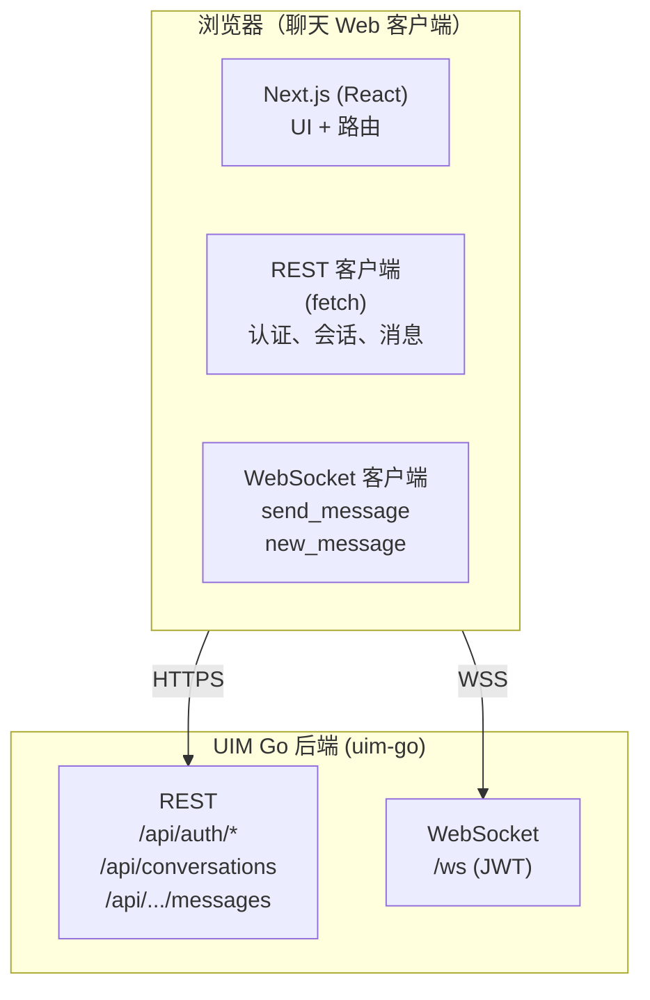
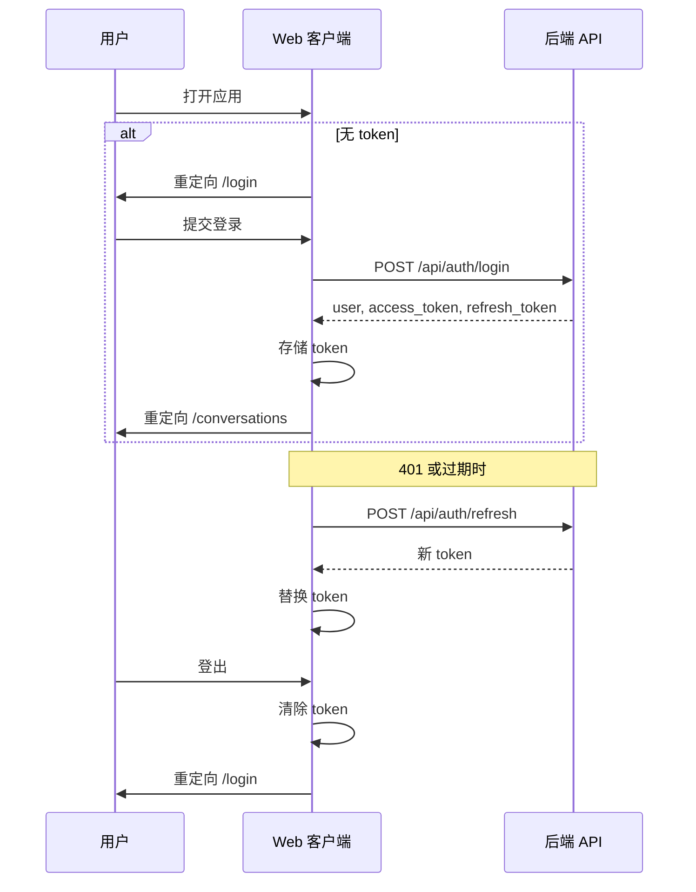
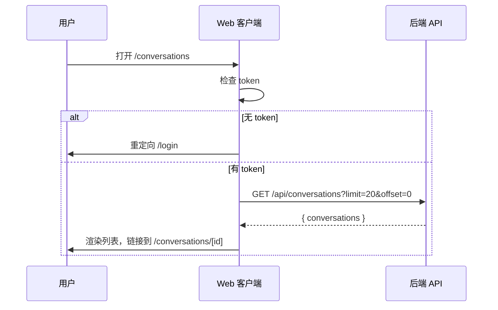
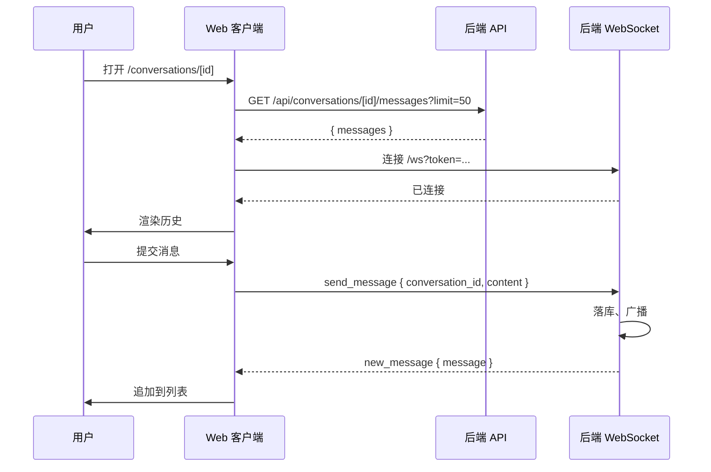
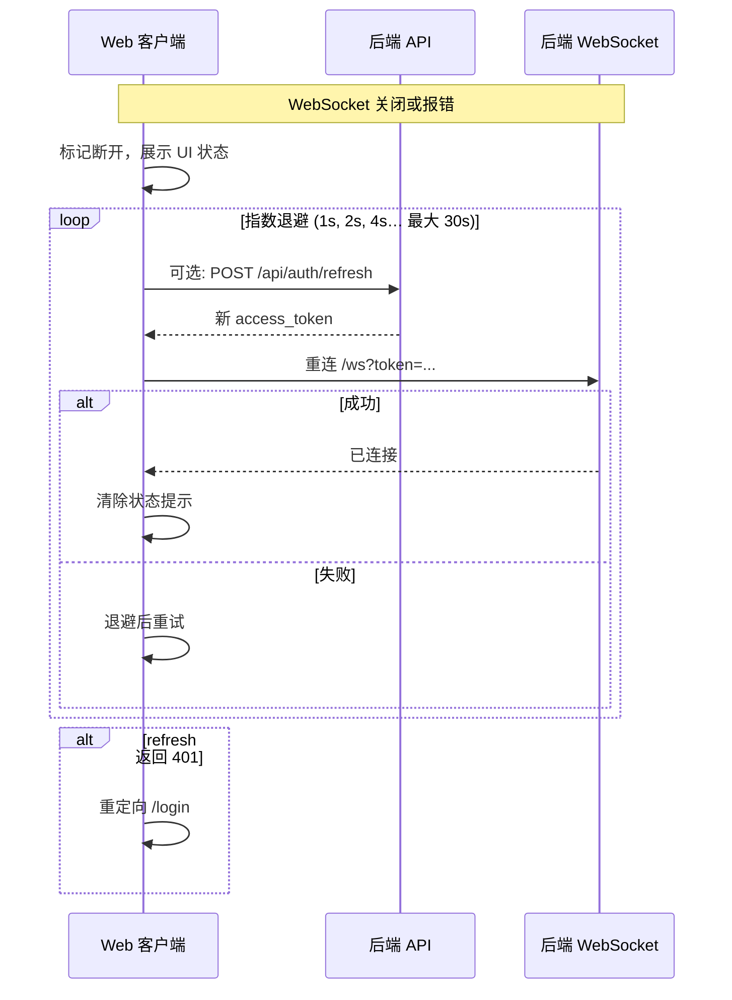

# 聊天前端技术方案 – v1.0

**文档版本：** 1.0  
**最后更新：** 2026-01-26  
**作者：** convexwf@gmail.com  
**后端参考：** UIM Go 后端 (uim-go)；[Core Messaging](../feature/core-messaging.md)、[UIM System Design v1.0](../design/v1.0/uim-system-design-v1.0.md)

---

## 文档目的与范围

本文档规定 UIM 系统 v1.0 **聊天 Web 客户端**的技术设计，包括架构、技术选型、用户流程、与后端 API 的集成、安全、性能、测试与部署，以便前端按业界规范实现与维护。

**范围内**（以下均为本方案要实现的内容，按前端功能领域组织，见 [§3 功能领域与实现范围](#3-功能领域与实现范围)）

- Web 客户端：React + TypeScript + Next.js + Tailwind CSS；与 Go 后端（REST + WebSocket `/ws`）集成；支持静态或 Node 托管部署。
- **认证与账号**：注册、登录、刷新 Token、登出；Token 存储与鉴权。
- **会话与单聊**：会话列表（分页）、打开/发起单聊、消息历史（分页/游标）、展示名。
- **消息收发**：通过 WebSocket 发送与实时接收文本消息；与 REST 历史拉取配合。
- **连接与重连**：WebSocket 连接状态展示、断开后指数退避重连、Token 刷新后重连。
- **离线消息同步**：断线期间本地排队发送（可选）、重连后拉取或接收离线队列消息、展示「同步中」状态。
- **在线状态**：调用 presence API，在会话列表或聊天头展示在线/离线。
- **群聊**：群会话列表项、创建群、群详情（名称、成员、角色）、群聊面板、成员列表与增删（依后端 API）。
- **消息搜索**：搜索入口与筛选、调用搜索 API、结果展示与高亮。
- **输入状态与已读回执**：展示「正在输入」、展示已读状态（依后端能力）；可选隐私设置。
- **质量与运维**：安全（XSS/CSP、Token）、性能（虚拟列表等）、测试、构建与部署、可观测性。

**范围外（v1.0 不做）**

- 原生移动端（iOS/Android）、桌面独立应用（Electron）；专用移动端由 Flutter 承担。
- 富媒体（图片、文件）、端到端加密、音视频。
- PWA、国际化（i18n）、多主题（除浅色/深色外）。

---

## 目录

- [1. 背景与目标](#1-背景与目标)
  - [1.1 业务背景](#11-业务背景)
  - [1.2 设计目标](#12-设计目标)
  - [1.3 非目标](#13-非目标)
- [2. 需求](#2-需求)
  - [2.1 功能需求](#21-功能需求)
  - [2.2 非功能需求](#22-非功能需求)
- [3. 功能领域与实现范围](#3-功能领域与实现范围)
- [4. 术语](#4-术语)
- [5. 总体架构](#5-总体架构)
  - [5.1 客户端-服务端模型](#51-客户端-服务端模型)
  - [5.2 前端分层](#52-前端分层)
- [6. 技术栈](#6-技术栈)
  - [6.1 核心栈](#61-核心栈)
  - [6.2 辅助库](#62-辅助库)
- [7. 关键用户流程](#7-关键用户流程)
  - [7.1 认证流程](#71-认证流程)
  - [7.2 会话列表流程](#72-会话列表流程)
  - [7.3 聊天流程（发送/接收）](#73-聊天流程发送接收)
  - [7.4 重连与离线处理](#74-重连与离线处理)
- [8. API 与协议约定](#8-api-与协议约定)
  - [8.1 REST API 使用](#81-rest-api-使用)
  - [8.2 WebSocket 协议](#82-websocket-协议)
  - [8.3 TypeScript 类型](#83-typescript-类型)
- [9. 目录结构](#9-目录结构)
- [10. 状态管理](#10-状态管理)
- [11. UI/UX 要求](#11-uiux-要求)
  - [11.1 无障碍](#111-无障碍)
  - [11.2 加载与错误状态](#112-加载与错误状态)
  - [11.3 响应式设计（PC 与手机）](#113-响应式设计pc-与手机)
- [12. 安全](#12-安全)
  - [12.1 Token 存储](#121-token-存储)
  - [12.2 传输与加固](#122-传输与加固)
- [13. 性能](#13-性能)
- [14. 测试策略](#14-测试策略)
- [15. 构建与部署](#15-构建与部署)
- [16. 可观测性](#16-可观测性)
- [17. 验收标准](#17-验收标准)
- [18. 风险与权衡](#18-风险与权衡)
- [参考资料](#参考资料)

---

## 1. 背景与目标

### 1.1 业务背景

UIM 系统面向个人或小团队即时通讯。Web 客户端是用户使用产品的主要入口，需实现：

- 用户**注册与登录**并获取 JWT。
- 展示**会话列表**并打开**单聊**。
- 通过 WebSocket **实时收发消息**，通过 REST 拉取历史。
- 在现代浏览器上稳定运行，在断线或后端异常时优雅降级。

### 1.2 设计目标

- **简洁**：依赖少、结构清晰、便于新人上手。
- **与后端一致**：以后端 REST 与 WebSocket 契约为唯一事实来源（见 [Core Messaging](../feature/core-messaging.md)）。
- **可维护**：TypeScript、统一模式、决策有文档。
- **可部署**：支持静态导出或 Node 服务、环境配置、简单 CI/CD。

### 1.3 非目标

- 不对聊天内容做 SSR/SSG（MVP 可采用客户端渲染）。
- v1.0 不要求 PWA/离线优先。
- v1.0 不做国际化（i18n）。
- 除浅色/深色外不强制多主题。
- **不要求 Web 端达到与移动端应用同级的完整移动体验**：专用移动端由 **Flutter 应用**（规划中）承担；React Web 端无需在手机端适配上投入大量精力。

---

## 2. 需求

### 2.1 功能需求

| ID   | 需求 | 优先级 |
| ---- | ----- | ------ |
| F1   | 用户可注册（用户名、邮箱、密码）并获取 JWT。 | P0 |
| F2   | 用户可登录并获取 access_token 与 refresh_token。 | P0 |
| F3   | 用户可使用 refresh_token 刷新 access_token。 | P0 |
| F4   | 已认证用户可分页拉取会话列表。 | P0 |
| F5   | 用户可发起或打开单聊（通过对方 user_id 或已有 conversation_id）。 | P0 |
| F6   | 用户可查看某会话的消息历史（分页、游标）。 | P0 |
| F7   | 用户可通过 WebSocket 在会话中发送文本消息。 | P0 |
| F8   | 用户通过 WebSocket 实时收到当前会话新消息。 | P0 |
| F9   | 对 API 与 WebSocket 有明确的加载与错误状态展示。 | P0 |
| F10  | WebSocket 断开后客户端按退避策略重连；UI 展示连接状态。 | P0 |
| F11  | 刷新页面后会话保持（如 token 持久化）。 | P0 |
| F12  | 离线消息同步：断线时本地可排队发送，重连后拉取或接收队列消息，展示「同步中」状态。 | P0 |
| F13  | 在线状态：调用 presence API，在会话列表或聊天头展示在线/离线。 | P0 |
| F14  | 群聊：群会话列表、创建群、群详情（名称、成员、角色）、群聊消息面板、成员列表与增删（依后端 API）。 | P0 |
| F15  | 消息搜索：搜索入口与筛选、调用 `GET /api/conversations/:id/messages/search`，结果展示与高亮。 | P0 |
| F16  | 输入状态：订阅输入事件，在聊天中展示「X 正在输入」。 | P0 |
| F17  | 已读回执：展示消息已读状态（依后端下发）；可选隐私设置 UI。 | P0 |

### 2.2 非功能需求

| ID   | 需求 | 目标 |
| ---- | ----- | ---- |
| NF1  | 首次内容绘制 (FCP) | 3G 条件下 &lt; 2s。 |
| NF2  | 可交互时间 (TTI) | &lt; 4s。 |
| NF3  | 首包体积 | 尽量 &lt; 300 KB gzip。 |
| NF4  | 浏览器支持 | Chrome、Firefox、Safari、Edge 最近两个主版本。 |
| NF5  | 无障碍 | 至少符合 WCAG 2.1 Level A。 |
| NF6  | 安全 | 生产环境 HTTPS；URL 中不携带 token。 |
| NF7  | 目标设备 | **桌面/笔记本为主**；手机浏览器**基本可用**（布局、触控区域）；**专用移动端**：Flutter 应用（规划中）。React Web 不要求做完整移动端体验投入。 |

---

## 3. 功能领域与实现范围

本节按**前端功能领域**列出 v1.0 内全部要实现的内容；每条均为本方案规定要做的工作，实现细节见后续章节。

| 领域 | 要实现的内容 | 详见 |
| ----- | ------------ | ---- |
| **3.1 认证与账号** | 注册、登录、刷新 Token、登出；access/refresh token 持久化；请求头与 WebSocket 鉴权；401 时刷新或跳转登录。 | §7.1 认证流程、§8.1 REST、§12 安全 |
| **3.2 会话列表与单聊** | 会话列表分页（GET /api/conversations）；发起/打开单聊（POST 创建或 GET 列表后进入）；单聊展示对方展示名；路由 `/conversations`、`/conversations/[id]`。 | §7.2 会话列表流程、§8.1 REST |
| **3.3 消息收发与历史** | 消息历史分页与游标（GET messages，before_id）；通过 WebSocket 发送（send_message）与接收（new_message）；乐观更新可选，与服务端 new_message 合并。 | §7.3 聊天流程、§8.2 WebSocket、§8.3 类型 |
| **3.4 连接、重连与离线消息** | WebSocket 连接状态在 UI 展示；断开后指数退避重连（如 1s/2s/4s，最大 30s）；Token 过期时先 refresh 再重连；离线队列：断线期间本地可排队发送，重连后拉取或接收服务端离线消息，展示「同步中」状态。 | §7.4 重连与离线处理、§8.2 WebSocket |
| **3.5 在线状态** | 调用 `GET /api/users/:id/presence`（或后端等价接口）；在会话列表或聊天头展示在线/离线；缓存与轮询策略依后端能力。 | §8 API 约定（presence 接口以实际为准） |
| **3.6 群聊** | 群会话在列表中与单聊区分展示；创建群 UI（依 `POST /api/conversations/group` 或等价）；群详情：名称、成员、角色；群聊面板使用同一消息列表模式；成员列表与增删（依 `GET/POST/DELETE .../members`）。 | §8 REST（群组相关接口以实际为准） |
| **3.7 消息搜索** | 会话内或全局搜索入口；调用 `GET /api/conversations/:id/messages/search`（或等价）；筛选（日期、发送者等）；结果列表与高亮展示。 | §8 REST（搜索接口以实际为准） |
| **3.8 输入状态与已读回执** | 输入状态：订阅后端输入事件（WebSocket 或 API），在聊天区展示「X 正在输入」；已读回执：展示消息已读状态（依后端协议）；可选已读隐私设置 UI。 | §8 WebSocket/API（协议以实际为准） |
| **3.9 质量与运维** | 安全：Token 存储与传输、XSS/CSP、不向 URL/日志泄露 token；性能：长列表虚拟化、按需加载；测试：单元与集成策略；构建与部署：静态或 Node、环境变量；可观测性：错误边界、连接状态、可选 Sentry。 | §12 安全、§13 性能、§14 测试、§15 构建与部署、§16 可观测性 |

---

## 4. 术语

| 术语 | 定义 |
| ---- | ---- |
| **Access token** | 用于 REST `Authorization: Bearer` 及 WebSocket 鉴权的 JWT，短期有效。 |
| **Refresh token** | 用于换取新 access/refresh token 的 JWT，长期有效。 |
| **Conversation** | 两名用户之间的单聊，由 `conversation_id`（UUID）标识。 |
| **Message** | 会话中的一条文本消息，含 `message_id`、`sender_id`、`content`、`created_at`。 |
| **WebSocket 连接** | 与后端 `GET /ws?token=<access_token>` 的持久连接，用于实时收发。 |
| **重连** | 断开后客户端按退避策略重新建立 WebSocket。 |

---

## 5. 总体架构

### 5.1 客户端-服务端模型



- **REST**：登录、注册、刷新、会话列表、消息历史。
- **WebSocket**：发送消息（`send_message`）、接收消息（`new_message`）；鉴权使用 access token。

### 5.2 前端分层

| 层级 | 职责 |
| ---- | ---- |
| **页面/路由** | Next.js App Router：`/`、`/login`、`/register`、`/conversations`、`/conversations/[id]`。 |
| **组件** | UI（按钮、输入、列表项）、布局（顶栏、侧栏）、功能（会话列表、聊天区）。 |
| **Lib/服务** | API 客户端（REST）、WebSocket 客户端、认证（token 读写、登录/登出）。 |
| **状态** | React state + context 或轻量 store；与 REST/WebSocket 同步。 |
| **类型** | 与后端一致的 TypeScript 类型（User、Conversation、Message）。 |

---

## 6. 技术栈

### 6.1 核心栈

| 选型 | 版本/说明 |
| ---- | ---------- |
| **React** | 18.x（随 Next.js）。 |
| **TypeScript** | 5.x，strict 模式。 |
| **Next.js** | 14.x 或 15.x；App Router。 |
| **Tailwind CSS** | 3.x 样式。 |

### 6.2 辅助库

| 用途 | 建议 | 说明 |
| ---- | ----- | ---- |
| HTTP 客户端 | `fetch` 或 `axios` | 在 `lib/api.ts` 中封装 base URL 与鉴权头。 |
| WebSocket | 原生 `WebSocket` 或 `reconnecting-websocket` | 处理 ping/pong；退避重连。 |
| 表单 | React state 或 `react-hook-form` | 登录/注册可选。 |
| 日期时间 | `date-fns` 或原生 `Intl` | 消息时间展示。 |
| 路由 | Next.js 内置 | 无需额外路由库。 |

---

## 7. 关键用户流程

### 7.1 认证流程

1. 用户打开应用；若无有效 token，重定向至 `/login`。
2. 用户提交登录（用户名、密码）→ `POST /api/auth/login`。
3. 后端返回 `{ user, access_token, refresh_token }`；客户端持久化 token（如 localStorage 或 httpOnly cookie）及用户信息。
4. 重定向至 `/conversations`。
5. **刷新**：在 token 过期前或收到 401 时，用 `refresh_token` 调 `POST /api/auth/refresh`，更新本地 token。
6. **登出**：清除 token 与用户信息，重定向至 `/login`。



### 7.2 会话列表流程

1. 用户进入 `/conversations`；若无 access token 则重定向登录。
2. 带 `Authorization: Bearer <access_token>` 请求 `GET /api/conversations?limit=20&offset=0`。
3. 渲染会话列表；每项链接到 `/conversations/[id]`。
4. 单聊展示对方展示名（若后端未直接返回，需从参与者或后续接口解析）。
5. 分页：可选「加载更多」配合 `offset` 或下一页。



### 7.3 聊天流程（发送/接收）

1. 用户点击会话 → 进入 `/conversations/[id]`。
2. 拉取历史：`GET /api/conversations/[id]/messages?limit=50`（可选 `before_id` 拉更早消息）。
3. 建立 WebSocket：`new WebSocket(WS_URL + '?token=' + access_token)`（若后端支持也可在 subprotocol/header 传 token）。
4. **发送**：提交时通过 WebSocket 发送 `{ type: 'send_message', conversation_id: id, content: text }`。可选乐观更新 UI，收到服务端 `new_message` 后合并。
5. **接收**：收到 `{ type: 'new_message', message: { ... } }` 时，若 `message.conversation_id === currentConversationId` 则追加到当前会话；否则可通知或角标。
6. **分页**：「加载更早」→ 同一 GET 接口传 `before_id=<当前最小 message_id>`。



### 7.4 重连与离线处理

1. WebSocket `close` 或 `error` 时标记为断开，UI 展示状态。
2. 按指数退避（如 1s、2s、4s，最大 30s）重连；使用当前 access token（必要时先通过 REST 刷新）。
3. 重连后依赖服务端推送或可选重拉最后一页消息以避免缺口。
4. 若 refresh 返回 401，重定向登录。



---

## 8. API 与协议约定

### 8.1 REST API 使用

Base URL：`NEXT_PUBLIC_API_URL`（如 `http://localhost:8080`）。鉴权请求均带 `Authorization: Bearer <access_token>`。

| 方法 | 路径 | 请求体 | 成功响应 |
| ---- | ---- | ------ | -------- |
| POST | `/api/auth/register` | `{ username, email, password }` | `201` + `{ user, access_token, refresh_token }` |
| POST | `/api/auth/login` | `{ username, password }` | `200` + `{ user, access_token, refresh_token }` |
| POST | `/api/auth/refresh` | `{ refresh_token }` | `200` + 新 token（body 结构以实际为准） |
| POST | `/api/conversations` | `{ other_user_id: string }` | `201` + Conversation |
| GET | `/api/conversations` | `?limit=20&offset=0` | `200` + `{ conversations: Conversation[] }` |
| GET | `/api/conversations/:id/messages` | `?limit=50&offset=0&before_id=123` | `200` + `{ messages: Message[] }` |

错误：`4xx/5xx`，body `{ error: string }`。需处理 401（重新认证或刷新）、403、404、400。

### 8.2 WebSocket 协议

- **URL**：`ws(s)://<host>/ws?token=<access_token>`（或后端支持的 Authorization header）。
- **客户端 → 服务端**：`{ "type": "send_message", "conversation_id": "<uuid>", "content": "text" }`。
- **服务端 → 客户端**：`{ "type": "new_message", "message": { "message_id", "conversation_id", "sender_id", "content", "type", "created_at", ... } }`。
- **Ping/Pong**：服务端发 ping；浏览器 WebSocket API 自动回 pong。客户端一般无需应用层 ping，除非需自定义保活。
- **限速**：后端每连接 60 条/分钟；前端不应超出。

### 8.3 TypeScript 类型

与后端 JSON 对齐，示例：

```ts
type User = {
  user_id: string;
  username: string;
  email: string;
  display_name?: string;
  avatar_url?: string;
};

type Conversation = {
  conversation_id: string;
  type: 'one_on_one' | 'group';
  name?: string;
  created_by: string;
  created_at: string;
  updated_at: string;
};

type Message = {
  message_id: number;
  conversation_id: string;
  sender_id: string;
  content: string;
  type: string;
  created_at: string;
  metadata?: unknown;
};
```

---

## 9. 目录结构

建议在项目根（如 `client/uim-react/` 或仓库根）下结构：

```
.
├── app/
│   ├── layout.tsx
│   ├── page.tsx
│   ├── globals.css
│   ├── (auth)/
│   │   ├── login/page.tsx
│   │   └── register/page.tsx
│   └── (chat)/
│       ├── layout.tsx
│       ├── conversations/page.tsx
│       └── conversations/[id]/page.tsx
├── components/
│   ├── ui/          # Button, Input, Card
│   ├── layout/      # Header, Sidebar
│   └── features/    # ConversationList, ChatPane, MessageInput
├── lib/
│   ├── api.ts       # REST: auth, conversations, messages
│   ├── ws.ts        # WebSocket 连接、发送、订阅
│   ├── auth.ts      # getToken, setToken, logout, refresh
│   └── types.ts     # User, Conversation, Message
├── hooks/
│   ├── useAuth.ts
│   ├── useConversation.ts
│   └── useWebSocket.ts
├── public/
├── doc/             # 项目文档（README、部署说明）
├── scripts/         # build.sh, deploy.sh
├── .env.local.example
├── next.config.js
├── tailwind.config.ts
├── tsconfig.json
└── package.json
```

---

## 10. 状态管理

- **认证状态**：access/refresh token 与用户信息；内存 + 持久化（如 localStorage）；用 Context 或小 store 提供「当前用户」「已登录」。
- **会话列表**：在 `/conversations` 拉取；存于组件 state 或 context；聚焦或新建会话后可 refetch。
- **当前会话消息**：为 `/conversations/[id]` 拉取；WebSocket 新消息追加；可选「加载更早」在顶部追加或前插。
- **WebSocket**：应用内单例；连接状态（已连接/断开/错误）供 UI 展示。
- MVP 可不引入 Redux/Zustand；复杂度增加再考虑。

---

## 11. UI/UX 要求

### 10.1 无障碍

- 语义化 HTML（标题、列表、按钮、链接）。
- 表单标签与错误信息与输入关联。
- 焦点顺序与可见焦点样式。
- 色彩对比满足 WCAG 2.1 Level A。

### 11.2 加载与错误状态

- **加载**：会话列表与消息列表使用骨架或 loading。
- **错误**：登录/注册行内错误；API/WS 错误用 toast 或横幅；可提供重试。
- **空状态**：「暂无会话」「暂无消息」并提示下一步操作。

### 11.3 响应式设计（PC 与手机）

**目标设备**

- **主要**：桌面与笔记本（及平板横屏）。React Web 客户端以此为主要使用场景进行优化。
- **次要**：手机浏览器仅**基本可用**——布局不破裂（如 320px–1920px 视口）、内容可读、触控区域合理即可。不要求完整移动端 UX（如重度手势导航、移动优先交互）。
- **专用移动端**：由 **Flutter 应用**（规划中）提供完整移动体验。React Web 端**无需**在手机端适配上投入大量精力。

**实现要点**

- 桌面优先或移动优先按产品定；至少 320px–1920px 可用。
- 会话列表与聊天区：小屏上下堆叠，大屏左右分栏。
- 不在 Web 代码库中投入复杂移动专属 UX，保持响应式布局简洁可维护。

---

## 12. 安全

### 12.1 Token 存储

- **方案 A**：`localStorage`：实现简单，但 XSS 可窃取。通过 CSP、禁止 eval、输入净化降低风险。
- **方案 B**：refresh token 放 httpOnly cookie；access token 仅内存（刷新页面需先 refresh）。更安全，需后端配合设 cookie。
- **v1.0 建议**：采用 `localStorage`，配合严格 CSP 与依赖管理；在文档中说明风险并预留 cookie 方案。

### 12.2 传输与加固

- 生产环境全部 **HTTPS** 与 **WSS**。
- **CSP**：限制脚本来源；尽量避免内联脚本。
- **输入**：渲染前对用户内容转义或净化，防止 XSS（尤其消息内容）。
- REST 不在 URL 中传 token；WebSocket 的 query 按后端文档使用，但避免写入日志。

---

## 13. 性能

- **代码分割**：Next.js 按路由自动；必要时对重组件懒加载。
- **图片**：若后续有图片，使用 Next.js `Image`。
- **长列表**：消息数 &gt; 100 时考虑虚拟列表（如 `react-window`、`@tanstack/react-virtual`）。
- **包体积**：用 `next/bundle-analyzer` 审计；首屏 JS 尽量 &lt; 300 KB gzip。

---

## 14. 测试策略

| 层级 | 工具 | 范围 |
| ---- | ---- | ---- |
| **单元** | Vitest 或 Jest | `lib/*`、`hooks/*`、纯工具函数。 |
| **组件** | React Testing Library | 关键组件（登录表单、消息项）。 |
| **E2E** | Playwright 或 Cypress | 登录 → 打开会话 → 发消息；可选。 |
| **手工** | 检查表 | 多浏览器、响应式、无障碍。 |

测试中 mock REST 与 WebSocket；可选用 MSW。

---

## 15. 构建与部署

- **构建**：`next build`。静态导出：在 `next.config.js` 中设 `output: 'export'`，再 `next build` → 产出 `out/`。
- **环境**：`NEXT_PUBLIC_API_URL`，可选 `NEXT_PUBLIC_WS_URL`（默认与 API 同 host）。提供 `.env.local.example`。
- **部署**：
  - **静态**：用 Nginx/Vercel/Netlify 托管 `out/`；API/WS 可同机或另机。
  - **Node**：`next start` 置于反向代理后；环境变量一致。
- **CI**：安装依赖 → lint → 测试 → 构建；可选部署（如 Vercel 或 rsync 到服务器）。

---

## 16. 可观测性

- **前端错误**：全局 Error Boundary；控制台输出；可选接入 Sentry 等。
- **连接状态**：UI 展示「已断开」「重连中」。
- **后端指标由后端负责**：前端仅按需上报自身错误。

---

## 17. 验收标准

- [ ] 用户可注册、登录；token 正确存储并用于 API 与 WebSocket。
- [ ] 用户可见会话列表并打开会话。
- [ ] 用户可见消息历史并发送消息；消息出现在列表且持久化（刷新后仍存在）。
- [ ] WebSocket 连接时用户能实时收到新消息。
- [ ] 断开后尝试重连且状态可见；重新登录后聊天正常。
- [ ] 加载与错误状态清晰；URL 中无 token。
- [ ] 在支持的浏览器中运行；关键路径满足 WCAG 2.1 Level A。
- [ ] 构建产出静态导出或 Node 包；部署文档至少描述一种部署方式。

---

## 18. 风险与权衡

| 风险 | 应对 |
| ---- | ---- |
| **XSS**（localStorage token 或消息内容） | CSP、消息内容转义/净化，不对用户内容使用 `dangerouslySetInnerHTML`。 |
| **WebSocket 重连风暴** | 指数退避、最大间隔、限制重试次数。 |
| **Token 过期** | 401 或到期前刷新；刷新失败则跳转登录。 |
| **消息列表过长** | 虚拟列表 + `before_id` 分页。 |

**权衡**

- **localStorage vs cookie**：简单 vs 安全；v1.0 选简单并文档化加固措施。
- **乐观更新**：发送消息可选；提升感知速度；需与服务端 `new_message` 做一致性处理。

---

## 参考资料

- [Core Messaging (Backend)](../feature/core-messaging.md) – REST 与 WebSocket 契约。
- [UIM System Design v1.0](../design/v1.0/uim-system-design-v1.0.md) – 后端架构与流程。
- [Roadmap v1.0](../design/v1.0/roadmap-v1.0.md) – 阶段与任务（Phase 1–3）。
- [Next.js App Router](https://nextjs.org/docs/app) – 路由与布局。
- [Tailwind CSS](https://tailwindcss.com/docs) – 样式。
- [WCAG 2.1](https://www.w3.org/WAI/WCAG21/quickref/) – 无障碍。
