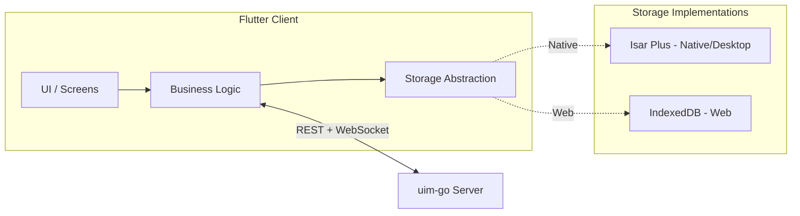

# UIM Flutter Client Refactoring Specification

**Document Version:** 1.0  
**Last Updated:** 2026-02-24  
**Author:** convexwf@gmail.com  
**Backend Reference:** uim-go; [Initialization](../feature/initialization.md), [Core Messaging](../feature/core-messaging.md)

---

## Table of Contents

- [1. Purpose and Scope](#1-purpose-and-scope)
  - [1.1 Document Purpose](#11-document-purpose)
  - [1.2 In Scope](#12-in-scope)
  - [1.3 Out of Scope](#13-out-of-scope)
- [2. Principles and Constraints](#2-principles-and-constraints)
- [3. API and Protocol Contract](#3-api-and-protocol-contract)
  - [3.1 REST API](#31-rest-api)
  - [3.2 WebSocket Protocol](#32-websocket-protocol)
  - [3.3 Dart / Flutter Type Mapping](#33-dart--flutter-type-mapping)
- [4. Local Storage (Platform-Split and Abstraction)](#4-local-storage-platform-split-and-abstraction)
  - [4.1 Unified Storage Abstraction](#41-unified-storage-abstraction)
  - [4.2 Native / Desktop: Isar Plus](#42-native--desktop-isar-plus)
  - [4.3 Web: IndexedDB](#43-web-indexeddb)
- [5. Seed Users](#5-seed-users)
- [6. Implementation Phases](#6-implementation-phases)
- [7. Development Workflow](#7-development-workflow)
- [8. Data Flow Diagram](#8-data-flow-diagram)
- [9. Suggested Directory Structure](#9-suggested-directory-structure)
- [References](#references)

---

## 1. Purpose and Scope

### 1.1 Document Purpose

This document defines how the **uim-flutter** client must be refactored to align with the **uim-go** backend. It is the single reference for implementing the refactor: principles, storage strategy, API contract, seed users, and implementation phases.

### 1.2 In Scope

- **Authentication**: Register, login, refresh token; token storage and `Authorization: Bearer` headers.
- **Conversations**: List conversations (paginated), create one-on-one by `other_user_id`.
- **Messages**: Message history via REST; send/receive via WebSocket (`send_message` / `new_message`).
- **Unified storage abstraction** and data models aligned with uim-go; **Native**: Isar Plus implementation; **Web**: IndexedDB implementation (no Hive, no Isar Plus on web).
- Removal of Hive and contact-related logic from the current codebase.
- Running and debugging on **Flutter Web** first, with configurable backend URL.

### 1.3 Out of Scope

- Contact list, user search, friend management.
- Native-first or desktop-first as the primary development target.
- Features not implemented in uim-go v1.0.

---

## 2. Principles and Constraints

| Principle | Requirement |
| --------- | ----------- |
| **uim-go as standard** | **uim-go is the single source of truth.** API paths, request/response shapes, WebSocket protocol, and field names (e.g. `conversation_id`, `sender_id`, `created_at`) must match the backend. The Flutter client must not introduce divergent contracts. |
| **Web for debugging** | **Primary development and integration target is Flutter Web.** Run integration tests and backend connectivity checks in the browser (e.g. `flutter run -d chrome`). Mobile and desktop can follow. |
| **Platform-split local storage** | **Native/Desktop**: Use **Isar Plus** for local persistence and performance. **Web**: **Do not use Hive.** Use a lighter approach: **direct IndexedDB** (browser native; optional thin wrapper via `idb_shim`, `indexed_db`, or similar Dart packages). A **unified storage abstraction** (interface) must be used: business and UI layers depend only on this interface, not on Isar Plus or IndexedDB. Native implements the interface with Isar Plus; Web implements the same interface with IndexedDB. The abstraction API must be **async** (e.g. `Future<List<Message>> getMessages(...)`) to match IndexedDB semantics. |
| **No contacts; seed users only** | **Contacts and user discovery are out of scope.** The client uses **seed users** only. Document the seed users (from [cmd/seed/main.go](../../cmd/seed/main.go)): `alice`, `bob`, `test`, all with password `password123`. No "contacts list" API or UI; conversations are created using known seed `user_id` (e.g. a small in-app or config list of seed user IDs). |

---

## 3. API and Protocol Contract

All contracts are defined by uim-go. See [Initialization](../feature/initialization.md) and [Core Messaging](../feature/core-messaging.md) for full details.

### 3.1 REST API

| Method | Path | Description |
| ------ | ---- | ----------- |
| POST | `/api/auth/register` | Register. Body: `username`, `email`, `password`. Response: `user`, `access_token`, `refresh_token`. |
| POST | `/api/auth/login` | Login. Body: `username`, `password`. Response: `user`, `access_token`, `refresh_token`. |
| POST | `/api/auth/refresh` | Refresh. Body: `refresh_token`. Response: `access_token`, `refresh_token`. |
| GET | `/api/conversations` | List conversations. Query: `limit`, `offset`. Header: `Authorization: Bearer <access_token>`. |
| POST | `/api/conversations` | Create 1:1. Body: `{ "other_user_id": "<uuid>" }`. Header: Bearer token. |
| GET | `/api/conversations/:id/messages` | List messages. Query: `limit`, `offset`, optional `before_id`. Header: Bearer token. |

Request/response field names use **snake_case** (e.g. `access_token`, `conversation_id`, `other_user_id`, `created_at`).

### 3.2 WebSocket Protocol

- **Endpoint**: `GET /ws`. Token via query `?token=<access_token>` or header `Authorization: Bearer <access_token>`.
- **Client → Server**: `{ "type": "send_message", "conversation_id": "<uuid>", "content": "text" }`.
- **Server → Client**: `{ "type": "new_message", "message": { "message_id", "conversation_id", "sender_id", "content", "type", "created_at", ... } }`.
- **Rate limit**: 60 messages per minute per connection. Server sends ping; client should respond with pong.

See [Core Messaging – WebSocket](../feature/core-messaging.md#websocket) for full protocol.

### 3.3 Dart / Flutter Type Mapping

Backend JSON uses snake_case. In Dart, either:

- Keep snake_case in serialization (e.g. `@JsonKey(name: 'conversation_id')`) and use camelCase in domain models, or
- Use a single convention (e.g. snake_case in DTOs) and map to domain models.

Align field names and types with uim-go:

| Backend (JSON) | Dart (suggested) |
| ----------------- | ----------------- |
| `user_id` | `userId` or `user_id` |
| `conversation_id` | `conversationId` or `conversation_id` |
| `sender_id` | `senderId` or `sender_id` |
| `message_id` | `messageId` or `message_id` |
| `created_at` | `createdAt` (DateTime) or `created_at` (String) |
| `access_token`, `refresh_token` | same or camelCase in code |

---

## 4. Local Storage (Platform-Split and Abstraction)

### 4.1 Unified Storage Abstraction

- Define **data models** aligned with uim-go: User, Conversation, Message (field names and types match backend JSON).
- Define a **local storage interface** (e.g. conversation list read/write, message list read/write with pagination). The interface must be **async** (e.g. `Future<List<Message>> getMessages(...)`) so that IndexedDB can implement it.
- Business and UI layers depend only on this interface, not on Isar Plus or IndexedDB.

### 4.2 Native / Desktop: Isar Plus

- Use **Isar Plus** to implement the storage interface.
- Isar Plus collections and field names must align with uim-go JSON: `message_id`, `conversation_id`, `sender_id`, `content`, `type`, `created_at`, etc.
- Use Isar Plus built-in code generation (build_runner) as needed.

### 4.3 Web: IndexedDB

- **Do not use Hive or Isar Plus on web.** Implement the same storage interface using **IndexedDB** directly (e.g. via `idb_shim`, `indexed_db`, or a thin wrapper).
- Object stores and indexes should use the same schema and field names as uim-go.
- Document Web-specific initialization and async handling (e.g. database open, transaction lifecycle).

---

## 5. Seed Users

Seed users are created by `make seed-db` (see [cmd/seed/main.go](../../cmd/seed/main.go)). Use them for creating 1:1 conversations and testing; there is no contacts API.

| username | email | display_name | password |
| -------- | ----- | ------------ | -------- |
| alice | alice@example.com | Alice | password123 |
| bob | bob@example.com | Bob | password123 |
| test | test@example.com | Test User | password123 |

**Usage**: To create a 1:1 conversation, the client needs the other user's `user_id` (UUID). Obtain it by either (1) logging in as that user once and storing the returned `user_id`, or (2) maintaining a small hardcoded or config list of seed user IDs for development. No general "contacts" API is provided.

---

## 6. Implementation Phases

| Phase | Tasks |
| ----- | ----- |
| **1 – Foundation** | Remove Hive (hive_ce, hive_ce_flutter, hive_ce_generator). Define uim-go-aligned **data models** and **local storage abstraction** (async API). **Native**: Add Isar Plus and codegen; implement the interface with Isar Plus. **Web**: Implement the same interface with **IndexedDB** (do not add Hive). Add HTTP client (e.g. dio or http) and configurable Base URL (e.g. `localhost:8080` or env). |
| **2 – Auth** | Implement register, login, refresh. Secure token storage (e.g. flutter_secure_storage; document Web alternative). Inject token into API client and WebSocket. |
| **3 – Conversations and messages** | REST: list conversations, create 1:1 (using seed `other_user_id`), list messages. WebSocket: connect with token, send `send_message`, handle `new_message`. Map server DTOs to local models and write through the storage abstraction (Isar Plus or IndexedDB). Optional: sync conversations and messages for offline display. |
| **4 – UI and Web** | Replace mock data in [chat_screen.dart](../../client/uim-flutter/uim/lib/page/chat_screen.dart) and related screens with API + storage abstraction data. Use a seed-only list for "contacts" placeholder. Ensure the app runs and is debuggable on **Flutter Web** with a configurable backend URL. |

---

## 7. Development Workflow

1. **Start uim-go**: `make init-db`, `make seed-db`, then build and run the server (e.g. `make build` and `./bin/server`).
2. **Run Flutter Web**: e.g. `cd client/uim-flutter/uim && flutter run -d chrome`.
3. **Configure Base URL**: Set API and WebSocket base URL (e.g. `http://localhost:8080`, `ws://localhost:8080/ws`) via environment variable, constants, or build config; document the chosen location in the project.

---

## 8. Data Flow Diagram



---

## 9. Suggested Directory Structure

Use a tree-style layout under `lib/` so that HTTP, WebSocket, storage abstraction, and implementations are clearly separated:

```txt
lib/
├── main.dart
├── api/
│   ├── client.dart          # HTTP client, base URL, auth header
│   └── endpoints.dart       # Paths and request/response types
├── models/
│   ├── user.dart
│   ├── conversation.dart
│   └── message.dart
├── storage/
│   ├── storage_interface.dart   # Abstract interface (async API)
│   ├── isar_storage.dart        # Isar Plus implementation (native/desktop)
│   └── indexed_db_storage.dart  # IndexedDB implementation (web)
├── screens/
│   ├── main_screen.dart
│   ├── chat_screen.dart
│   └── ...
└── ...
```

Storage abstraction and the two implementations (Isar Plus for native, IndexedDB for web) live under `storage/`. The rest of the app depends only on the interface.

---

## References

- [UIM Flutter Design Choices](uim-flutter-design-choices.md) – Backup of technology choices (state management, HTTP, token storage, WebSocket, IndexedDB, JSON, implementation order)
- [Initialization](../feature/initialization.md) – Auth, API endpoints, configuration
- [Core Messaging](../feature/core-messaging.md) – Conversations, messages, WebSocket protocol
- [cmd/seed/main.go](../../cmd/seed/main.go) – Seed user definitions
