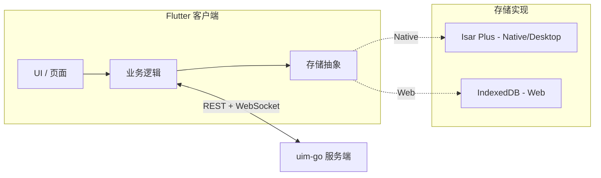

# UIM Flutter 客户端重构说明

**文档版本：** 1.0  
**最后更新：** 2026-04-28 
**作者：** convexwf@gmail.com  
**后端参考：** uim-go；[初始化](../feature/initialization.md)、[核心消息](../feature/core-messaging.md)

---

## 目录

- [UIM Flutter 客户端重构说明](#uim-flutter-客户端重构说明)
  - [目录](#目录)
  - [1. 目的与范围](#1-目的与范围)
    - [1.1 文档目的](#11-文档目的)
    - [1.2 范围内](#12-范围内)
    - [1.3 范围外](#13-范围外)
  - [2. 原则与约束](#2-原则与约束)
  - [3. API 与协议约定](#3-api-与协议约定)
    - [3.1 REST API](#31-rest-api)
    - [3.2 WebSocket 协议](#32-websocket-协议)
    - [3.3 Dart / Flutter 类型映射](#33-dart--flutter-类型映射)
  - [4. 本地存储（分平台与抽象层）](#4-本地存储分平台与抽象层)
    - [4.1 统一存储抽象](#41-统一存储抽象)
    - [4.2 Native / Desktop：Isar Plus](#42-native--desktopisar-plus)
    - [4.3 Web：IndexedDB](#43-webindexeddb)
  - [5. Seed 用户](#5-seed-用户)
  - [6. 实施阶段](#6-实施阶段)
  - [7. 开发流程](#7-开发流程)
  - [8. 数据流图](#8-数据流图)
  - [9. 建议目录结构](#9-建议目录结构)
  - [参考资料](#参考资料)

---

## 1. 目的与范围

### 1.1 文档目的

本文档规定 **uim-flutter** 客户端如何按 **uim-go** 后端进行重构，是实施重构的唯一依据：原则、存储策略、API 约定、Seed 用户及实施阶段。

### 1.2 范围内

- **认证**：注册、登录、刷新 Token；Token 存储与 `Authorization: Bearer` 请求头。
- **会话**：会话列表（分页）、通过 `other_user_id` 创建单聊。
- **消息**：通过 REST 拉取历史；通过 WebSocket 收发（`send_message` / `new_message`）。
- **统一存储抽象**及与 uim-go 对齐的数据模型；**Native** 由 Isar Plus 实现，**Web** 由 IndexedDB 实现（Web 不使用 Hive、不依赖 Isar Plus）。
- 移除当前代码库中的 Hive 及与联系人相关的逻辑。
- 以 **Flutter Web** 为首选运行与调试环境，后端地址可配置。

### 1.3 范围外

- 联系人列表、用户搜索、好友管理。
- 以原生或桌面为首选开发目标。
- uim-go v1.0 未实现的功能。

---

## 2. 原则与约束

| 原则                      | 要求                                                                                                                                                                                                                                                                                                                                                                                                                                                                               |
| ------------------------- | ---------------------------------------------------------------------------------------------------------------------------------------------------------------------------------------------------------------------------------------------------------------------------------------------------------------------------------------------------------------------------------------------------------------------------------------------------------------------------------- |
| **以 uim-go 为标准**      | **uim-go 为唯一事实来源**。API 路径、请求/响应结构、WebSocket 协议及字段名（如 `conversation_id`、`sender_id`、`created_at`）均以服务端为准，Flutter 不得引入与之不一致的约定。                                                                                                                                                                                                                                                                                                    |
| **Web 用于调试**          | **开发与联调以 Flutter Web 为主**。集成测试与后端连通性验证均在浏览器中完成（如 `flutter run -d chrome`），移动端与桌面端可后续支持。                                                                                                                                                                                                                                                                                                                                              |
| **分平台本地存储**        | **Native/Desktop**：使用 **Isar Plus** 作为本地持久化，追求原生性能与能力。**Web**：**不使用 Hive**，采用更轻量方案：**直接使用 IndexedDB**（浏览器原生能力；可选用 `idb_shim`、`indexed_db` 等 Dart 包做薄封装）。通过**统一存储抽象**（接口）对接：业务层与 UI 只依赖该接口，不依赖 Isar Plus 或 IndexedDB 的具体类型；Native 由 Isar Plus 实现接口，Web 由 IndexedDB 实现同一接口。抽象层 API 为**异步**（如 `Future<List<Message>> getMessages(...)`），以兼容 IndexedDB 的异步语义。 |
| **不做联系人、仅用 seed** | **联系人/用户发现不在本次重构范围内**。客户端仅使用 **seed 用户**。文档列出 seed 用户（来源 [cmd/seed/main.go](../../cmd/seed/main.go)）：`alice`、`bob`、`test`，密码均为 `password123`。不提供「联系人列表」API 或 UI；会话通过已知的 seed 用户 `user_id` 创建（如应用内或配置中的少量 seed 用户列表）。                                                                                                                                                                         |

---

## 3. API 与协议约定

所有约定以 uim-go 为准，详见 [初始化](../feature/initialization.md) 与 [核心消息](../feature/core-messaging.md)。

### 3.1 REST API

| 方法 | 路径                              | 说明                                                                                         |
| ---- | --------------------------------- | -------------------------------------------------------------------------------------------- |
| POST | `/api/auth/register`              | 注册。Body：`username`、`email`、`password`。响应：`user`、`access_token`、`refresh_token`。 |
| POST | `/api/auth/login`                 | 登录。Body：`username`、`password`。响应：`user`、`access_token`、`refresh_token`。          |
| POST | `/api/auth/refresh`               | 刷新 Token。Body：`refresh_token`。响应：`access_token`、`refresh_token`。                   |
| GET  | `/api/conversations`              | 会话列表。Query：`limit`、`offset`。Header：`Authorization: Bearer <access_token>`。         |
| POST | `/api/conversations`              | 创建单聊。Body：`{ "other_user_id": "<uuid>" }`。Header：Bearer token。                      |
| GET  | `/api/conversations/:id/messages` | 消息列表。Query：`limit`、`offset`，可选 `before_id`。Header：Bearer token。                 |

请求/响应字段名使用 **snake_case**（如 `access_token`、`conversation_id`、`other_user_id`、`created_at`）。

### 3.2 WebSocket 协议

- **端点**：`GET /ws`。Token 通过 query `?token=<access_token>` 或 header `Authorization: Bearer <access_token>` 传递。
- **客户端 → 服务端**：`{ "type": "send_message", "conversation_id": "<uuid>", "content": "文本" }`。
- **服务端 → 客户端**：`{ "type": "new_message", "message": { "message_id", "conversation_id", "sender_id", "content", "type", "created_at", ... } }`。
- **限速**：每连接每分钟 60 条消息。服务端发送 ping；客户端应回复 pong。

完整协议见 [核心消息 – WebSocket](../feature/core-messaging.md#websocket)。

### 3.3 Dart / Flutter 类型映射

后端 JSON 使用 snake_case。Dart 侧可：

- 在序列化中保留 snake_case（如 `@JsonKey(name: 'conversation_id')`），领域模型使用 camelCase；或
- 统一使用一种命名（如 DTO 用 snake_case），再映射到领域模型。

字段名与类型与 uim-go 对齐，例如：

| 后端（JSON）                    | Dart（建议）                                     |
| ------------------------------- | ------------------------------------------------ |
| `user_id`                       | `userId` 或 `user_id`                            |
| `conversation_id`               | `conversationId` 或 `conversation_id`            |
| `sender_id`                     | `senderId` 或 `sender_id`                        |
| `message_id`                    | `messageId` 或 `message_id`                      |
| `created_at`                    | `createdAt`（DateTime）或 `created_at`（String） |
| `access_token`、`refresh_token` | 保持一致或代码中用 camelCase                     |

---

## 4. 本地存储（分平台与抽象层）

### 4.1 统一存储抽象

- 定义与 uim-go 对齐的**数据模型**：User、Conversation、Message（字段名与类型与后端 JSON 一致）。
- 定义**本地存储接口**（如会话列表的读写、消息列表的读写与分页）。接口必须为**异步 API**（如 `Future<List<Message>> getMessages(...)`），以便 IndexedDB 实现。
- 业务层与 UI 只依赖该接口，不依赖具体存储实现。

### 4.2 Native / Desktop：Isar Plus

- 使用 **Isar Plus** 实现上述存储接口。
- Isar Plus 集合与字段名与 uim-go 的 JSON 一致：`message_id`、`conversation_id`、`sender_id`、`content`、`type`、`created_at` 等。
- 按需使用 Isar Plus 内建代码生成（build_runner）。

### 4.3 Web：IndexedDB

- **Web 上不使用 Hive，不依赖 Isar Plus**。使用 **IndexedDB** 直接实现同一套存储接口（可选用 `idb_shim`、`indexed_db` 等 Dart 包做薄封装）。
- Object Store / 索引的 schema 与 uim-go 字段名一致。
- 文档中说明 Web 下 IndexedDB 的初始化方式及异步注意事项。

---

## 5. Seed 用户

Seed 用户由 `make seed-db` 创建（见 [cmd/seed/main.go](../../cmd/seed/main.go)）。用于创建单聊与联调；无联系人 API。

| username | email             | display_name | password    |
| -------- | ----------------- | ------------ | ----------- |
| alice    | alice@example.com | Alice        | password123 |
| bob      | bob@example.com   | Bob          | password123 |
| test     | test@example.com  | Test User    | password123 |

**使用方式**：创建单聊需要对方的 `user_id`（UUID）。可通过（1）以该用户登录一次并保存返回的 `user_id`，或（2）维护一份开发用的小型硬编码/配置 seed 用户 ID 列表 获取。不提供通用「联系人」API。

---

## 6. 实施阶段

| 阶段               | 任务                                                                                                                                                                                                                                                                                                                                  |
| ------------------ | ------------------------------------------------------------------------------------------------------------------------------------------------------------------------------------------------------------------------------------------------------------------------------------------------------------------------------------- |
| **1 – 基础**       | 移除 Hive（hive_ce、hive_ce_flutter、hive_ce_generator）。定义与 uim-go 对齐的**数据模型**及**本地存储抽象接口**（异步 API）。**Native**：引入 Isar Plus 与代码生成，用 Isar Plus 实现该接口；**Web**：用 **IndexedDB** 实现同一接口（不引入 Hive）。增加 HTTP 客户端（如 dio 或 http）及 Base URL 配置（Web 如 `localhost:8080` 或环境变量）。 |
| **2 – 认证**       | 实现注册、登录、刷新；安全存储 Token（如 flutter_secure_storage；Web 需说明替代方案）；在 API 与 WebSocket 中注入 Token。                                                                                                                                                                                                             |
| **3 – 会话与消息** | REST：会话列表、创建单聊（使用 seed 的 `other_user_id`）、消息列表；WebSocket：带 Token 连接、发送 `send_message`、处理 `new_message`；将服务端 DTO 映射到本地模型并写入存储抽象（Isar Plus 或 IndexedDB）；可选：同步会话与消息以支持离线展示。                                                                                           |
| **4 – UI 与 Web**  | 将 [chat_screen.dart](../../client/uim-flutter/uim/lib/page/chat_screen.dart) 及相关页面的假数据替换为 API + 存储抽象数据；占位联系人列表仅使用 seed 列表；保证在 **Flutter Web** 上可运行并调试，且后端地址可配置。                                                                                                                  |

---

## 7. 开发流程

1. **启动 uim-go**：`make init-db`、`make seed-db`，然后构建并运行服务（如 `make build` 与 `./bin/server`）。
2. **运行 Flutter Web**：如 `cd client/uim-flutter/uim && flutter run -d chrome`。
3. **配置 Base URL**：通过环境变量、常量或构建配置设置 API 与 WebSocket 的 Base URL（如 `http://localhost:8080`、`ws://localhost:8080/ws`）；在项目中注明配置位置。

---

## 8. 数据流图



---

## 9. 建议目录结构

在 `lib/` 下采用树形布局，便于区分 HTTP、WebSocket、存储抽象及实现：

```txt
lib/
├── main.dart
├── api/
│   ├── client.dart          # HTTP 客户端、Base URL、鉴权头
│   └── endpoints.dart       # 路径与请求/响应类型
├── models/
│   ├── user.dart
│   ├── conversation.dart
│   └── message.dart
├── storage/
│   ├── storage_interface.dart   # 抽象接口（异步 API）
│   ├── isar_storage.dart        # Isar Plus 实现（native/desktop）
│   └── indexed_db_storage.dart  # IndexedDB 实现（web）
├── screens/
│   ├── main_screen.dart
│   ├── chat_screen.dart
│   └── ...
└── ...
```

存储抽象及两套实现（Native 用 Isar Plus，Web 用 IndexedDB）位于 `storage/`，其余代码仅依赖接口。

---

## 参考资料

- [UIM Flutter 方案选型说明](uim-flutter-design-choices.md) – 状态管理、HTTP、Token 存储、WebSocket、IndexedDB、JSON、实施顺序等选型备份
- [初始化](../feature/initialization.md) – 认证、API 端点、配置
- [核心消息](../feature/core-messaging.md) – 会话、消息、WebSocket 协议
- [cmd/seed/main.go](../../cmd/seed/main.go) – Seed 用户定义
